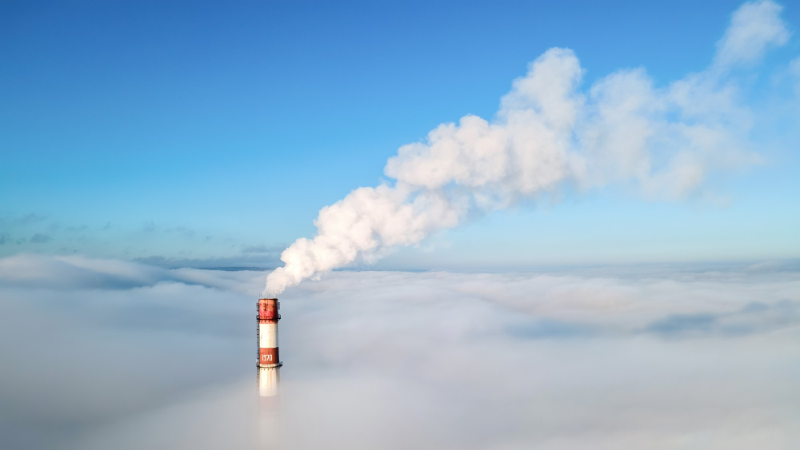

# 2.1 - Les émissions comptabilisées dans un Bilan Carbone®

<figure><figcaption>
Source : Freepik
</figcaption></figure>

Le Bilan Carbone® quantifie et permet d'agir sur les émissions **induites** par une [organisation](../annexes/glossaire.md#organisation), quelle qu'elle soit, mais aussi par un évènement donné ou par un projet spécifique.

> :mag\_right: _La méthode Bilan Carbone® est alignée avec l'_[_avis de l'ADEME_](../annexes/bibliographie/#autres) _sur la neutralité carbone, qui invite à ne pas viser une neutralité carbone arithmétique à l'échelle d'une organisation, mais de prioriser les leviers de décarbonation sur le périmètre de l'organisation (émissions induites)._

> :mag\_right: _La méthode Bilan Carbone® est alignée avec  le_ [_référentiel Net Zero Initiative_](../annexes/bibliographie/#net-zero-initiative) _pour organiser l'action d'une organisation selon 3 piliers : les émissions induites (pilier A), évitées (pilier B), et séquestrées (ou négatives, pilier C). La Net Zero Initiative propose aux organisations une manière de décrire et d’organiser leur action climat en vue de maximiser leur contribution à la neutralité carbone mondiale._

Le Bilan Carbone® quantifie et agit sur les émissions induites (pilier A). Il est tout à fait cohérent et pertinent de quantifier les piliers B et C pour un meilleur pilotage de la stratégie climat d'une organisation.

Les trois piliers, A/ Réduire ses émissions ; B/ Aider les autres à réduire ; C/ Développer les puits de carbone, doivent tous trois être menés de front. Ils sont strictement non combinables entre eux : ni additionnables, ni soustrayables.

## Émissions induites (Pilier A)

Pour contribuer à la baisse globale des émissions, une organisation doit **réduire ses propres émissions directes et indirectes** (pilier A) aux niveaux requis par les scénarios de décarbonation compatibles avec l’Accord de Paris.

Sauf exception, le pilier A “réduction des émissions de l’organisation” est **prioritaire** par rapport aux deux autres piliers B et C,  de par son rôle dans la dépendance de l'organisation à un système basé sur les énergies fossiles, et son influence sur les risques et les opportunités que l'organisation devra intégrer à sa stratégie.&#x20;


Le Bilan Carbone® quantifie et agit sur le pilier A.


## Émissions évitées (Pilier B)

Pour contribuer à la baisse globale des émissions, une organisation doit **réduire les émissions des autres** (pilier B). Elle évalue alors et augmente ses contributions à la décarbonation de tierces parties :

* Soit sous l’effet de ses produits et services distribués ou vendus qui viennent se substituer à une solution plus carbonée chez les clients finaux
* Soit sous l’effet de financements de projets de réduction d’émissions hors de sa chaîne de valeur (achats de réductions d’émissions certifiées, prises de participation directe dans des projets bas-carbone, contrats d’énergie bas carbone sous certaines conditions, etc.)


Une organisation peut déterminer les émissions de GES évitées par une activité.  L’organisation ne doit pas déduire ces émissions évitées des émissions totales, mais peut les comptabiliser et le cas échéant les déclarer à part.&#x20;


> <mark style="background-color:blue;">⏳\[</mark>[<mark style="background-color:blue;">WIP</mark>](../#structures-des-informations-specifiques)<mark style="background-color:blue;">] La méthodologie Bilan Carbone® ne traite pas des émissions évitées. Il est recommandé de s'appuyer sur le</mark> [<mark style="background-color:blue;">guide de calcul des émissions évitées</mark>](../annexes/bibliographie/#net-zero-initiative-guide-pilier-b) <mark style="background-color:blue;">(pilier B). Une prochaine mise à jour de la méthode Bilan Carbone® donnera des guidelines sur la quantification des émissions évitées.</mark>

## Émissions séquestrées, ou émissions négatives (Pilier C)

Pour contribuer à l'augmentation globale de la séquestration carbone, l'organisation doit **préserver et augmenter les puits de carbone** dans ou en dehors de sa chaîne de valeur (pilier C). Elle évalue ses contributions à la préservation et à l’augmentation des puits de carbone naturels et technologiques mondiaux :

* Soit dans sa chaîne de valeur, en développant ses propres puits de carbone (absorptions directes) ou ceux en amont (dans sa chaîne d'approvisionnement) et en aval (au sein des clients ou utilisateurs finaux)
* Soit hors de sa chaîne de valeur, grâce à ses financements de projets de séquestration (achats de séquestrations carbone certifiées, prise de participation directe dans des projets, etc.)


Une organisation peut déterminer les puits et réservoirs de GES permettant de capter et concentrer les GES pour éviter leur largage dans l’atmosphère (croissance forestière, préservation des sols, etc.). L’organisation ne doit pas déduire ces émissions séquestrées ou négatives des émissions totales, mais peut les comptabiliser et le cas échéant les déclarer à part.&#x20;


> <mark style="background-color:blue;">⏳\[</mark>[<mark style="background-color:blue;">WIP</mark>](../#structures-des-informations-specifiques)<mark style="background-color:blue;">] La méthodologie Bilan Carbone® ne traite pas des émissions séquestrées. Il est recommandé de s'appuyer sur le</mark> [<mark style="background-color:blue;">guide de construction d'une stratégie de séquestration carbone</mark>](../annexes/bibliographie/#net-zero-initiative-guide-pilier-b) <mark style="background-color:blue;">(pilier C). Une prochaine mise à jour de la méthode Bilan Carbone® donnera des guidelines sur la quantification des émissions séquestrées.</mark>

***

_Vous avez une question de compréhension ?_ [_Consultez la FAQ_](../annexes/faq.md)_. La méthode est vivante et donc susceptible d'évoluer (précisions, compléments) : retrouvez le_ [_suivi des modifications ici_](../avant-propos/historique-et-suivi-des-modifications.md)_._
