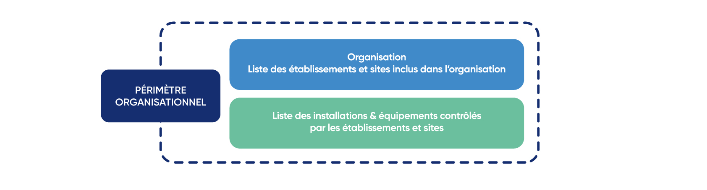

# 2.2 - Organisational boundary

<figure><figcaption>
Source: Pexels
</figcaption></figure>

The Bilan Carbone® method is applied here at the scale of an organisation, whose [definition](../annexes/glossaire.md#o) includes any company, local authority, association, public establishment, company, society, firm, authority, institution, or a part or combination of the foregoing entities.

The [establishments](../annexes/glossaire.md#e), [equipment](../annexes/glossaire.md#e) and [installations](../annexes/glossaire.md#i) of the organisation constitute the **organisational boundary** to be considered during the Bilan Carbone®. In order to define the organisational boundary, the organisation must map its organisational chart by listing all the buildings, agencies, subsidiaries, clients, suppliers, etc. that gravitate around it.

<figure><figcaption>
Establishing the organisational boundary - figure 2.2.
</figcaption></figure>

<mark style="color:$info;">🌐</mark> [_<mark style="color:$info;">English version</mark>_](https://abc-transitionbascarbone.fr/wp-content/uploads/2025/11/Organisational-boundary.png) _<mark style="color:$info;">of this image.</mark>_

Within the framework of a Bilan Carbone® and regardless of the [maturity level](../1-cadrage-de-la-demarche/1.1-definir-son-niveau-de-maturite-bilan-carbone-r.md) targeted, 100% of the equipment and installations over which the organisation exercises [operational control](../annexes/glossaire.md#c), i.e. that it operates and uses, must be included in the organisational boundary. Any other choice must be justified.

> :mag\_right: _This requirement corresponds to the "operational control" approach of the_ [_mandatory BEGES-R_](../annexes/bibliographie/#autres-standards-normes-et-reglementations-de-comptabilisation-des-emissions-de-ges)_, and of_ [_ISO standard 14064-1: 2018_](../annexes/bibliographie/#autres-standards-normes-et-reglementations-de-comptabilisation-des-emissions-de-ges)_._

> :mag\_right: _To express the Bilan Carbone® with a so-called "analytical" reading, consistent with_ [_analytical carbon accounting_](../annexes/bibliographie/#guides-pratiques)_, the organisational boundary considers or defines the_ [_analytical axes_](../annexes/glossaire.md#a) _of the organisation._


Within the framework of the Bilan Carbone®, it is possible to restrict the boundary to a part of the organisation, at the scale of a site, a project, a worksite, or an event. The flexibility this generates regarding the boundary may be relevant to adapt to certain needs (decision-making, action management, etc.).

This choice is justified, transparent, and included in the [Deliverables](2-introduction-a-lidentification-des-perimetres.md#livrables-relatifs-a-lidentification-des-perimetres).


> :mag\_right: _If the Bilan Carbone® is intended to serve a specific regulatory reporting purpose, the organisational boundary is that of the_ [_Legal Entity_](../annexes/glossaire.md#p) _subject to the regulation. The declaration of the_ [_mandatory BEGES-R_](../annexes/bibliographie/#autres-standards-normes-et-reglementations-de-comptabilisation-des-emissions-de-ges) _must concern the SIREN of the organisation in question. The_ [_CSRD_](../annexes/bibliographie/#autres-standards-normes-et-reglementations-de-comptabilisation-des-emissions-de-ges) _sustainability declaration must concern the same reporting company as the financial statements._

Throughout the rest of this document, the Bilan Carbone® method uses only the term "organisation". It refers to the organisational boundary adopted here (including if it is a part of the organisation or a grouping of organisations); and thus differs from an Individual, Product or Territory [boundary](../introduction-a-la-transition-bas-carbone/quelle-integration-du-bilan-carbone-r-au-sein-dune-demarche-de-transition-bas-carbone.md#id-1-les-differentes-echelles-de-comptabilite-carbone). Certain [specificities](../annexes/annexes/annexe-5-specificites-pour-les-collectivites-et-les-associations/) apply to local authorities or associations.


Double counting is inherent to the exercise. The emissions for which the organisation is responsible and on which it is dependent overlap with certain dependency and responsibility emissions of another organisation. When consolidating across multiple sites of the same organisation (a so-called multi-site approach), care must be taken to exclude double counting within this consolidation.


***

_Do you have a question of understanding?_ [_Consult the FAQ_](../annexes/faq.md)_. The method is a living document and therefore subject to change (clarifications, additions): find the_ [_change log here_](../avant-propos/historique-et-suivi-des-modifications.md)_._
