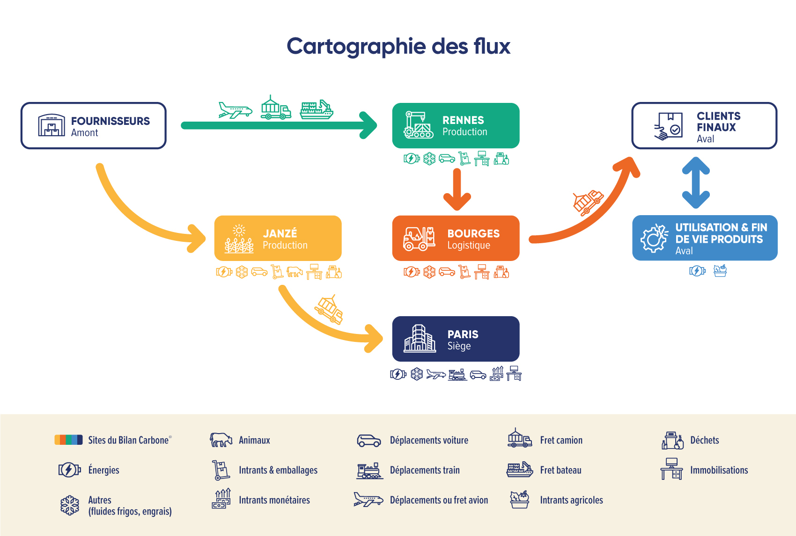

# 2.4 - Périmètre opérationnel

<figure><figcaption>
Source : Freepik
</figcaption></figure>

L'ensemble des émissions de GES engendrées par les établissements, équipements et installations de l'organisation (i.e : du [périmètre organisationnel](2.2-perimetre-organisationnel.md)), constitue le **périmètre opérationnel** du bilan.

La définition du périmètre opérationnel se fait en 3 étapes :&#x20;

1. Identification des sources d'émissions ;
2. Ventilation de ces sources d'émissions selon la nomenclature des postes d'émission du Bilan Carbone® ;
3. Identification des émissions indirectes et délimitation du périmètre opérationnel

## :one: Identification des sources d'émissions

L'organisation doit identifier les sources d'émissions qui constitueront son Bilan Carbone®.

L'identification des sources d'émissions est itérative. La cartographie des flux de l'organisation nourrit la définition des périmètres qui délimitent l'étude (organisationnel, temporel, opérationnel). Et inversement, la définition des périmètres va borner l'identification des sources d'émissions. Les 2 réflexions se nourrissent ainsi mutuellement.

### Identifier les flux dont l'organisation est responsable et dépendante.

L'organisation doit identifier l'ensemble des flux entrants, internes et sortants : flux d'énergie, de fluides, de matières premières, de personnes, de produits (biens et services), et de déchets, qui sont nécessaires à l’activité, quel que soit celui qui en est « responsable ».

Dans une logique de dépendance au carbone : si l'un des flux listés ci-dessus influence, ou est influencé par l'activité de l'organisation, alors il doit être intégré au périmètre. Si un flux est carboné, cela signifie que l'activité de l'organisation est [vulnérable](2.5-identification-des-risques-et-opportunites-de-transition.md) (prix des énergies fossiles, taxe carbone, modèle compatible au monde bas carbone, etc.) et qu'il est nécessaire de quantifier ce flux. L'[objectif premier ](../introduction-au-bilan-carbone-r/0.1-objectifs-et-principes-du-bilan-carbone-r.md)du Bilan Carbone® est de **savoir sur quoi agir et comment.**

Cela permet de préparer la phase de comptabilisation, en étant certain d'inclure toutes les [émissions directes et indirectes](2.4-perimetre-operationnel.md#la-notion-demissions-indirectes) de l'organisation, et d'être exhaustif lors de la collecte des données d'activité.

La comptabilisation des émissions « en dépendance»  permet de construire un plan de transition qui agira sur la compatibilité de l'activité vers un modèle bas carbone.

### Exigences relatives à la cartographie des sources d'émissions

L'organisation doit identifier toutes les sources d'émissions à prendre en compte lors de son Bilan Carbone®. Voici différentes recommandations à atteindre pour chacun des 3 [niveaux de maturité](../1-cadrage-de-la-demarche/1.1-definir-son-niveau-de-maturite-bilan-carbone-r.md).

Niveau Initial, Standard et Avancé : critère F1, F2 et F3

L'organisation doit produire une **cartographie des flux**.

Les éléments à cartographier sont les flux d'énergie, de fluides, de matières premières, de personnes, de produits (biens et services), et de déchets, en s’inspirant du modèle ci-dessous.

<figure><figcaption>
Figure 2.4.1 : Exemple de cartographie des flux
</figcaption></figure>

Exemple d'élaboration itérative d'une cartographie des flux :&#x20;

1. :arrows\_counterclockwise: Schématiser l'organigramme de l'organisation en listant tous les bâtiments, agences, filiales, groupes de clients et fournisseurs, etc. qui gravitent autour d'elle. Cette étape va permettre de définir le [périmètre organisationnel.](2.2-perimetre-organisationnel.md)
2. :arrows\_counterclockwise: Cartographier pour chacun des bâtiments, agences, etc.  l'ensemble des flux entrants, internes et sortants qui génèrent des émissions, et les postes d'émissions concernés par ces flux. C'est cette identification des sources d'émissions qui va servir à la définition du [périmètre opérationnel](2.4-perimetre-operationnel.md). Ce processus est itératif car il permet d'identifier des oublis éventuels dans le périmètre organisationnel.
3. :arrows\_counterclockwise: Pour chacun des flux présents sur cette cartographie des flux, il faut ensuite préciser les données d'activité associées, permettant de construire la [matrice de collecte des données](../4-comptabilisation/4.2-methode-de-collecte-des-donnees-dactivite.md).  Ce processus de construction est itératif et évolue entre les données idéales à collecter et les données disponibles.
4. :arrows\_counterclockwise: Finaliser la **cartographie des flux** ainsi obtenue, avec toutes les informations pertinentes.

Optionnel : cartographie quantifiée des flux

En fonction de la maturité de l'organisation, il est recommandé de **quantifier** cette cartographie des flux. Cette ressource illustrative et pédagogique s'inscrit dans les recommandations [en termes de mobilisation](../3-mobilisation-des-parties-prenantes/3.1-programmer-les-phases-de-mobilisation/) pour les [niveaux de maturité](../1-cadrage-de-la-demarche/1.1-definir-son-niveau-de-maturite-bilan-carbone-r.md) Standard et Avancé sur la collecte des données et la restitution du profil d'émission.

⏳ <mark style="background-color:blue;">Pour information, un schéma exemple d'une cartographie quantifiée des flux sera prochainement inséré ici.</mark>

La base de cartographie des flux obtenue précédemment peut être complétée des 2 étapes suivantes :

1. :arrows\_counterclockwise: Compléter cette cartographie de façon itérative tout au long de la collecte avec les valeurs **des données d'activité** en face des principaux flux.  Finaliser la cartographie quantifiée des flux ainsi obtenue, avec toutes les informations pertinentes.
2. :arrows\_counterclockwise: Pour la restitution, la cartographie est complétée par les valeurs **des émissions** en face des principaux flux. Elle sert de base visuelle pour une meilleure compréhension des résultats et du lien entre flux physiques et émissions de GES.

La cartographie quantifiée sert ensuite de tableau de bord. Elle peut ainsi servir de support à un [suivi](../5-plan-de-transition/5.5-suivi-et-pilotage-du-plan-de-transition.md) annuel des données d’activité significatives.

Optionnel pour un Niveau Avancé : cartographie analytique

Pour exprimer le Bilan Carbone® en cohérence avec la [comptabilité carbone analytique](../annexes/bibliographie/), l’organisation doit identifier les mêmes sources d’émissions (celles dont elle est responsable et dépendante), mais en gardant l’objectif de les ventiler ensuite selon une cartographie dite « analytique » qui croisera [codes comptables](../annexes/glossaire.md#e) et [axes analytiques](../annexes/glossaire.md#a).

Elle identifie les émissions supportées et non supportées. Les émissions supportées proviennent des activités financées par l’organisation. Elles apparaissent donc dans les exports comptables. Les émissions non supportées ne sont pas financées par l’organisation, mais sont quand même inclues obligatoirement.

*   Les émissions supportées sont cartographiées à partir des données comptables de l’entreprise. Pour identifier les émissions supportées, une analyse des [exports comptables](../annexes/glossaire.md#e) est réalisée pour identifier toutes les classes de comptes :&#x20;

    * Représentant un flux physique,
    * Pour lesquels il existe un coût ou un amortissement en cours sur la période analysée.

    Toutes les classes de comptes identifiées doivent être inclues dans la Comptabilité Carbone Analytique comme étant un ou plusieurs postes d’émission.
* Les émissions non supportées par l’entreprises doivent être rajoutées. Pour comptabiliser les émissions non supportées, il est possible de réaliser une cartographie des flux ou toute autre méthode permettant d’identifier la liste des postes d’émissions de manière exhaustive. L’objectif est d’identifier tous les flux physiques dont les activités de l’organisation dépendent et qui ne sont pas supportés par l’organisation. Ces flux devront être intégrées dans la Comptabilité Carbone Analytique comme étant un ou plusieurs postes d’émission.

L'organisation peut trouver en [section 4.5](../4-comptabilisation/4.5-profil-demission.md#comptabilite-carbone-analytique) un tableau de correspondance listant l'ensemble des codes comptables qui seront à passer en revue dans le but d'identifier les sources d'émissions qui doivent être considérées au sein du Bilan Carbone®.


Une ressource proposée en annexe fournit un [modèle réutilisable de cartographie des flux](../annexes/annexes/annexe-4-aide-a-la-determination-du-perimetre.md).


## :two: Nomenclature des postes d'émissions

Les sources d'émissions générées par l’activité de l’organisation (directes ou indirectes) sont à ventiler au sein des différents **postes** d'émissions du Bilan Carbone®.

### Liste des postes et sous-postes du Bilan Carbone® :&#x20;

<figure><figcaption>
Figure 2.4.2 : Nomenclature des postes et sous-postes du Bilan Carbone®
</figcaption></figure>

<mark style="color:$info;">🌐</mark> [_<mark style="color:$info;">English version</mark>_](https://abc-transitionbascarbone.fr/wp-content/uploads/2025/11/Classification-of-BC.png) _<mark style="color:$info;">of this image.</mark>_

### Descriptions des postes et sous-postes du Bilan Carbone® :&#x20;

<figure><figcaption>
Figure 2.4.3 : Nomenclature des postes et sous-postes du Bilan Carbone®
</figcaption></figure>

<mark style="color:$info;">🌐</mark> [_<mark style="color:$info;">English version</mark>_](https://abc-transitionbascarbone.fr/wp-content/uploads/2025/11/Description-of-the-categories_Description-des-postes-et-sous-postes--scaled.png) _<mark style="color:$info;">of this image.</mark>_

### Autres nomenclatures :

Plusieurs nomenclatures existent et peuvent se combiner. L'important est d'être exhaustif sur le périmètre car il est aisé d'[exporter ces résultats](../4-comptabilisation/4.5-profil-demission.md) dans plusieurs nomenclatures différentes à la fois (postes Bilan Carbone®, catégories et postes du BEGES règlementaire et de ISO 14064-1, structure du plan analytique, scopes du GHG-P, etc.).


Pour exprimer le Bilan Carbone® selon d'autres nomenclatures, référentiels ou standards, des [étapes complémentaires](../4-comptabilisation/4.5-profil-demission.md#autres-formats-du-profil-demission) peuvent être nécessaires.

Par exemple :&#x20;

* Pour obtenir un export en cohérence avec le [BEGES règlementaire](../annexes/bibliographie/), une caractérisation des sources d'émissions est nécessaire (caractériser une source [opérée](../annexes/glossaire.md), [supportée](../annexes/glossaire.md), etc.)
* Pour obtenir un export en cohérence avec la [comptabilité carbone analytique](../annexes/bibliographie/#guides-pratiques-de-comptabilisation), il est nécessaire de diviser les sources d'émissions identifiées dans les [exports comptables](../annexes/glossaire.md) par [axes analytiques](../annexes/glossaire.md) (site, activité, équipe, fournisseur, client…). A noter que les axes peuvent différer pour chaque source (par exemple l’énergie sera divisée par site, ou les achats par fournisseur).


## :three: Identification des émissions indirectes et délimitation du périmètre opérationnel

### La notion d'émissions indirectes

> :mag\_right: _La norme ISO 14064-1 distingue les émissions directes (sources contrôlées par l’organisation) des émissions indirectes (sources nécessaires aux activités de l’organisation)._

La méthode Bilan Carbone® se veut exhaustive et inclut l'ensemble des flux émetteurs dans une logique de dépendance au carbone, et donc toutes les émissions directes et indirectes.&#x20;


Où s'arrêtent les émissions indirectes ?

* « Les émissions indirectes du constructeur de phares incluent elles la consommation électrique du phare lors de son utilisation ? Ou bien également la consommation de carburant du véhicule sur sa durée de vie ? »
* « Les émissions indirectes d'une campagne de publicité incluent elles la consommation énergétiques des spots publicitaires ? Ou bien également des produits dont elle fait la promotion ? »
* « Les émissions indirectes d'un musée incluent elles les déplacements des touristes étrangers ? Ou bien seulement au prorata de leur séjour à proximité du musée ? »

:ballot\_box\_with\_check: La réponse à ces questions fréquentes est ici systématiquement « **Oui** ».

L'étendue de la prise en compte des émissions indirectes se détermine au cas-par-cas, par exemple en fonction des secteurs d'activité. L’organisation pourra se référer à l'[annexe d'aide à la détermination du périmètre](../annexes/annexes/annexe-4-aide-a-la-determination-du-perimetre.md).



Il ne s'agit pas ici de quantifier l'influence climatique (ou [ombre climatique](../annexes/bibliographie/#autres-ressources)) de l'organisation. Cette notion est complémentaire à l'empreinte carbone pour l'analyse des résultats et la priorisation des actions.

Certaines activités indirectes vont générer simultanément des émissions induites, évitées et séquestrées. Comme [rappelé ici](2.1-les-emissions-comptabilisees-dans-un-bilan-carbone-r.md), ces émissions appartiennent à différents piliers de l'action en faveur du climat, et sont ainsi strictement non combinables : ni additionnables, ni soustrayables.


### La notion d'émissions indirectes significatives

Il est admis que certaines sources d’émissions indirectes de GES, au sein du périmètre opérationnel d'une organisation, ne contribuent pas de manière significative au total des émissions indirectes. Pour qu'une émission soit dite significative, elle doit répondre à au moins un des [critères de significativité](../annexes/glossaire.md#s).&#x20;

La notion de significativité peut être utile pour dresser des priorités lors de la comptabilisation, lors du choix des actions ou encore du suivi des résultats. Ces critères de significativité permettent par exemple d’**identifier les actions** les plus efficientes pour réduire les émissions de GES de l’organisation.

> :mag\_right: _Certaines normes internationales (_[_ISO 14064-1_](../annexes/bibliographie/)_), ou nationales (_[_BEGES-R_](../annexes/bibliographie/)_), proposent d’identifier les sources d’émissions significatives pour l’organisation._

L’organisation pourra se référer à l'[annexe d'aide à la détermination de la significativité](../annexes/annexes/annexe-4-aide-a-la-determination-du-perimetre.md). Dans le Bilan Carbone®, la procédure de délimitation du périmètre aux émissions significatives est possible pour le niveau Initial seulement.

### Exigences relatives au périmètre opérationnel

L'organisation doit délimiter le périmètre opérationnel à prendre en compte lors de son Bilan Carbone®. Voici différentes recommandations à atteindre pour chacun des 3 [niveaux de maturité](../1-cadrage-de-la-demarche/1.1-definir-son-niveau-de-maturite-bilan-carbone-r.md).

Niveau Initial : critère E1

La méthode Bilan Carbone® se veut exhaustive et inclut l'ensemble des flux émetteurs dans une logique de dépendance au carbone, et donc toutes les émissions directes et indirectes.&#x20;

L’organisation se réfère à l'[annexe d'aide à la détermination de la significativité](../annexes/annexes/annexe-4-aide-a-la-determination-du-perimetre.md) : en résumé, les émissions sont considérées comme significatives si elles sont substantielles d'un point de vue quantitatif (critère d'ampleur ou d'importance), si elles sont directement influencées par l'organisation (critère d'influence et de leviers d'actions), si elles contribuent à l'exposition aux risques et opportunités (critère d'importance stratégique et vulnérabilité), si elles sont jugées significatives pour le secteur d’activité de l'organisation (critère des lignes directrices du secteur), si elles résultent d'activités de base externalisées par l'organisation (critère de sous-traitance), et si elles sont susceptibles de mobiliser les collaborateurs (critère d'engagement du personnel).

Concernant les émissions jugées non significatives, la méthode Bilan Carbone® **recommande** de les inclure autant que possible pour couvrir l'ensemble du périmètre, si besoin avec des hypothèses engendrant une [incertitude](../4-comptabilisation/4.4-methode-destimation-des-incertitudes/) plus élevée.

Il est a minima **demandé** pour un niveau Initial de prendre en compte toutes les émissions directes et entre 80% et 100% des émissions indirectes de l'organisation.

:mag\_right: _Cela correspond au critère d'ampleur ou d'importance tel que défini par le Bilan GES règlementaire ou la norme ISO 14064-1 : « Les postes d’émissions indirectes estimés substantiels d’un point de vue quantitatif sont à retenir. Un seuil d’ampleur minimal à considérer est exprimé en pourcentage. Il établit la proportion minimale des émissions indirectes du périmètre opérationnel à inclure. Le seuil d’ampleur ne devra pas être inférieur à 80%. »_

L'organisation pourra s'appuyer sur plusieurs ressources [détaillées en annexe](../annexes/annexes/annexe-4-aide-a-la-determination-du-perimetre.md) pour inclure l'ensemble de ses émissions indirectes significatives.

Les sources d'émissions considérées comme non significatives sont justifiées, documentées et [restituées](../6-synthese-et-restitution/6.1-restitution-du-bilan-carbone-r.md) (postes concernées et critère de non significativité).

Lors du [renouvellement de bilan](../6-synthese-et-restitution/6.3-renouvellement-et-amelioration-continue.md), rendre accessible une donnée jusqu’ici inconnue ou non quantifiée devrait être un objectif de l’organisation, pour comptabiliser progressivement 100% des émissions indirectes.

Niveau Standard et Avancé : critères E2 et E3

La méthode Bilan Carbone® se veut exhaustive et inclut l'ensemble des flux émetteurs dans une logique de dépendance au carbone, et donc toutes les émissions directes et indirectes.

Il est **demandé** pour un Niveau Standard et Avancé d'inclure dans le bilan toutes les émissions directes et indirectes de l'organisation, qu'elles soient significatives ou moins significatives.

La notion de critères de [significativité](../annexes/glossaire.md#s) reste pertinente pour l'organisation :

* Les sources d'émissions indirectes qui cochent plusieurs des 6 critères doivent faire l'objet d'une attention particulière à tous les niveaux (comptabilisation suivie et régulière, incertitude faible, actions prioritaires).
* Les sources d'émissions indirectes qui ne cochent aucun des 6 critères ne font pas nécessairement l'objet d'un suivi régulier, d'actions prioritaires et peuvent être comptabilisés avec une incertitude élevée.

L'organisation pourra pour cela s'appuyer sur plusieurs ressources [détaillées en annexe](../annexes/annexes/annexe-4-aide-a-la-determination-du-perimetre.md).

> :mag\_right: _Si le Bilan Carbone® doit servir au reporting du_ [_Bilan GES règlementaire_](../annexes/bibliographie/#autres-standards-normes-et-reglementations-de-comptabilisation-des-emissions-de-ges)_, le périmètre opérationnel considéré ici, quelque soit le niveau de maturité, est conforme aux attentes règlementaires, notamment vis-à-vis du critère d'ampleur et de sa justification. Dans ce cas, il constitue le_ [_périmètre de déclaration_](../annexes/glossaire.md#p)_._

Toutes les informations sur le périmètre opérationnel sont documentées et[ restituées](../6-synthese-et-restitution/6.1-restitution-du-bilan-carbone-r.md).

***

_Vous avez une question de compréhension ?_ [_Consultez la FAQ_](../annexes/faq.md)_. La méthode est vivante et donc susceptible d'évoluer (précisions, compléments) : retrouvez le_ [_suivi des modifications ici_](../avant-propos/historique-et-suivi-des-modifications.md)_._
