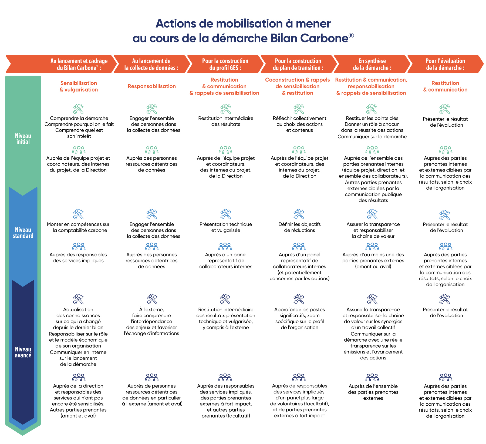

# 3.1 - Scheduling the engagement phases

<figure><figcaption>
Source: Freepik
</figcaption></figure>

The method defines the expected outcomes, i.e. the messages and content to be delivered within the framework of [Stakeholder Engagement](https://app.gitbook.com/s/GBSULMB7RDjF3KmSrnc9/3-mobilisation-des-parties-prenantes).

Conversely, the method is designed to be flexible and does not impose specific means, tools or formats. [Resources](../../annexes/annexes/annexe-9-ressources-pour-la-mobilisation/) are provided in the appendix to give some inspiring examples.

Here are the various recommendations for **adapting** the engagement phases to the different [maturity levels](../../1-cadrage-de-la-demarche/1.1-definir-son-niveau-de-maturite-bilan-carbone-r.md)**, steps, stakeholders and organisational profiles.**

<figure><figcaption>
Figure 3.1: Engagement actions to be carried out during the Bilan Carbone® approach.
</figcaption></figure>

<mark style="color:$info;">🌐</mark> [_<mark style="color:$info;">English version</mark>_](https://abc-transitionbascarbone.fr/wp-content/uploads/2025/11/Stakeholder-engagement-actions.png) _<mark style="color:$info;">of this image.</mark>_

These recommendations make it possible to comply with the [requirements](../3-introduction-a-la-mobilisation.md#exigences-relatives-aux-etapes-de-mobilisation) in terms of Engagement. They are detailed in the following sub-sections.

***

_Do you have a question? [Consult the FAQ](../../annexes/faq.md). The method is a living document and may therefore evolve (clarifications, additions): find the [change history here](../../avant-propos/historique-et-suivi-des-modifications.md)._
