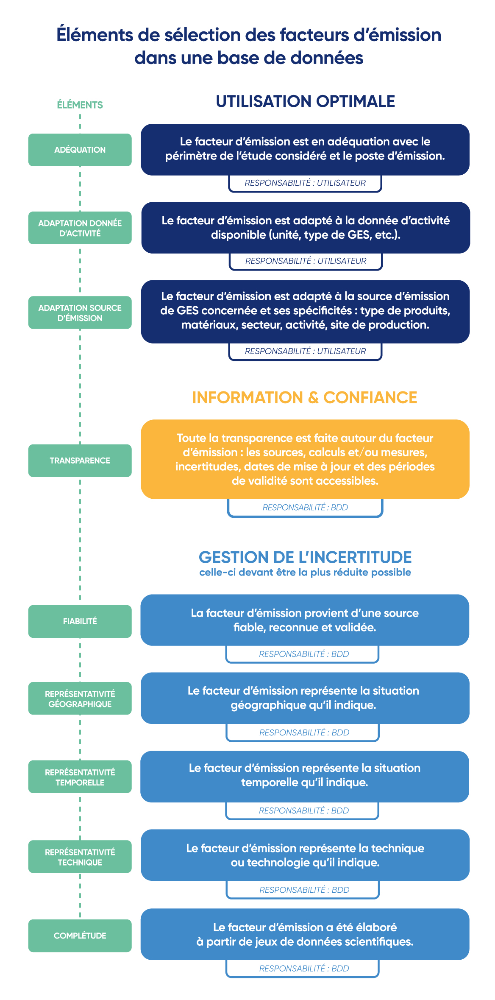

# 4.3 - Emission Factor Selection Method

<figure><figcaption>
Source: Midjourney
</figcaption></figure>

This sub-section details what an emission factor is, how to choose or develop one from available information, and provides some examples of emission factor [databases](../annexes/annexes/annexe-2-exemples-de-bases-de-donnees-de-facteurs-demission.md) (DB).&#x20;


As a reminder, the emissions from each emission source of the organisation are estimated as follows:&#x20;

Emission from a source = [Activity data](4.2-methode-de-collecte-des-donnees-dactivite.md) x [Emission factor](4.3-methode-de-selection-des-facteurs-demission.md) = [Result](4.5-profil-demission.md) ± [Uncertainty](4.4-methode-destimation-des-incertitudes/)


## Emission Factors

The [emission quantification method](4.1-methode-de-quantification-des-emissions.md) involves defining emission factors (EFs) to convert an organisation's activity data into tCO₂e. These EFs represent the average quantity of GHGs emitted per reference unit. They do not allow GHG emissions to be measured, but rather to be estimated. They typically take the following form:&#x20;


EF apricot, pitted, raw = 0.88 kgCO₂e/kg (source: Agribalyse®)&#x20;


By multiplying this EF by the number of kilograms of raw pitted apricots consumed by an organisation, it will obtain the GHG emissions associated with that consumption. EFs are therefore essential for carbon accounting, but must be handled with care.&#x20;

Indeed, EFs are developed from assumptions and the resulting studies. An EF covers a specific temporal, geographical and technical scope. The emission factors for the French average electricity mix, for example, only apply to France, and differ between years. It is therefore always important to ensure that the most appropriate EF is chosen for the situation.

## Selection of Emission Factors

Not all EFs are of equal quality, so they must be carefully chosen to achieve **precise** accounting. In general, the larger the scope an EF covers, the less precise it is, and vice versa.

Thus, when choosing EFs, the organisation must:&#x20;

* Choose or develop EFs of the best possible quality, in accordance with the various criteria set out above.
* Document and retain all EFs used, including in particular their source, the units and [uncertainty](4.4-methode-destimation-des-incertitudes/) associated (all characteristics), the associated documents (DB documentation, sources used, etc.) and any other information deemed relevant, in order to ensure that these emission factors are traceable and comparable from year to year.
* Balance efforts: Finding or developing a very precise EF for an emission source is often costly in terms of resources. It is important to take care with EF selection for significant emission sources. Focusing on action and reducing significant emissions is at the heart of the Bilan Carbone®.

### Data collection matrix

This documentation of emission factors is done in parallel with the documentation on the activity data used, in particular by including all this information in the [data collection matrix](4.2-methode-de-collecte-des-donnees-dactivite.md#matrice-de-collecte-des-donnees), which allows the corresponding AD and EFs to be matched.

## The Different Types of Emission Factors

The different scenarios an organisation will encounter when selecting emission factors are detailed below.

### EFs from databases&#x20;

A number of EFs are available in databases (DBs), some of which are [listed in the following section](../annexes/annexes/annexe-2-exemples-de-bases-de-donnees-de-facteurs-demission.md).&#x20;

:mag\_right: _The reference database for France is the_ [_Base Empreinte®_](../annexes/annexes/annexe-2-exemples-de-bases-de-donnees-de-facteurs-demission.md) _of the Agence de l'Environnement et la Maîtrise de l'Énergie (_[_ADEME_](../annexes/glossaire.md#a)_)._

Here are a number of elements to take into account, which must be considered by the organisation in order to choose the best possible EF from a DB. These **selection elements** may be the responsibility of the organisation or of the DB (but the organisation is responsible for its choice of DB). When several EFs are available for the same emission source, the organisation must refer to these elements to decide.&#x20;

<figure><figcaption>
Figure 4.3: Selection elements for emission factors in a database.
</figcaption></figure>

<mark style="color:$info;">🌐</mark> [_<mark style="color:$info;">English version</mark>_](https://abc-transitionbascarbone.fr/wp-content/uploads/2025/11/Elements-to-consider.png) _<mark style="color:$info;">of this image.</mark>_

### EFs developed by the organisation

In cases where no EF is available for the emission source considered, or to improve the precision or representativeness of an EF, the organisation may:&#x20;

* Approximate this emission source to another similar emission source. This degrades the representativeness of the EF and will lead to less precise quantification. The organisation must therefore use an [uncertainty](4.4-methode-destimation-des-incertitudes/4.4.2-comment-les-determiner.md) greater than that of the similar EF chosen.&#x20;
* Develop its own emission factor for the emission source considered.

To develop an emission factor, the organisation must carry out a relevant life cycle assessment (LCA) and use the "Climate Change" indicator. Note that it is necessary to follow the EF creation methodological recommendations of the database most used by the organisation in order to maintain homogeneity among the EFs used.

Following the LCA, the emission factor will in principle be as representative and precise as possible, as it is specific to the organisation's emission source. An uncertainty derived from the LCA must be associated with the EF obtained.

If this is not possible, the organisation can develop its own EF from, for example, the various raw materials used to create the product (via their respective EFs) or from the carbon accounting of the manufacturer of said products. In the case of a product that requires machining, manufacturing or assembly phases, the organisation can add a certain percentage to the EFs of the various raw materials, to account for the additional emissions linked to these phases. In all cases, it will be necessary to assign a high uncertainty rate to this EF.

### Monetary ratio EFs&#x20;

Some EFs take the form of values in kgCO₂e/k€ spent, which are notably [proposed by several DBs](../annexes/annexes/annexe-2-exemples-de-bases-de-donnees-de-facteurs-demission.md). They are called "[Monetary ratios](../annexes/glossaire.md#ratios-monetaires)", or "Non-specific monetary ratios".&#x20;

While they have the advantage of being usable with data easily accessible to the organisation ([financial activity data](4.2-methode-de-collecte-des-donnees-dactivite.md#les-donnees-dactivite-comptables) from the organisation's standard accounting), these EFs have two major drawbacks in carbon accounting:&#x20;

* There are very few of them, and they are derived from averages across many products, and are consequently associated with very high uncertainties. They are also sensitive to [inflation](../annexes/glossaire.md#i) and not always representative of the activity. For example, the monetary ratio "land transport" in kgCO2e/k€ can be used for any land vehicle in the same way, even though cost is not representative of the GHG emission differences between one vehicle and another.
* They do not allow the impact of actions to be tracked from one assessment to the next. With an assessment calculated from monetary ratios, the only lever for decarbonisation becomes the reduction of the spending amount. Yet responsible purchasing policies (local, sustainable purchasing) are often more costly, which will lead to an increase in the assessment if these purchases are accounted for via monetary ratio EFs.

An organisation can create its own monetary ratio, for example from the carbon accounting of its stakeholders. These EFs are called "[Specific monetary ratios](../annexes/glossaire.md#ratios-monetaires-specifiques)". However, even if the associated uncertainties are low (monetary ratio developed specifically for an emission source), this does not allow for fine-tuned management of actions, as the only lever for decarbonisation becomes the reduction of the spending amount.&#x20;

It is therefore strongly recommended **not to use** monetary ratio EFs. These EFs may occasionally be used for the following emission sources:&#x20;

* Use of service and intellectual services activities (lawyers, consulting, etc.), but the organisation will need to develop "Specific monetary ratio" EFs as it grows in maturity.
* Non-significant emission sources for which data is difficult to access (e.g. small office supplies). The organisation will nonetheless need to move away from monetary ratios for these emission sources as it grows in maturity.&#x20;

In cases where the organisation does use monetary ratios, it can [correct](../annexes/annexes/annexe-1-grands-principes-de-comptabilisation-du-bilan-carbone-r.md) these monetary ratios to account for inflation applied to its purchases or rental of goods and services.

## Requirements relating to the selection of emission factors

Here are the various requirements to be met in terms of EF selection for each of the 3 [maturity levels](../1-cadrage-de-la-demarche/1.1-definir-son-niveau-de-maturite-bilan-carbone-r.md).

Initial Level: criterion L1

The share of emissions calculated using monetary ratio emission factors (specific and non-specific) must be reported. It is recommended not to calculate more than 30% of the total assessment emissions via monetary ratios.

The use of non-specific monetary ratios must be justified. In the case of non-significant emission categories or service provisions, the use of these monetary ratios is tolerated by default.

The organisation must build a solid documentation process that will enable the selection of emission factors to be improved for future Bilan Carbone® exercises. If done precisely, the data collection matrix can form an integral part of this documentation.

Standard Level: criterion L2

The use of monetary ratios must progressively decrease, notably through the calculation of monetary ratios specific to the organisation's partners, service providers or suppliers. The emission factors used must be refined as the organisation grows in maturity on carbon topics.&#x20;

The share of emissions calculated using monetary ratio emission factors (specific and non-specific) must be reported.&#x20;

It is recommended not to calculate more than 20% of the total assessment emissions via specific monetary ratios.

The use of non-specific monetary ratios must be justified. Ideally, all non-specific monetary ratios are excluded. It is recommended not to calculate more than 10% of the total assessment emissions via non-specific monetary ratios: any exceedance must be subject to detailed justification.&#x20;

The organisation must build a solid documentation process that will enable the selection of emission factors to be improved for future Bilan Carbone® exercises. If done precisely, the data collection matrix can form an integral part of this documentation.

Advanced Level: criterion L3

The use of monetary ratios must continue to decrease, notably through the calculation of monetary ratios specific to the organisation's partners, service providers or suppliers. The emission factors used must be refined as the organisation grows in maturity on carbon topics.&#x20;

The share of emissions resulting from a calculation using specific and non-specific monetary ratio emission factors is reported. It is recommended not to calculate more than 10% of the total assessment emissions via specific ratios and not to use any non-specific ratios.

The use of non-specific monetary ratios must be particularly well justified, and in the vast majority of cases excluded.&#x20;

The organisation must have **developed** specific emission factors for key emission categories.

The organisation must build a solid documentation process that will enable the selection of emission factors to be improved for future Bilan Carbone® exercises. If done precisely, the data collection matrix can form an integral part of this documentation.

---

_Do you have a comprehension question?_ [_Consult the FAQ_](../annexes/faq.md)_. The method is living and therefore subject to change (clarifications, additions): find the_ [_change log here_](../avant-propos/historique-et-suivi-des-modifications.md)_._
