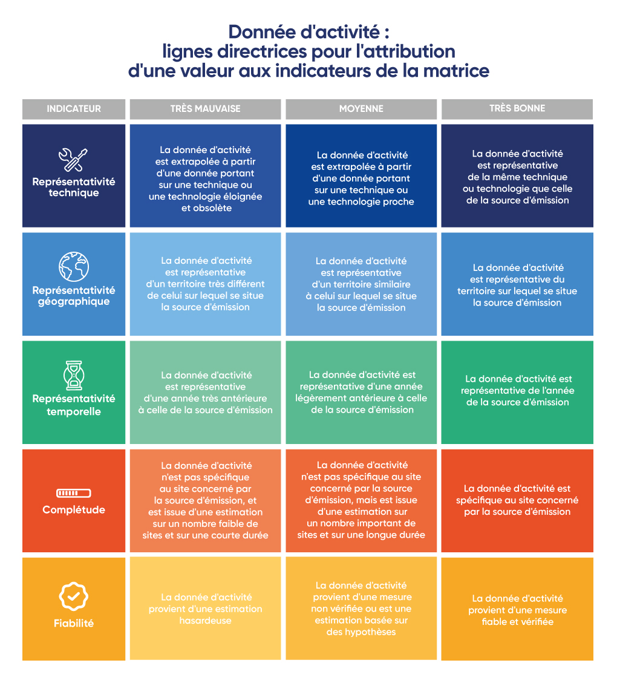

# 4.4.2 - How to Determine Them?

<figure><figcaption>
Source: Freepik
</figcaption></figure>

Uncertainties within a Bilan Carbone® take two different forms. The [first](4.4.2-comment-les-determiner.md#determination-qualitative) is **qualitative**, meaning that characteristics are defined for activity data and emission factors, then rated qualitatively. The [second](4.4.2-comment-les-determiner.md#determination-quantitative) is **quantitative**, derives from the qualitative information and leads to the determination of a 95% confidence interval.&#x20;

## Reporting formats

Taking uncertainties into account leads to three different but correlated forms of results:

1. A qualitative uncertainty on GHG emissions, ranging from "Very high" to "Very low"
2. A 95% confidence interval, i.e. an interval \[Lower Bound; Upper Bound] within which the result has a 95% probability of being contained
3. A percentage value, meaning that the result is potentially .png>)% **greater** than its value: .png>)

These three forms of results are complementary and allow uncertainties to be reported to audiences with different levels of understanding of these issues.

## Qualitative determination

The qualitative determination of uncertainties for an emission source involves completing two matrices, one for the emission factor and one for the activity data. To fill in these two matrices, the organisation must assign a **quality score** (Very good, Good, Average, Poor, Very poor) to each of the five **characteristics** of the activity data or emission factor. The meaning of the different characteristics is detailed below.&#x20;

| Characteristic              | Quality    |
| --------------------------- | ---------- |
| Technical correlation | Very good  |
| Geographic correlation | Good    |
| Temporal correlation | Average    |
| Completeness                | Poor       |
| Reliability                 | Very poor  |

The five characteristics used are as follows:

* **Technical correlation:** This characteristic assesses whether the value is representative of the current state of the techniques and technologies used. \
  EF: Assesses whether technological advances have occurred since the emission factor was created.\
  AD: Assesses whether the activity data comes from a different or obsolete technology. 
* **Geographic correlation:** This characteristic assesses whether the value is well suited to the geographical location of the emission source.\
  EF: Assesses whether the emission factor applies to a different territory than that of the emission source.\
  AD: Assesses whether the activity data comes from a different territory.
* **Temporal correlation:** This characteristic assesses whether the value is up to date for the emission source. \
  EF: Assesses whether the emission factor is sufficiently up to date, whether its validity period has expired, or whether changes have occurred since the emission factor was created.\
  AD: Assesses whether the activity data used comes from a different year than the year in which the assessment was carried out.
* **Completeness:** This characteristic assesses whether the value is statistically representative of the emission source. \
  EF: Assesses whether the emission factor is developed from a representative dataset.\
  AD: Assesses whether the activity data comes from statistical averages or extrapolations based on an insufficient number of data points.
* **Reliability:** This characteristic determines whether the method used to collect the activity data and the source from which the emission factor is derived are reliable. \
  EF: Assesses whether the emission factor comes from an unqualified or unreliable source.\
  AD: Assesses whether the activity data is derived from a rough or even hazardous estimate rather than from precise measurement.

### For an emission factor:

If the emission factor (EF) comes from a database that uses uncertainties, the matrix must be taken or completed from the database's information.&#x20;

> :mag\_right: _For the_ [_Base Empreinte®_](../../annexes/annexes/annexe-2-exemples-de-bases-de-donnees-de-facteurs-demission.md)_, for example, users can use as-is the scores associated with the EF characteristics on the database. These scores evaluate the EF's capacity to represent what it claims to be._

On the other hand, the organisation may use an emission factor that is not entirely suited to the emission source in question. Thus, for organisations wishing to be more precise in their consideration of uncertainties, it may be relevant to adjust and reassess the scores of the different characteristics from the databases.

**Example:** The emission factor for a Spanish orange comes from a very high-quality LCA, and all its scores show "Very good". An organisation that uses this emission factor for oranges from another country should ideally downgrade the score associated with the "Geographic correlation" characteristic.&#x20;

If the emission factor does not come from a database that uses uncertainties, the matrix must be established from the documentation provided on the EF. If no documentation is available, the scores associated with the EF in the matrix must be low.

> ⏳\[[WIP](../../#structures-des-informations-specifiques)] A practical example of completing (qualitative and quantitative) the uncertainty will be available shortly, [in the annex](../../annexes/annexes/annexe-3-exemple-de-determination-de-lincertitude.md).

A guide for completing the matrix for an emission factor is given below.

<figure><figcaption>
Figure 4.4.2 - 1: Emission factor: guidelines for assigning a value to matrix indicators
</figcaption></figure>

<mark style="color:$info;">🌐</mark> [_<mark style="color:$info;">English version</mark>_](https://abc-transitionbascarbone.fr/wp-content/uploads/2025/11/Emission-factor.png) _<mark style="color:$info;">of this image.</mark>_

### **For activity data:**&#x20;

For activity data (AD), the organisation must assign a score to the activity data used.&#x20;

**Example:** The organisation's data is a number of kWh from the twelve invoices associated with the chosen time scope. The organisation assigns the score "Very good" to this activity data.

On the other hand, for organisations wishing to be more precise in their consideration of uncertainties, it is possible, as with emission factors, to assign a score to each of the five characteristics of the matrix.&#x20;

> ⏳\[[WIP](../../#structures-des-informations-specifiques)] A practical example of completing (qualitative and quantitative) the uncertainty will be available shortly, [in the annex](../../annexes/annexes/annexe-3-exemple-de-determination-de-lincertitude.md).&#x20;

> :mag\_right: _Uncertainty matrices completed for standard collection methods will shortly be available on the_ [_Plan Carbone Général_](../../annexes/bibliographie/#guides-pratiques-de-comptabilisation)_._

A guide for completing the matrix for activity data is given below.

<figure><figcaption>
Figure 4.4.2 - 2: Activity data: guidelines for assigning a value to matrix indicators
</figcaption></figure>

<mark style="color:$info;">🌐</mark> [_<mark style="color:$info;">English version</mark>_](https://abc-transitionbascarbone.fr/wp-content/uploads/2025/11/Activity-data.png) _<mark style="color:$info;">of this image.</mark>_

## Quantitative determination&#x20;

The quantitative determination of uncertainties requires no additional effort from the organisation. The Bilan Carbone® tools use the qualitative determination of uncertainties to arrive automatically at this quantitative determination. For this quantitative approach, it is assumed that the uncertainty distribution laws are [log-normal](../../annexes/glossaire.md#loi-log-normale).

The matrices obtained via the qualitative determination serve as the basis for the quantitative determination. Coefficients are associated with each quality for each characteristic according to the matrix below:&#x20;

<table data-full-width="true"><thead><tr><th>Characteristic</th><th align="center">Score</th><th align="center">Coefficient (Ecoinvent 1)</th></tr></thead><tbody><tr><td>Technical correlation</td><td align="center">
Very poor

Poor

Average

Good

Very good 
</td><td align="center">
U1 = 2.00 U1 = 1.50

U1 = 1.20

U1 = 1.10* U1 = 1.00 *Coefficient assigned by ABC
</td></tr><tr><td>Geographic correlation</td><td align="center">
Very poor

Poor

Average

Good

Very good 
</td><td align="center">
U2 = 1.10 U2 = 1.05*

U2 = 1.02

U2 = 1.01 U2 = 1.00 *Coefficient assigned by ABC
</td></tr><tr><td>Temporal correlation</td><td align="center">
Very poor

Poor

Average

Good

Very good
</td><td align="center">
U3 = 1.50 U3 = 1.20

U3 = 1.10

U3 = 1.03 U3 = 1.00
</td></tr><tr><td>Completeness</td><td align="center">
Very poor

Poor

Average

Good

Very good
</td><td align="center">
U4 = 1.20 U4 = 1.10

U4 = 1.05

U4 = 1.02 U4 = 1.00
</td></tr><tr><td>Reliability</td><td align="center">
Very poor

Poor

Average

Good

Very good
</td><td align="center">
U5 = 1.50 U5 = 1.20

U5 = 1.10

U5 = 1.05 U5 = 1.00
</td></tr></tbody></table>

The geometric standard deviations (GSD) associated with the activity data and the emission factor are then calculated using the following formula:

<figure><figcaption>
GSD calculation for an emission factor or activity data
</figcaption></figure>

These two geometric standard deviations are then combined to obtain a standard deviation for the emission source, using the following formula:

<figure><figcaption>
GSD calculation for an emission source
</figcaption></figure>

Using this geometric standard deviation, the organisation obtains the 95% confidence interval for the emission source, which is as follows:&#x20;

<figure><figcaption>
Confidence interval
</figcaption></figure>

The lower value of this interval is called the "Lower Bound", and the higher value is called the "Upper Bound". It is then possible to propagate these uncertainties associated with the various emission sources to obtain uncertainties for an emission subcategory, an emission category or for the entire assessment.&#x20;

For a given emission source, its sensitivity is defined as its weight in the total assessment. Given E1 as the value of an emission source and T as the total value of the assessment, the sensitivity S1 of emission source E1 is:&#x20;

<figure><figcaption>
Sensitivity calculation
</figcaption></figure>

Given E1 and E2 as the values of two emission sources, S1 and S2 their respective sensitivities and GSD(E1) and GSD(E2) their respective geometric standard deviations, the geometric standard deviation for E1 + E2 is:&#x20;

<figure><figcaption>
GSD propagation formula.
</figcaption></figure>

The 95% confidence interval is then obtained using the same method as previously.

> <mark style="background-color:blue;">⏳\[</mark>[<mark style="background-color:blue;">WIP</mark>](../../#structures-des-informations-specifiques)<mark style="background-color:blue;">] A practical example of completing (qualitative and quantitative) the uncertainty will be available shortly,</mark> [<mark style="background-color:blue;">in the annex</mark>](../../annexes/annexes/annexe-3-exemple-de-determination-de-lincertitude.md)<mark style="background-color:blue;">.</mark>&#x20;

## Requirements relating to uncertainties&#x20;

Here are the various requirements to be met in terms of consideration of uncertainties for each of the 3 [maturity levels](../../1-cadrage-de-la-demarche/1.1-definir-son-niveau-de-maturite-bilan-carbone-r.md).

Initial Level: criterion M1

The organisation must qualify and quantify the uncertainties for all direct GHG emissions and [significant indirect emissions](../../2-perimetre-de-la-demarche/2.4-perimetre-operationnel.md#la-notion-demissions-indirectes-significatives) of the Bilan Carbone® (as a reminder, this represents at least 80% of emissions).

The qualitative determination of uncertainty can be carried out:&#x20;

* **by assigning a single** quality score (Very good, Good, Average, Poor, Very poor) to each relevant activity data point. This overall score is therefore representative of and consistent with all 5 characteristics.
* **by using as-is** the scores of emission factors from databases.

The quantitative determination of uncertainty is automatically calculated from the qualitative determination.

Standard Level: criterion M2

The organisation must qualify and quantify the uncertainties for all direct GHG emissions and [significant indirect emissions](../../2-perimetre-de-la-demarche/2.4-perimetre-operationnel.md#la-notion-demissions-indirectes-significatives) of the Bilan Carbone® (as a reminder, this represents at least 80% of emissions).

The qualitative determination of uncertainty can be carried out:&#x20;

* by assigning a single quality score (Very good, Good, Average, Poor, Very poor) to each relevant activity data point. However, it is **recommended** to assign a score to each of the 5 characteristics (technical, geographical, and temporal correlation, completeness and reliability), i.e. 5 scores for each activity data point responsible for the **most significant** emissions in the assessment.
* by using as-is the scores of emission factors from databases. However, it is **recommended** to adjust these scores when the actual use is not exactly within the scope of application intended by the database.

The quantitative determination of uncertainty is automatically calculated from the qualitative determination.

Advanced Level: criterion M3

The organisation must qualify and quantify the uncertainties for all emissions in the Bilan Carbone®.

The organisation must systematically use the five characteristics for activity data and modify the scores assigned to emission factors by databases when relevant.

The qualitative determination of uncertainty **must** systematically be carried out:&#x20;

* by assigning a quality score (Very good, Good, Average, Poor, Very poor) **to each of the 5 characteristics** (technical, geographical, and temporal correlation, completeness and reliability), for each activity data point used.
* **by adjusting the scores** of emission factors from databases when necessary (when the actual use is not exactly within the scope of application intended by the database).

The quantitative determination of uncertainty is automatically calculated from the qualitative determination.

---

_Do you have a comprehension question?_ [_Consult the FAQ_](../../annexes/faq.md)_. The method is living and therefore subject to change (clarifications, additions): find the_ [_change log here_](../../avant-propos/historique-et-suivi-des-modifications.md)_._
