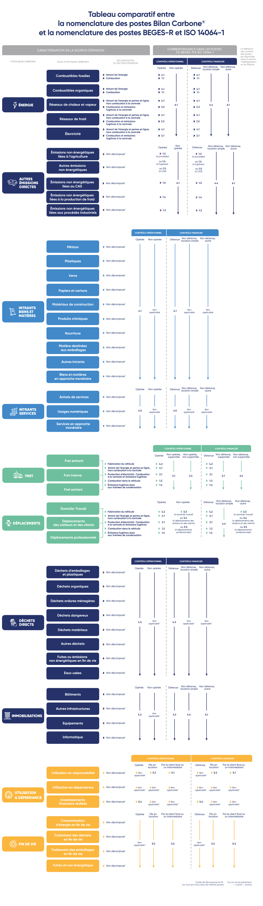
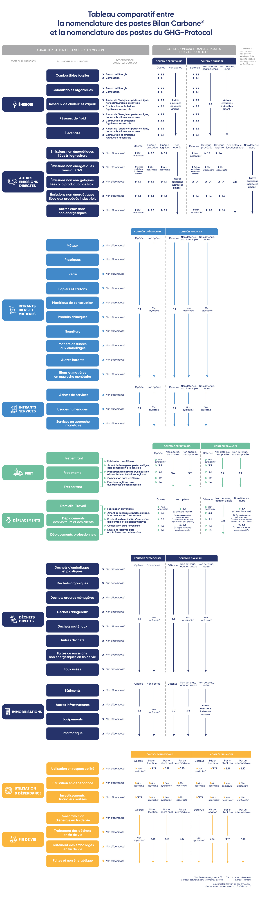

# 4.5 - Profil d'émission

<figure><figcaption>
Source : Freepik
</figcaption></figure>


Pour rappel, les émissions de chaque source d'émission de l'organisation sont estimées de la façon suivante :&#x20;

Émission d'une source = [Donnée d'activité](4.2-methode-de-collecte-des-donnees-dactivite.md) x [facteur d'émission](4.3-methode-de-selection-des-facteurs-demission.md) = [résultat](4.5-profil-demission.md) ± [incertitude](4.4-methode-destimation-des-incertitudes/)


Cette sous-section ne traite que du profil d'émission, c'est-à-dire de l'agrégation et de la présentation des résultats pour l'ensemble des sources d'émissions comprises au sein des périmètres définis précédemment, obtenus à l'issue de l'étape de comptabilisation, et qui alimentent la [restitution intermédiaire](4-introduction-a-la-comptabilisation-des-emissions.md#mobilisation-relative-aux-etapes-de-comptabilisation).&#x20;

L'[étape de restitution ](https://app.gitbook.com/s/GBSULMB7RDjF3KmSrnc9/6-synthese-et-restitution)finale présente le reste des livrables attendus à l'issue de la démarche.

## Profil d'émission au format Bilan Carbone®&#x20;

Les émissions de l'ensemble des activités de l'organisation doivent être réparties sur les 10 postes et 48 sous-postes d'émissions du Bilan Carbone®. Ces postes reflètent les grands flux de l'organisation et apportent une vision claire des domaines sur lesquels il est prioritaire d'agir.&#x20;

Chaque émission ne doit être comptabilisée que dans un seul sous-poste (et donc dans un seul poste). Pour chaque sous-poste, le profil d'émission doit afficher clairement :&#x20;

* Les émissions associées, en tCO2e ou en kgCO2e&#x20;
* Les incertitudes associées, sous le [format de restitution](4.4-methode-destimation-des-incertitudes/4.4.2-comment-les-determiner.md#formats-de-restitution) demandé
* La part d'émission comptabilisée via des ratios monétaires (spécifiques et non spécifiques), en pourcentage. L'organisation peut choisir de distinguer une part en ratios monétaires spécifiques et une part en ratios monétaires non spécifiques

Ce profil d'émission doit faire l'objet d'une [restitution](../3-mobilisation-des-parties-prenantes/3.1-programmer-les-phases-de-mobilisation/3.1.3-a-lissue-de-la-construction-du-profil-ges.md) aux parties prenantes adaptées.

Les sous-postes du Bilan Carbone® sont structurés de la manière suivante :&#x20;

<figure><figcaption>
Figure 4.5.1 : Nomenclature des postes et sous-postes du Bilan Carbone®.
</figcaption></figure>

<mark style="color:$info;">🌐</mark> [_<mark style="color:$info;">English version</mark>_](https://abc-transitionbascarbone.fr/wp-content/uploads/2025/11/Classification-of-BC.png) _<mark style="color:$info;">of this image.</mark>_

Les définitions des postes, des sources d'émissions qu'ils incluent et des grands principes de comptabilisation associés sont détaillés en [Annexe](../annexes/annexes/annexe-1-grands-principes-de-comptabilisation-du-bilan-carbone-r.md).


Il est recommandé de présenter le profil d'émission final **avec et sans** le sous-poste "Utilisation en dépendance". Les 2 résultats sont complémentaires et le Bilan Carbone® doit permettre de fournir des indicateurs adaptés à chaque levier d'action.

Ces deux sous-postes mènent à des analyses et donc des [actions](../5-plan-de-transition/5.2-construction-du-plan-daction.md) différentes au sein du plan de transition. Le sous-poste "Utilisation en responsabilité" mènera généralement vers des actions améliorant l'efficacité énergétique des produits (sur leur phase utilisation), le poids des produits, ou réduisant la consommation de matière induite par l'utilisation du produit ou du service. A l'inverse, le sous-poste "Utilisation en dépendance" vise des [actions ](../5-plan-de-transition/5.2-construction-du-plan-daction.md#les-differentes-categories-dactions)plus [stratégiques](../5-plan-de-transition/5.2-construction-du-plan-daction.md#les-differentes-categories-dactions) : résilience du modèle économique, ou actions menées en coopération avec la chaine de valeur aval pour réduire les émissions de ce poste.



Il est recommandé de personnaliser le profil d'émission de l'organisation, afin de faciliter au maximum la bonne compréhension des résultats et l'élaboration du plan de transition par la suite. Cette personnalisation peut par exemple inclure les actions suivantes :&#x20;

* Renommer un poste ou un sous-poste pour le mettre en accord avec la réalité interne de l'organisation. Par exemple, le sous-poste "Fret sortant" pourra être renommé en "Distribution des produits".
* Fusionner certains postes ou sous-postes entre eux
* Séparer certains postes ou sous-postes en plusieurs postes ou sous-postes distincts

L'organisation doit brièvement justifier ses choix si ceux-ci implique une variation vis-à-vis du format présenté ci-dessus.

:mag\_right: _La personnalisation du profil d'émission peut se baser sur une lecture dite "_[_analytique_](4.5-profil-demission.md#comptabilite-carbone-analytique)_"._


Pour analyser correctement les résultats de cette étape de comptabilisation et ainsi préparer l'élaboration du plan de transition, il est recommandé que l'organisation enrichisse également  son profil d'émission :&#x20;

* En établissant des graphiques ou des visuels mettant en avant les différents résultats obtenus et les points méritants une attention particulière&#x20;
* En établissant des graphiques ou des visuels vulgarisant les résultats, par exemple en comparant les ordres de grandeur des émissions obtenues à des activités de référence (par exemple combustion d'un litre de pétrole, trajet en avion)
* En détaillant la répartition des émissions au sein de chacun des postes du bilan, et en analysant de manière plus ou moins détaillée ces résultats pour chaque poste, en fonction de l'importance dudit poste au sein du Bilan Carbone®. Les trois postes les plus importants du bilan doivent faire l'objet d'une analyse détaillée
* En établissant des indicateurs complémentaires issus des résultats obtenus. Quelques exemples classiques incluent : &#x20;
  * Une intensité carbone par k€ de chiffre d'affaire, en tCO2e/k€ ou kgCO2e/k€
  * Une intensité carbone par équivalent temps plein (ETP), en tCO2e/ETP ou kgCO2e/ETP
  * Une intensité carbone par unité d'œuvre, en tCO2e/unité ou kgCO2e/unité
* En faisant le lien entre les émissions et les données d'activité ou les facteurs d'émission impliqués lorsque cela est pertinent


Pour un niveau Standard ou Avancé, il est recommandé de reporter les données d'activité et les émissions associées sur la [cartographie des flux](../2-perimetre-de-la-demarche/2.4-perimetre-operationnel.md#exigences-relatives-a-la-cartographie-des-sources-demissions), afin d'obtenir une [cartographie des flux quantifiée](../2-perimetre-de-la-demarche/2.4-perimetre-operationnel.md#optionnel-cartographie-quantifiee-des-flux).


## Autres formats du profil d'émission

L'organisation peut présenter ces résultats aux formats attendus par d'autres méthodes de comptabilité carbone, en s'aidant des tableaux de correspondance ci-dessous. L'ensemble des [outils Bilan Carbone®](../formation-et-outils-dapplication-de-la-methode/outils-bilan-carbone-r-tableurs-et-logiciel.md) permet d'exporter les résultats dans ces formats. Pour que ces exports fonctionnent, l'organisation devra caractériser chaque source d'émission dans ces outils. Cette [caractérisation](../annexes/glossaire.md#c) dépend du type de contrôle choisit par l'organisation. Pour plus de détail, l'organisation devra se référer aux méthodologies concernées. \
\
Il est recommandé d'exporter l'ensemble des GES comptabilisés lors du Bilan Carbone®, même ceux qui sont relatifs à des postes facultatifs dans certains standards.

### BEGES-R&#x20;

Si l'organisation désire présenter ces résultats au format GHG Protocol, elle doit publier ses émissions en tCO2e, en incluant les GES suivants : CO₂, CH₄, N₂O, NF₃, SF₆, [HFCs](../annexes/glossaire.md#hydrofluorocarbures), [PFCs](../annexes/glossaire.md#perfluorocarbures), CO₂b. Ces émissions doivent être décomposées par type de GES.

Elle pourra s'aider du tableau de correspondance suivant pour obtenir son profil d'émission au format BEGES-R :&#x20;

<figure><figcaption>
Figure 4.5.2 : Tableau comparatif entre la nomenclature des postes Bilan Carbone® et la nomenclature des postes BEGES-R et ISO 14064-1.
</figcaption></figure>

### CSRD (ESRS E1-6 et E1-5)

Pour un export visant à répondre à la CSRD (ESRS E1-6), l'organisation peut au choix utiliser le format [GHG-Protocol](4.5-profil-demission.md#ghg-protocol) ou le format [ISO 14064-1](4.5-profil-demission.md#iso-14064-1). Elle doit en revanche également prendre en compte le NF₃.

Pour un export CSRD, l'organisation doit également fournir certaines données d'activité afin de répondre aux exigences de l'ESRS E1 (E1-5). Le tableau ci-dessous indique les données d'activité issues du Bilan Carbone® et pouvant être utilisées pour répondre à ces exigences.&#x20;

> ⏳\[[WIP](../#structures-des-informations-specifiques)] Une prochaine ressource sera produite et mise à disposition pour fournir un tableau de correspondance entre les données d'activité du Bilan Carbone® et l'ESRS E1-5. Ces correspondances seront intégrées aux exports des outils Bilan Carbone®.

### GHG Protocol

Si l'organisation désire présenter ces résultats au format GHG Protocol, elle doit publier ses émissions en tCO2e, en incluant les GES suivants :  CO₂, CH₄, N₂O, [HFCs](../annexes/glossaire.md#hydrofluorocarbures), [PFCs](../annexes/glossaire.md#perfluorocarbures), SF₆. La prise en compte du CO₂b et des autres gaz est facultative. Ces émissions doivent être décomposées par type de GES.

Elle pourra s'aider du tableau de correspondance suivant pour obtenir son profil d'émission au format GHG Protocol :&#x20;

<figure><figcaption>
Figure 4.5.4 : Tableau comparatif entre la nomenclature des postes Bilan Carbone® et le GHG Protocol.
</figcaption></figure>

### ISO 14064-1

Si l'organisation désire présenter ces résultats au format ISO 14064-1, elle devra publier :&#x20;

* Les émissions en tCO2e, en incluant les GES suivants : CO₂, CH₄, N₂O, NF₃, SF₆, autres gaz appropriés ([HFCs](../annexes/glossaire.md#hydrofluorocarbures), [PFCs](../annexes/glossaire.md#perfluorocarbures)) et CO₂b. Ces émissions doivent être décomposées par type de GES pour les émissions directes.&#x20;
* Les suppressions de GES, en tCO2e

L'organisation pourra s'aider du tableau de correspondance entre les postes Bilan Carbone® et les postes BEGES-R et ISO 14064-1 ([se trouvant plus haut dans cette page](4.5-profil-demission.md#beges-r)) pour obtenir son profil d'émission au format ISO 14064-1.

### Comptabilité Carbone Analytique

Si l'organisation utilise la comptabilité analytique, les émissions seront réparties selon les codes comptables et les [axes analytiques](../annexes/glossaire.md), établis spécifiquement pour l'organisation, qui reflètent aux mieux la structure et le mode de fonctionnement de celle-ci (activités réalisées, processus internes, etc.). Des axes analytiques différents peuvent être utilisés pour chaque poste d’émission (par exemple les achats peuvent être repartis par fournisseur, et l’énergie par site)

Par conséquent, un tableau de correspondance générique ne peut être envisagé.

Néanmoins, l'organisation pourra trouver ci-dessous un tableau de correspondance listant l'ensemble des codes comptables qui seront à passer en revue dans le but d'identifier les sources d'émissions qui doivent être considérées au sein du Bilan Carbone®. Lorsqu'une source d'émission ne donne pas lieu à des dépenses monétaires (émissions non supportées), elle reste évidemment à prendre en compte au sein du Bilan Carbone®.

Le tableau ci-dessous présente la correspondance avec la nomenclature d'un plan comptable.

<figure><figcaption>
Figure 4.5.3 : Tableau comparatif entre la nomenclature des postes Bilan Carbone® et la nomenclature des codes comptables et analytiques.
</figcaption></figure>

> ⏳\[[WIP](../#structures-des-informations-specifiques)] Ces correspondances seront intégrées aux exports des outils Bilan Carbone®.

## Exigences relatives à la production du profil d'émission

Voici les exigences à atteindre, qui sont similaires pour les 3 [niveaux de maturité](../1-cadrage-de-la-demarche/1.1-definir-son-niveau-de-maturite-bilan-carbone-r.md) :

Niveau Initial, Standard ou Avancé : critères N1, N2, et N3

Pour ces trois niveaux de maturité, le profil d'émission doit être présenté au format Bilan Carbone®. Tout choix fait par l'organisation qui impliquerait une variation vis-à-vis de ce format doit-être brièvement justifié.

***

_Vous avez une question de compréhension ?_ [_Consultez la FAQ_](../annexes/faq.md)_. La méthode est vivante et donc susceptible d'évoluer (précisions, compléments) : retrouvez le_ [_suivi des modifications ici_](../avant-propos/historique-et-suivi-des-modifications.md)_._
