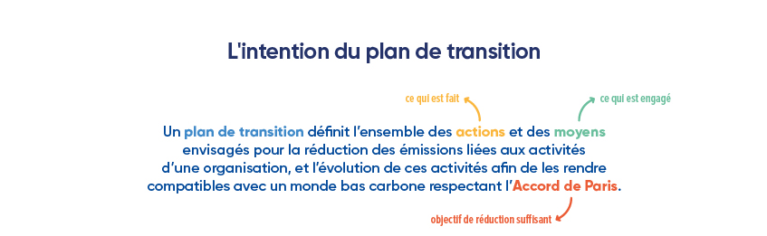

# 5 - Introduction au plan de transition

<figure><figcaption>
Figure 5.0.1 : L'intention du plan de transition
</figcaption></figure>

<mark style="color:$info;">🌐</mark> [_<mark style="color:$info;">English version</mark>_](https://abc-transitionbascarbone.fr/wp-content/uploads/2025/11/The-purpose-of-the-transition-plan_Lintention-du-plan-de-transition-1-scaled.png) _<mark style="color:$info;">of this image.</mark>_

Le Bilan Carbone®, après l'étape de comptabilisation, aboutit naturellement à l'élaboration d'un plan de transition, toute démarche de [démarche de comptabilité carbone](../introduction-a-la-transition-bas-carbone/quest-ce-quune-demarche-de-transition-bas-carbone.md) ayant vocation à permettre le passage à l'action.

Le plan de transition doit viser à décarboner autant que possible l'activité de l'organisation en réduisant au maximum ses émissions de GES. L'organisation doit penser son plan de transition comme une approche d'amélioration continue en considérant les atouts des démarches multicritères, ainsi que comme un moyen de réduire les risques en profitant des opportunités nouvelles liées à la transition énergie climat.

En s'appuyant sur son [profil d'émission de GES](../4-comptabilisation/4.5-profil-demission.md), son niveau de maturité et son niveau de [mobilisation](../3-mobilisation-des-parties-prenantes/3-introduction-a-la-mobilisation.md), l'organisation doit construire son plan de transition en suivant ces sous étapes :&#x20;

* Étape 5.1 : définir ses [objectifs](5.1-definition-des-objectifs.md) à court, moyen ou long terme.
  * Visualiser les [objectifs ](5.1-definition-des-objectifs.md)et trajectoires de référence dont l’ambition à l’échelle planétaire est celle de l’Accord de Paris.
  * Sélectionner une trajectoire de décarbonation descendante ou « [top-down](../annexes/glossaire.md#trajectoire-de-transition) », c’est-à-dire la trajectoire théorique que l’organisation devrait suivre.
* Étape 5.2 : Construire son [plan d’action](5.2-construction-du-plan-daction.md) et les fiches actions associées.
  * Ainsi qu'estimer l’impact prévisionnel de la mise en œuvre du plan d’action (potentiel de réduction).
* Étape 5.3 : Construire sa [trajectoire](5.3-definition-de-la-trajectoire-de-transition.md) de transition
  * Construire une trajectoire de transition ascendante ou « [bottom-up](../annexes/glossaire.md#trajectoire-de-transition) » en se servant du potentiel de réduction du plan d'action.
  * Vérifier la cohérence : la trajectoire bottom-up atteignable justifie la crédibilité des objectifs de référence (trajectoire top-down) à plus ou moins long terme selon la maturité de l’organisation.
* Étape 5.4 : Planifier la [mise en œuvre](5.4-mise-en-oeuvre-du-plan-de-transition.md) des actions.
* Étape 5.5 : Préparer le [suivi](5.5-suivi-et-pilotage-du-plan-de-transition.md) et le pilotage des actions.

<figure><figcaption>
Figure 5.0.2 : Chronologie de l'étape du plan de transition
</figcaption></figure>

<mark style="color:$info;">🌐</mark> [_<mark style="color:$info;">English version</mark>_](https://abc-transitionbascarbone.fr/wp-content/uploads/2025/11/Timeline-of-the-transition-plan_Chronologie-de-letape-du-Plan-de-Transition-scaled.png) _<mark style="color:$info;">of this image.</mark>_

> :mag\_right:_La définition du plan de transition et l'ensemble de l'_[_étape 5_](https://app.gitbook.com/s/GBSULMB7RDjF3KmSrnc9/5-plan-de-transition) _sont compatibles et inspirés du_ [_Guide pour la construction, la mise en œuvre et le suivi d'un plan de transition de l'ADEME_](../annexes/bibliographie/#ressources-sur-la-strategie-et-plan-de-transition)_, à la différence que le Bilan Carbone® formule des exigences progressives selon le niveau de maturité de l'organisation._

## Glossaire relatif au Plan de transition

L'ensemble des termes relatif aux étapes d'élaboration du plan de transition sont explicités dans le [glossaire](../annexes/glossaire.md). Il font l'objet d'un rappel ci-dessous :&#x20;

* Plan de transition : Un plan de transition définit l'ensemble des actions (ce qui est fait), et des moyens envisagés (ce qui est engagé) pour la réduction des émissions liées aux activités d'une organisation, et l'évolution de ces activités afin de les rendre compatibles avec un monde bas carbone (à un niveau suffisant) respectant l'Accord de Paris.
* Objectifs de transition : Dans le cadre de la démarche Bilan Carbone®, ils visent à réduire les émissions de GES et à permettre à l'organisation de devenir plus résiliente. Ils sont fixés à plusieurs échéances (horizons temporels) : court, moyen ou long terme. Ils sont cohérents avec les objectifs globaux de l’organisation et intégrés à sa stratégie globale.
* Vision de transition : elle représente la manière dont l'organisation projette sa place dans un monde bas carbone (à long terme, soit jusqu'en 2050). Elle ne nécessite pas de description détaillée dans le cadre du Bilan Carbone®, mais elle permet de projeter la stratégie future de l'organisation en ce qui concerne le climat.
* Stratégie de transition : La stratégie de transition bas carbone de l'organisation détaille les moyens envisagés pour atteindre les objectifs de l'organisation, tout en préservant, et idéalement en améliorant, sa pérennité. La stratégie porte sur les investissements matériels, les investissements intangibles (comme la R\&D ou les compétences), le management et la politique auprès de toutes ses parties prenantes (employés, mais aussi fournisseurs, clients). Dans le cadre du Bilan Carbone®, le plan de transition amènera l'organisation à faire évoluer son modèle de fonctionnement. Au cours de sa progression dans le parcours de maturité, l'organisation sera amenée à réfléchir sur la pertinence de ses activités, produits et services, dans un monde bas carbone.
* Trajectoire de transition : Dans le cadre du Bilan Carbone®, la trajectoire est définie en approche ascendante (dite bottom-up) : le profil d'émission (situation actuelle de l'organisation) et les potentiels de réduction des actions permettent de projeter une trajectoire atteignable (tendance et évolutions des émissions) qui renforce la crédibilité des objectifs.
* Plan d'action : Ensemble d'actions concrètes envisagées et permettant d'atteindre les objectifs du plan de transition. Le plan d'action est établi à court terme (jusqu'au renouvellement du bilan), même si certaines actions s'étendent jusqu'à moyen ou long terme. C'est la traduction opérationnelle du plan de transition et de la stratégie de transition bas carbone de l'organisation.

<figure><figcaption>
Figure 5.0.3 : Glossaire relatif au Plan de transition
</figcaption></figure>

<mark style="color:$info;">🌐</mark> [_<mark style="color:$info;">English version</mark>_](https://abc-transitionbascarbone.fr/wp-content/uploads/2025/11/The-purpose-of-the-transition-plan_Lintention-du-plan-de-transition-1-scaled.png) _<mark style="color:$info;">of this image.</mark>_

## Gouvernance relative au Plan de transition

La gouvernance du plan de transition s'inscrit dans la [gouvernance globale](../1-cadrage-de-la-demarche/1.2-definir-le-pilotage-de-la-demarche-bilan-carbone-r.md) de la démarche Bilan Carbone® présentée précédemment.&#x20;

Le cadre dans lequel s'inscrit le plan de transition est défini en spécifiant les éléments suivants, qui peuvent être différents selon le niveau de maturité de l'organisation :&#x20;

* Un comité de pilotage pour la gestion du plan de transition, qui sert à assurer le bon suivi du plan de transition ainsi que sa cohérence avec la stratégie globale de l'organisation. Ce **pilotage spécifique** au plan de transition est défini dans la [section 1.2 de la démarche](../1-cadrage-de-la-demarche/1.2-definir-le-pilotage-de-la-demarche-bilan-carbone-r.md#exigences-relatives-au-pilotage-du-bilan-carbone-r). La mise en œuvre, comme le suivi du plan de transition, sont à réaliser en interne.
* Les risques et opportunités associés à la transition : ceux-ci sont détaillés dans [l'étape 2.5.](../2-perimetre-de-la-demarche/2.5-identification-des-risques-et-opportunites-de-transition.md#risques-de-transition) La mise en œuvre du plan de transition permet d'atténuer les risques et de saisir les opportunités détectées.
* Les éléments caractérisant la situation actuelle de l'organisation : définir correctement le point de départ et le contexte dans lequel est inscrit le plan de transition. Cet état correspond à la situation décrite par le [profil d'émission du Bilan Carbone®](../4-comptabilisation/4.5-profil-demission.md).
* Les [périmètres organisationnel](../2-perimetre-de-la-demarche/2.2-perimetre-organisationnel.md) et [opérationnel](../2-perimetre-de-la-demarche/2.4-perimetre-operationnel.md) auxquels le plan de transition s’appliquera, qui doivent être ceux couverts par le Bilan Carbone®. Cela implique de bien définir les cibles (sites, activités ou parties prenantes concernées par les actions permettant d'agir sur ces périmètres).
* L'établissement d'un nouveau plan de transition analyse et intègre le plan de transition établit lors du dernier bilan, pour assurer une continuité ou amplifier certaines actions pour assurer l'atteinte des objectifs de réduction.

## Mobilisation relative au Plan de transition

Une [action de mobilisation](../3-mobilisation-des-parties-prenantes/3.1-programmer-les-phases-de-mobilisation/) intervient au cours de l'étape 5, pour la construction du plan de transition. Elle vise la [coconstruction des actions](../3-mobilisation-des-parties-prenantes/3.1-programmer-les-phases-de-mobilisation/3.1.4-pour-la-construction-du-plan-de-transition.md).

## Exigences relatives au Plan de transition

Pour **rappel**, voici le [résumé des exigences](../1-cadrage-de-la-demarche/1.1-definir-son-niveau-de-maturite-bilan-carbone-r.md#comparatif-des-criteres-des-niveaux-de-maturite-pour-lamelioration-continue-du-bilan-carbone-r) et recommandations, pour chacun des niveaux de maturités. Ces critères font l'objet d'explications détaillées dans les sous-sections suivantes.



#### Pilotage

* A : Implication hiérarchique :&#x20;
  * A1 :  Un coordinateur ou une coordinatrice est nommé.e en interne. Il ou elle pilote la démarche, puis est responsable de la construction, mise en œuvre et suivi du plan de transition

#### Plan de transition :&#x20;

* O : Vision et Objectifs
  * O1 : La vision de l'organisation est définie par un objectif moyen et long terme (horizon temporel 2030 et 2050), exprimés en valeur absolue, et en cohérence avec la stratégie nationale.
* P : Plan d'action&#x20;
  * P1 : Le plan de transition contient des actions immédiates, prioritaires et d'amélioration de la collecte.
* Q : Quantification des actions&#x20;
  * Q1 : Un potentiel de réduction d'émissions global du plan de transition est évalué quantitativement. Les impacts de l'implémentation des actions sont évalués qualitativement.
* R : Trajectoire bas carbone
  * R1 : La quantification du potentiel de réduction permet de construire une trajectoire en approche ascendante (dite bottom-up) sur 3-4 ans, soit la période de renouvellement du bilan. Elle justifie l'atteinte d'un objectif court terme (horizon du prochain bilan) cohérent avec l'objectif global.
* S : Suivi&#x20;
  * S1 : Des indicateurs de suivi et de mise en œuvre des actions sont définis. Le suivi des indicateurs de performance (émissions significatives) entre chaque renouvellement de la démarche n'est pas imposé.



#### Pilotage

* A : Implication hiérarchique :&#x20;
  * A2 : Un.e membre de la direction est en charge de la démarche. Un coordinateur ou une coordinatrice est nommé.e en interne : il ou elle pilote la démarche, puis est responsable de la construction, mise en œuvre et suivi du plan de transition. Les principales fonctions opérationnelles concernées par le plan de transition, participent également à sa construction.

#### Plan de transition :&#x20;

* O : Vision et Objectifs
  * O2 : La vision de l'organisation est définie par un objectif moyen et long terme (horizon temporel 2030 et 2050), exprimés en valeur absolue et en intensité relative. Ils sont cohérents avec les objectifs des standards sectoriels internationaux.
* P : Plan d'action&#x20;
  * P2 : Le plan de transition contient des actions immédiates, prioritaires, stratégiques, d'adaptation et d'amélioration de la collecte.
* Q : Quantification des actions&#x20;
  * Q2 : Les potentiels de réductions d'émissions sont quantifiés, à minima pour les actions immédiates et prioritaires.
* R : Trajectoire bas carbone
  * R2 : La quantification du potentiel de réduction permet de construire une trajectoire en approche ascendante (dite bottom-up) sur 10 ans. Elle justifie l'atteinte des objectifs court terme (horizon du prochain bilan) et moyen terme (horizon 2030 ou sur une dizaine d'années) cohérents avec l'objectif global.
* S : Suivi&#x20;
  * S2 : Des indicateurs de suivi et de mise en œuvre des actions sont définis. Des indicateurs de performance permettent de suivre les émissions les plus significatives. Un [dispositif de suivi](../annexes/glossaire.md#dispositif-de-suivi) de type tableau de bord est utilisé pour le suivi de ces indicateurs entre chaque renouvellement de la démarche. Il permet d'analyser les évolutions.



#### Pilotage

* A : Implication hiérarchique :&#x20;
  * A3 : Un.e membre de la direction est en charge de la démarche. Un coordinateur ou une coordinatrice est nommé.e en interne : il ou elle pilote la démarche, puis est responsable de la construction du plan de transition avec l'appui des principales fonctions opérationnelles concernées. La mise en œuvre et suivi du plan de transition sont la responsabilité des principales fonctions opérationnelles et au moins un membre de la direction est garant.e de son application au sein de l'organisatio&#x6E;**.**

#### Plan de transition :&#x20;

* O : Vision et Objectifs
  * O3 : La vision de l'organisation est définie par un objectif moyen et long terme (horizon temporel 2030 et 2050), exprimés en valeur absolue et en intensité relative. Ils sont cohérents avec les objectifs des standards sectoriels internationaux, et sont mis en perspective avec une analyse des projections d'activité de l'organisation. La vision s'appuie aussi sur des objectifs d'adaptation.
* P : Plan d'action&#x20;
  * P3 : Le plan de transition contient un panachage d'actions (immédiates, prioritaires, stratégiques, d'adaptation et d'amélioration de la collecte) significatives et cohérentes entre elles, portant également sur certaines émissions évitées.
* Q : Quantification des actions&#x20;
  * Q3 : Les potentiels de réductions d'émissions liés à chaque action sont quantifiés (y compris de certaines actions stratégiques dont la définition et la quantification peut se baser sur un travail préexistant ou complémentaire)
* R : Trajectoire bas carbone
  * R3 : L'organisation se dote ou consolide une trajectoire en approche ascendante (dite bottom-up) sur 30 ans, basée sur le potentiel de réduction des actions et/ou de sa stratégie climat (issue d'un travail préexistant ou complémentaire). Cette trajectoire justifie l'atteinte des objectifs court terme (horizon annuel), moyen terme (horizon 2030 ou sur une dizaine d'années) et long terme (horizon 2050) cohérents avec l'objectif global.
* S : Suivi&#x20;
  * S3 : Des indicateurs de mise en œuvre, de suivi et de performance sont obligatoires et un [dispositif de suivi](../annexes/glossaire.md#dispositif-de-suivi) de type tableau de bord est utilisé. Les indicateurs de performance du plan de transition (les émissions significatives) sont ancrés dans la stratégie globale de l'organisation et sont suivis à minima annuellement. Les résultats de la démarche sont remontés périodiquement à la direction.



## **Livrables** relatifs au Plan de transition

Les informations et livrables obtenus à l'issue de l'étape 5, et associés aux exigences ci-dessus, sont à [restituer](../6-synthese-et-restitution/6.1-restitution-du-bilan-carbone-r.md) en fin de démarche :&#x20;

* [x] Les objectifs associés au plan de transition ;
* [x] Le plan d'action via l'ensemble des fiches actions ;
* [x] La trajectoire du plan de transition ;
* [x] Le dispositif de suivi de type tableau de bord employé pour le suivi du plan de transition du bilan, le cas échéant.

***

_Vous avez une question de compréhension ?_ [_Consultez la FAQ_](../annexes/faq.md)_. La méthode est vivante et donc susceptible d'évoluer (précisions, compléments) : retrouvez le_ [_suivi des modifications ici_](../avant-propos/historique-et-suivi-des-modifications.md)_._
