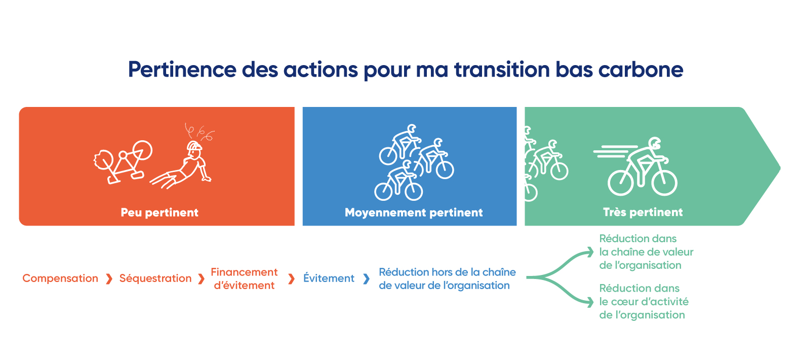

# 5.2 - Construction du plan d'action

Le plan d'action est la feuille de route opérationnelle du plan de transition. Elle regroupe l'ensemble des actions et des mesures spécifiques qui seront entreprises par l'organisation suite à la réalisation de sa comptabilité carbone. Elles doivent être en accord avec l'[objectif global](5.1-definition-des-objectifs.md) que l'organisation décide d'adopter. Afin qu'elles soient réalisables et compréhensibles, leur définition est cadrée comme suit :&#x20;

## Les différentes catégories d'actions

Les actions peuvent être classées dans une ou deux des catégories suivantes :

* _**Actions immédiates**_ : actions à court terme permettant de lancer le plan de transition et motiver les équipes. Ces actions peuvent être mises en œuvre sans difficultés majeures et dans un délai court ;
* _**Actions prioritaires**_ : actions à court et moyen terme qui permettent de réduire fortement ses émissions, puisqu'elles concernent directement des postes significatifs ;
* **Actions stratégiques** : actions à moyen et long terme concernant la stratégie globale et le modèle économique de l'organisation et qui permettent donc de réduire fortement la vulnérabilité carbone et économique de l’organisation ;&#x20;
* _**Actions d'améliorations de la démarche** :_ actions permettant de prendre du recul par rapport au Bilan Carbone® réalisé. Ceci peut concerner l'évaluation du respect des principes du Bilan Carbone®, l'amélioration de la collecte des données pour gagner en précision et réduire [les incertitudes](../4-comptabilisation/4.4-methode-destimation-des-incertitudes/4.4.1-pourquoi-des-incertitudes.md), la montée en [niveau de maturité](../1-cadrage-de-la-demarche/1.1-definir-son-niveau-de-maturite-bilan-carbone-r.md), et la prise en compte des retours vis-à-vis de la [mobilisation ](../3-mobilisation-des-parties-prenantes/3-introduction-a-la-mobilisation.md)menée par l'organisation ;
* _**Actions d'adaptation** :_ actions à court et moyen terme permettant de s'adapter aux conséquences du changement climatique pour assurer la résilience et la survie de l'organisation. Elles répondent aux problématiques soulevées par l['identification des risques](../2-perimetre-de-la-demarche/2.5-identification-des-risques-et-opportunites-de-transition.md). Ces actions concernent en priorité les niveaux Standard et Avancé.

Toute action doit viser à **réduire** ou **éviter** des émissions de GES et/ou des vulnérabilités, ainsi que mobiliser lorsque cela est possible un potentiel de progrès tel que la séquestration. Chaque action est dépendante du secteur d'activité de l'organisation. Elle sera donc plus [pertinente](5.2-construction-du-plan-daction.md#pertinence-de-laction) et son impact plus important, si elle reste proche du cœur d'activité de l'organisation.

## Étapes pour la sélection des actions à mettre en œuvre

Dans un premier temps, une large gamme d'actions est étudiée. Par la suite, une décision [collective ](../3-mobilisation-des-parties-prenantes/3.1-programmer-les-phases-de-mobilisation/#etape-5-construction-du-plan-de-transition)devra être prise sur les axes de réduction de l'empreinte de l'organisation, qui guideront le choix sur les types d'actions à mettre en place. Par ailleurs, le choix sera souvent guidé par l'équilibre entre la réduction de l'empreinte carbone et d'autres indicateurs (environnementaux, économiques, sociaux).&#x20;

Ci-dessous sont présentées les étapes à suivre pour choisir les actions.

> :mag\_right: _Ces étapes sont alignées avec le_ [_Guide pour la construction, la mise en œuvre et le suivi d'un plan de transition_](../annexes/bibliographie/#guide-pour-la-construction-la-mise-en-oeuvre-et-le-suivi-dun-plan-de-transition-de-lademe) _de l'ADEME :_

* Définition des **axes ou orientations** **de réduction**, qui sont les grandes catégories du plan de transition qui regrouperont plusieurs actions d'une même thématique. Les axes peuvent correspondre aux postes significatifs du bilan. _(par exemple : collaboration avec ses fournisseurs, achats responsables, travail en interne,_ [_mobilisation_](https://app.gitbook.com/s/GBSULMB7RDjF3KmSrnc9/3-mobilisation-des-parties-prenantes)_...)_ ;
* Identification des **moyens humains**, **techniques et financiers** nécessaires et/ou à disposition pour que le plan de transition soit réalisable ;
* Définition des **critères de sélection** des actions et leur priorisation _(par exemple : la quantification de l'impact de l'action, le budget nécessaire, les prérequis pour la mise en œuvre de l'action...)_ ;
* **Évaluation** des actions de réduction au regard des critères définis et sélection de celles aux meilleurs résultats. Ceci doit se faire tout en assurant l'objectif global de réduction d'émissions de l'organisation en considérant les réductions d'émissions engendrées par l'action mais également le budget nécessaire à la mise en œuvre de l'action ;
* Réalisation des **fiches actions**. Leur contenu sera défini [ci-dessous](5.2-construction-du-plan-daction.md#la-definition-des-fiches-actions) ;&#x20;
* **Validation** des actions de réduction qui seront mises en œuvre et de leur fiche action par les [référents du plan de transition](../1-cadrage-de-la-demarche/1.2-definir-le-pilotage-de-la-demarche-bilan-carbone-r.md).

Lors de la sélection des actions, le suivi des actions mises en œuvre depuis le dernier bilan permet de consolider et assurer la continuité des actions pertinentes déjà existantes.


Quelques sources d'inspiration pour la sélection des actions de réduction

⏳\[[WIP](../#structures-des-informations-specifiques)] Une prochaine ressource sera produite et mise à disposition pour fournir des sources d'inspirations de manière publique et transparente, en regroupant plusieurs banques d'actions déjà existantes.


## La définition des fiches actions

Chaque action est définie par une fiche action. Celles-ci regroupent les informations suivantes, qui sont obligatoires (cependant des informations supplémentaires peuvent être ajoutées) :

1. Objectifs et cibles (sites et activités) de l’action ;
2. Potentiels de réduction d'émissions, quantifiés ;
3. Porteur(s) de l’action ;
4. Description détaillée de l’action et de l’implication des parties prenantes ;
5. Budget et calendrier prévisionnel de l’action ;
6. [Indicateurs](5.5-suivi-et-pilotage-du-plan-de-transition.md) de mise en œuvre, de suivi et de performance ;
7. Facilitateurs et freins potentiels à l’action ;
8. Catégorie(s) de l'action _(voir_ [_ici_](5.2-construction-du-plan-daction.md#categories-des-actions)_)_ ;
9. Nature de l'action _(voir_ [_ici_](5.2-construction-du-plan-daction.md#nature-de-laction)_)_ ;
10. Pertinence de l'action _(voir_ [_ici_](5.2-construction-du-plan-daction.md#pertinence-de-laction)_) ceci ne concerne que les actions d'atténuation._


Exemple de fiche action : L'exemple de [fiche action](../annexes/annexes/annexe-10-ressource-pour-le-plan-de-transition.md#construire-une-fiche-action) ci-dessous est donné à titre indicatif et est composé d'un socle obligatoire (informations 1 à 10 ci-dessus) auquel des informations complémentaires peuvent être ajoutées :&#x20;

* Intitulé de l'action ; (champ libre)
* Ses sous étapes ; (champ libre)
* Description détaillée de l’action et de l’implication des parties prenantes ; (champ libre)
* Ressources nécessaires à sa mise en place ; (champ libre)
* Informations supplémentaires : (champ libre)


<figure><figcaption>
Figure 5.2 : Exemple de <a href="https://www.bilancarbone-methode.com/annexes/annexes/annexe-10-ressource-pour-le-plan-de-transition#construire-une-fiche-action">fiche action</a> Bilan Carbone®
</figcaption></figure>

### Caractériser la nature de l'action

Dans une logique de transparence du plan de transition, les actions qui le composent peuvent être classées selon leur **nature :**&#x20;

* Actions physiques : modifications des équipements et systèmes ;
* Actions organisationnelles : changement dans les processus organisationnels ;
* Actions comportementales : changement dans les comportements quotidiens ;
* Actions réglementaires : modification des règles.

> :mag\_right: _Classification compatible avec la méthode ADEME_ [_Quanti GES_](../annexes/bibliographie/#quanti-ges)_._

### Caractériser la pertinence de l'action

Les actions d'atténuation (à la différence des actions d'adaptation ou d'amélioration de la démarche) peuvent également être classées par **niveau de pertinence** :

* **Pertinence maximale** - Actions de réduction dans le cœur d’activité de l'organisation : l'organisation est entièrement responsable de l'action et ses impacts ;
* Actions de réduction dans le cadre de la chaîne de valeur de l'organisation : l'organisation peut contrôler les impacts de l'action faisant partie de sa chaîne de valeur ;
* Actions de réduction en dehors de la chaîne de valeur de l'organisation : l'organisation est dépendante et ne peut donc pas entièrement contrôler les impacts de l'action qui est en dehors de sa chaîne de valeur ;
* **Pertinence relative** - Actions d'évitement : action sous l’effet des produits et services distribués ou vendus par l'organisation, qui viennent se substituer à une solution plus carbonée chez les clients finaux, pour éviter les émissions ou à défaut, les réduire ;
* Actions de financements d'évitement : Action de financements de projets de réduction d’émissions hors de la chaîne de valeur de l'organisation ;
* Actions de séquestration : action dans le champs d'activité de l'organisation, visant à réduire les GES dans l'air grâce à l'augmentation des puits carbone ;
* **Pertinence minimale -** Actions de compensation : lorsque les impacts n'ont pas pu être évités, et à travers le financement de projets de séquestration des GES hors de la chaîne de valeur de l'organisation.

Il est important de privilégier les actions plus pertinentes, et que les actions de compensation, séquestration et évitement restent minoritaires.

<figure><figcaption>
Figure 5.2 : Échelle de pertinence de l'action.
</figcaption></figure>

<mark style="color:$info;">🌐</mark> [_<mark style="color:$info;">English version</mark>_](https://abc-transitionbascarbone.fr/wp-content/uploads/2025/11/Relevance-of-actions-for-my-low_Pertinence-des-actions-scaled.png) _<mark style="color:$info;">of this image.</mark>_

## Exigences relatives au Plan d'action

Niveau Initial : critères P1 et Q1

Le plan de transition contient des actions immédiates, prioritaires et d'amélioration de la collecte. Quelques actions stratégiques peuvent tout à fait être incluses sans que ce soit une véritable feuille de route.

Les objectifs des actions sont cohérents avec l'objectif global du plan de transition, puisqu'elles visent à l'atteindre. Le potentiel de réduction d'émissions global du plan de transition est évalué quantitativement, et les réductions prévues grâce à l'implémentation des actions sont évaluées qualitativement, a minima avec un système de classification simple : faible, moyenne, forte, et en donnant son degré de pertinence selon le schéma ci-dessus.

Niveau Standard : critère P2 et Q2

Le plan de transition contient des actions immédiates, prioritaires, stratégiques, d'adaptation et d'amélioration de la collecte. Leurs objectifs sont cohérents avec l'objectif global du plan de transition.

Les potentiels de réductions d'émissions prévues grâce à l'implémentation des actions sont quantifiés, a minima pour les actions immédiates et prioritaires. La quantification correspond au calcul des différences entre les émissions du scénario de référence et du scénario où l'action est mise en place.

:mag\_right: _Différents scénarios de référence sont possibles. (Source : méthode_ [_Quanti GES_](../annexes/bibliographie/#quanti-ges)_)._

Le scénario de référence utilisé pour la quantification est précisé :

* Scénario historique : prolongation de l'état actuel. Pas de mise en place de l'action **et** les émissions continuent d'évoluer comme elles le faisaient avant la mise en place de l'action
* Autres scénarios : pas de mise en place de l'action et d'autres facteurs ont joué sur l'évolution des émissions _(ceux-ci peuvent être d'autres actions, mais également des changements organisationnels, comportementaux, climatiques...)._

L'objectif de réduction des émissions des actions, et le potentiel de réduction que cela représente pour l'ensemble du plan d'action, alimente la définition de la [trajectoire de transition](5.3-definition-de-la-trajectoire-de-transition.md) de l'organisation.

Les effets des actions sont évalués **qualitativement**, en particulier pour les actions qui ne sont pas quantifiables. Les informations [demandées dans les fiches actions](5.2-construction-du-plan-daction.md#la-definition-des-fiches-actions) permettent de qualifier l'action, et notamment sa pertinence.

Niveau Avancé : critère P3 et Q3

Le plan de transition contient des actions immédiates, prioritaires, stratégiques, d'adaptation et d'amélioration de la collecte, significatives et cohérentes entre elles, portant également sur certaines émissions évitées.

Les potentiels de réductions d'émissions prévues grâce à l'implémentation de toutes les actions immédiates et prioritaires sont quantifiés. Les potentiels de réduction de certaines actions stratégiques retenues sont quantifiés lorsque cela est possible (la définition et la quantification des actions stratégiques peut se baser sur un travail préexistant ou complémentaire, type [ACT-S](../annexes/bibliographie/) ou équivalent). La quantification correspond au calcul des différences entre les émissions du scenario de référence et du scénario où l'action est mise en place.&#x20;

:mag\_right: _Différents scénarios de référence sont possibles. (Source : méthode_ [_Quanti GES_](../annexes/bibliographie/#quanti-ges)_)._

Le scénario de référence utilisé pour la quantification est précisé :

* Scénario historique : prolongation de l'état actuel. Pas de mise en place de l'action **et** les émissions continuent d'évoluer comme elles le faisaient avant la mise en place de l'action
* Autres scénarios : pas de mise en place de l'action et d'autres facteurs ont joué sur l'évolution des émissions _(ceux-ci peuvent être d'autres actions, mais également des changements organisationnels, comportementaux, climatiques...)_

L'objectif de réduction des émissions de chaque action, et le potentiel de réduction que cela représente pour l'ensemble du plan d'action, alimente la définition ou l'actualisation de la [trajectoire de transition](5.3-definition-de-la-trajectoire-de-transition.md) de l'organisation.

Les effets des actions sont évalués qualitativement, en particulier pour les actions qui ne sont pas quantifiables. Les informations [demandées dans les fiches actions](5.2-construction-du-plan-daction.md#la-definition-des-fiches-actions) permettent de qualifier l'action, et notamment sa pertinence. D'autres réflexions qualitatives sont possibles :&#x20;

* **Contribution de l'action** sur les risques et opportunités
* **Adéquation de l’action** avec le monde bas carbone

> :mag\_right: _Pour exprimer le Bilan Carbone® avec une lecture dite « analytique », en cohérence avec la_ [_comptabilité carbone analytique_](../annexes/bibliographie/#guides-pratiques)_, chaque action intègre, en plus des informations ci-dessus, les axes analytiques concernés._&#x20;
>
> _Si des actions peuvent correspondre à plusieurs axes analytiques : elles seront subdivisées en plusieurs fiches actions, identifiées sur un seul axe pour n’avoir qu’un seul responsable associé. Par exemple pour agir à l’échelle des sites, construire une fiche action par responsable de site permet de rendre l’action opérationnelle, de n’impliquer que les responsables des sites concernés, tout en permettant un pilotage des actions agrégées à l’échelle de l’ensemble des sites._
>
> _Cette déclinaison opérationnelle de l’action pour chaque responsable (par axe analytique interne : équipe, activité, projet …) ; et par parties prenantes externes (par axe analytique externe : fournisseurs, clients), permet de mettre en perspective pour chaque axe analytique les émissions et les actions, et donc de_ [_suivre les résultats_](5.5-suivi-et-pilotage-du-plan-de-transition.md)_._
>
> _Concernant les «_ [_actions d’amélioration de la démarche_](5.2-construction-du-plan-daction.md#les-differentes-categories-dactions) _», des actions spécifiques à la structuration de la comptabilité carbone analytique peuvent être considérées_

***

_Vous avez une question de compréhension ?_ [_Consultez la FAQ_](../annexes/faq.md)_. La méthode est vivante et donc susceptible d'évoluer (précisions, compléments) : retrouvez le_ [_suivi des modifications ici_](../avant-propos/historique-et-suivi-des-modifications.md)_._
