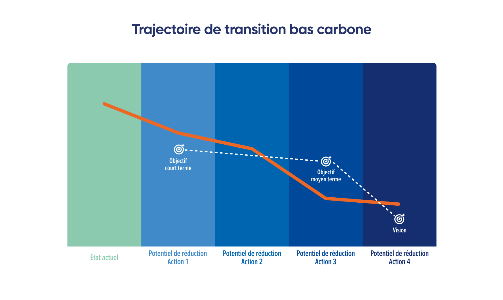

# 5.3 - Définition de la trajectoire de transition

<figure><figcaption>
Source : Freepik
</figcaption></figure>

La trajectoire de transition bas carbone décrit comment et par quels moyens l'organisation va évoluer pour atteindre son objectif de réduction des émissions de GES (que ce soit court, moyen ou long terme). C'est la tendance de l'intensité carbone de l'organisation.

Elle représente une série d'**étapes** liant l'état actuel de l'organisation (profil d'émission calculé) à ses objectifs de transition et à la vision de l'organisation qu'elle a d'elle même dans un monde bas carbone.


Ces **étapes** sont calculées et définies par la quantification des potentiels de réduction des actions. Elles permettent de justifier l'atteinte des jalons intermédiaires des objectifs, que l'organisation se fixe, à plus ou moins long terme en fonction de sa maturité.

On considère ainsi, dans le cadre de la démarche Bilan Carbone®, que la trajectoire est définie en **approche ascendante** (dite bottom-up) : les potentiels de réduction des actions permettent de définir la trajectoire qui justifie la crédibilité de l'atteinte de l'objectif.


## Exigences relatives à la trajectoire de transition

Selon le niveau de maturité de l'organisation, les attentes diffèrent :

Niveau Initial : critère R1

La quantification du [volume de réduction globale](5.2-construction-du-plan-daction.md) du plan de transition permet de construire une trajectoire en approche ascendante (dite bottom-up).

La trajectoire est définie sur 3-4 ans, soit la période de [renouvellement](../6-synthese-et-restitution/6.3-renouvellement-et-amelioration-continue.md) du bilan.&#x20;

Elle justifie l'atteinte d'un objectif court terme (horizon du prochain bilan) cohérent avec [l'objectif global](5.1-definition-des-objectifs.md).

Niveau Standard : critère R2

La [quantification du potentiel de réduction des actions](5.2-construction-du-plan-daction.md) permet de construire une trajectoire en approche ascendante (dite bottom-up).

La trajectoire est définie sur 10 ans.&#x20;

Elle lie le profil GES et justifie l'atteinte des objectifs court terme (horizon du prochain bilan) et moyen terme (horizon 2030 ou sur une dizaine d'années) cohérents avec l['objectif global](5.1-definition-des-objectifs.md). Cela signifie que le total de réduction estimé permet à minima de **suivre** la tendance fixée par les objectifs.

Niveau Avancé : critère R3

L'organisation se dote ou **consolide** une trajectoire en approche ascendante (dite bottom-up) sur 30 ans.&#x20;

La trajectoire intègre les étapes intermédiaires de réduction, définies grâce à la [quantification du potentiel de réduction des actions](5.2-construction-du-plan-daction.md) que l'organisation entreprend. Sont comprises les actions stratégiques, avec une réduction plus long terme.&#x20;

**Consolidation** : Pour ce Niveau Avancé, l'organisation peut se baser sur sa stratégie climat issue d'un travail préexistant ou complémentaire. Si une telle démarche a été suivie en amont, le Bilan Carbone® sert ici de pilotage de cette trajectoire (et d'une éventuelle évaluation ou réorientation).

:mag\_right: _Il est ainsi recommandé de s'appuyer sur des méthodes telles que_ [_ACT Step by Step_](../annexes/bibliographie/#act-step-by-step) _ou équivalent._&#x20;

Cette trajectoire justifie l'atteinte des objectifs court terme (horizon annuel), moyen terme (horizon 2030 ou sur une dizaine d'années) et long terme (horizon 2050) cohérents avec l'[objectif global](5.1-definition-des-objectifs.md). Cela signifie que pour un Niveau Avancé le total de réduction estimé permet de **faire mieux** que la tendance fixée par les objectifs.

<figure><figcaption>
Figure 5.3 : Exemple visuel d'une trajectoire de transition bas carbone.
</figcaption></figure>

<mark style="color:$info;">🌐</mark> [_<mark style="color:$info;">English version</mark>_](https://abc-transitionbascarbone.fr/wp-content/uploads/2025/11/Low-Carbon-Transition-Pathway_Trajectoire-de-transition-bas-carbone-scaled.png) _<mark style="color:$info;">of this image.</mark>_

> :mag\_right: _Pour exprimer le Bilan Carbone® avec une lecture dite « analytique », en cohérence avec la_ [_comptabilité carbone analytique_](../annexes/bibliographie/#guides-pratiques)_, la trajectoire globale de l’organisation peut s’appuyer sur des trajectoires par axes analytiques. Les objectifs et potentiels de réductions ne seront pas forcément les mêmes suivant les activités, équipes ou tout autre axes analytiques retenus. Chaque responsable s'engage sur sa propre trajectoire et sur ses propres émissions. La consolidation des trajectoires et actions envisagées par chaque responsable permet d’alimenter ou de vérifier la cohérence de la trajectoire globale._


En conclusion et [pour rappel](../introduction-a-la-transition-bas-carbone/quelle-integration-du-bilan-carbone-r-au-sein-dune-demarche-de-transition-bas-carbone.md#id-4-le-bilan-carbone-r-dans-une-demarche-de-transition-bas-carbone-section-a-relire-et-finir), la construction d'une trajectoire peut être un exercice complémentaire spécifique. Dans le cadre du Bilan Carbone® de Niveau Initial et Standards, les exigences sont atteignables car il s'agit d'une traduction de la réduction quantifiée (approche ascendante ou bottom-up) par le [plan d'action](5.2-construction-du-plan-daction.md). En revanche pour le Niveau Avancé, il faudra mener (ou avoir mené) une véritable stratégie climat, telle que [précisé en introduction](../1-cadrage-de-la-demarche/1.1-definir-son-niveau-de-maturite-bilan-carbone-r.md#niveau-avance-un-bilan-carbone-r-qui-pilote-une-veritable-strategie-de-transition).


***

_Vous avez une question de compréhension ?_ [_Consultez la FAQ_](../annexes/faq.md)_. La méthode est vivante et donc susceptible d'évoluer (précisions, compléments) : retrouvez le_ [_suivi des modifications ici_](../avant-propos/historique-et-suivi-des-modifications.md)_._
