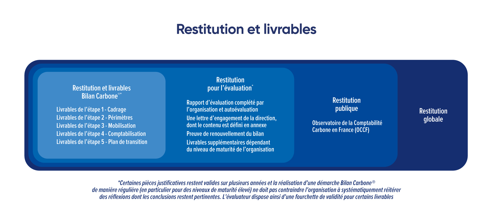

# 6.1 - Reporting of the Bilan Carbone®

<figure><figcaption>
Source: Pexels
</figcaption></figure>

The reporting of the Bilan Carbone® approach aims to:

* compile all deliverables obtained at each step
* inform its stakeholders
* document the approach, which is essential for [continuous improvement](6.3-renouvellement-et-amelioration-continue.md)
* communicate on its Bilan Carbone®

The organisation must determine the content, the availability to its stakeholders and the dissemination methods according to its internal and external reporting needs. Reporting is also a [stakeholder engagement](../3-mobilisation-des-parties-prenantes/3-introduction-a-la-mobilisation.md#glossaire-relatif-aux-etapes-de-mobilisation) phase.

The reporting of the approach is carried out in 2 or 3 steps:

1. Internal and final reporting of the Bilan Carbone® and associated deliverables
2. Reporting and publication of results: the emission profile is anonymously submitted to the French carbon accounting observatory platform.
3. Voluntary reporting for evaluation of the approach: in the event that the organisation wishes to have its assessment [evaluated](https://app.gitbook.com/s/GBSULMB7RDjF3KmSrnc9/7-evaluation-et-qualite-du-bilan-carbone-r), [additional supporting documents](6.1-restitution-du-bilan-carbone-r.md#pieces-justificatives-pour-levaluation) are required.

<figure><figcaption>
Figure 6.1.1: Timeline of the reporting stage
</figcaption></figure>

<mark style="color:$info;">🌐</mark> [_<mark style="color:$info;">English version</mark>_](https://abc-transitionbascarbone.fr/wp-content/uploads/2025/11/Timeline-of-the-reporting-Stage_Chronologie-de-letape-de-restitution-scaled.png) _<mark style="color:$info;">of this image.</mark>_

## :one: Bilan Carbone® Reporting and Deliverables

### Requirements relating to Bilan Carbone® deliverables

Internal reporting to the organisation is the process of finalising the approach, including the preparation of deliverables, their presentation and their validation.&#x20;

The expected deliverables differ according to the organisation's [maturity level](../1-cadrage-de-la-demarche/1.1-definir-son-niveau-de-maturite-bilan-carbone-r.md):&#x20;

Initial Level: criterion T1

* [x] Deliverables from step 1 – Scoping:

1. A description of the organisation covered by the Bilan Carbone®: company name, SIRET, SIREN, NAF code, number of FTEs;
2. A presentation of the approach coordinator: name, position held;
3. A presentation of the project team carrying out the Bilan Carbone®: name, training number, date of the Bilan Carbone® method training they attended, affiliated organisation (if external);
4. The maturity level of the approach;

* [x] Deliverables from step 2 – Boundaries:

5. The choice of organisational boundary together with a justification (list of facilities and sites concerned);
6. The chosen temporal boundary;
7. The choice of operational boundary (significance criterion where applicable) and its justification;
8. The organisation's flow map (quantified, where applicable);
9. A list of physical and transition risks related to climate change;

* [x] Deliverables from step 3 – Stakeholder Engagement:

10. A [summary](../3-mobilisation-des-parties-prenantes/3-introduction-a-la-mobilisation.md#livrables-relatifs-aux-etapes-de-mobilisation) of the various stakeholder engagement phases that have been implemented: their targets, the messages communicated, their format, the associated step of the approach;

* [x] Deliverables from step 4 – Accounting:

11. A summary of data collected together with a description of the data collection process followed [(data collection matrix)](../4-comptabilisation/4.2-methode-de-collecte-des-donnees-dactivite.md#matrice-de-collecte-des-donnees);
12. Documentation of the emission factors used, and of emission factors in monetary ratios (specific and non-specific) together with their sources [(data collection matrix)](../4-comptabilisation/4.3-methode-de-selection-des-facteurs-demission.md#matrice-de-collecte-des-donnees)
13. The uncertainties associated with the organisation's GHG profile;
14. The monetary ratio usage rate associated with the organisation's GHG profile;
15. The organisation's GHG profile, listing emissions in tCO2e;

* [x] Deliverables from step 5 – Transition Plan:

16. The objectives associated with the transition plan;
17. The action plan via all action sheets;
18. The transition plan trajectory;
19. Monitoring and implementation indicators

Standard Level: criterion T2

* [x] Deliverables from step 1 – Scoping:

1. A description of the organisation covered by the Bilan Carbone®: company name, SIRET, SIREN, NAF code, number of FTEs;
2. A presentation of the approach coordinator: name, position held; training number, date of the Bilan Carbone® method training they attended
3. A presentation of the project team carrying out the Bilan Carbone®: name, training number, date of the Bilan Carbone® method training they attended, affiliated organisation (if external);
4. The maturity level of the approach;

* [x] Deliverables from step 2 – Boundaries:

5. The choice of organisational boundary together with a justification (list of facilities and sites concerned);
6. The chosen temporal boundary;
7. The choice of operational boundary and its justification;
8. The organisation's flow map (quantified where applicable), and vulnerability-mapped (vulnerabilities are shown on it, in connection with point 9).
9. A list of physical and transition risks related to climate change with regard to the organisation's GHG profile, mapped (in connection with point 8);

* [x] Deliverables from step 3 – Stakeholder Engagement:

10. A [summary](../3-mobilisation-des-parties-prenantes/3-introduction-a-la-mobilisation.md#livrables-relatifs-aux-etapes-de-mobilisation) of the various stakeholder engagement phases that have been implemented: their targets, the messages communicated, their format, the associated step of the approach;

* [x] Deliverables from step 4 – Accounting:

11. A summary of data collected together with a description of the data collection process followed [(data collection matrix)](../4-comptabilisation/4.2-methode-de-collecte-des-donnees-dactivite.md#matrice-de-collecte-des-donnees);
12. Documentation of the emission factors used, and of emission factors in monetary ratios (specific and non-specific) together with their sources [(data collection matrix)](../4-comptabilisation/4.3-methode-de-selection-des-facteurs-demission.md#matrice-de-collecte-des-donnees)
13. The uncertainties associated with the organisation's GHG profile;
14. The monetary ratio usage rate associated with the organisation's GHG profile;
15. The organisation's GHG profile, listing emissions in tCO2e;

* [x] Deliverables from step 5 – Transition Plan:

16. The objectives associated with the transition plan;
17. The action plan via all action sheets;
18. The transition plan trajectory;
19. Indicators (monitoring, implementation and performance), and the dashboard-type monitoring system used for tracking the transition plan, where applicable;

Advanced Level: criterion T3

* [x] Deliverables from step 1 – Scoping:

1. A description of the organisation covered by the Bilan Carbone®: company name, SIRET, SIREN, NAF code, number of FTEs;
2. A presentation of the management member leading the approach: name, position held, training number, date of the Decision-Makers training attended. And a presentation of the approach coordinator: name, position held, training number, date of the Bilan Carbone® method training they attended
3. A presentation of the project team carrying out the Bilan Carbone®: name, training number, date of the Bilan Carbone® method training attended, affiliated organisation;
4. The maturity level of the approach;

* [x] Deliverables from step 2 – Boundaries:

5. The choice of organisational boundary together with a justification (list of facilities and sites concerned);
6. The chosen temporal boundary;
7. The choice of operational boundary and its justification;
8. The organisation's flow map (quantified where applicable), together with the analytical axes selected in the case of an analytical mapping;
9. An analysis of physical and transition risks related to climate change with regard to the organisation's GHG profile, and of the effects these risks may have on the entire value chain;

* [x] Deliverables from step 3 – Stakeholder Engagement:

10. A [summary](../3-mobilisation-des-parties-prenantes/3-introduction-a-la-mobilisation.md#livrables-relatifs-aux-etapes-de-mobilisation) of the various stakeholder engagement phases that have been implemented: their targets, the messages communicated, their format, the associated step of the approach;

* [x] Deliverables from step 4 – Accounting:

11. A summary of data collected together with a description of the data collection process followed [(data collection matrix)](../4-comptabilisation/4.2-methode-de-collecte-des-donnees-dactivite.md#matrice-de-collecte-des-donnees);
12. Documentation of the emission factors used, and of emission factors in monetary ratios (specific and non-specific) together with their sources [(data collection matrix)](../4-comptabilisation/4.3-methode-de-selection-des-facteurs-demission.md#matrice-de-collecte-des-donnees)
13. The uncertainties associated with the organisation's GHG profile;
14. The monetary ratio usage rate associated with the organisation's GHG profile;
15. The organisation's GHG profile, listing emissions in tCO2e;

* [x] Deliverables from step 5 – Transition Plan:

16. The objectives associated with the transition plan;
17. The action plan via all action sheets;
18. The transition plan trajectory;
19. Indicators (monitoring, implementation and performance), and the dashboard-type monitoring system used for tracking the transition plan, where applicable;

## :two: Reporting and publication of results

### Requirements relating to the submission of assessments on the OCCF platform

The organisation's GHG profile is anonymously submitted at the end of the approach to the OCCF platform. In the event that the organisation has its assessment evaluated, the evaluation result will also appear in the [Observatoire de la Comptabilité Carbone en France](../annexes/bibliographie/#labc-et-les-ressources-complementaires-au-bilan-carbone-r).

This contributes to public knowledge in carbon accounting, with the aim of improving knowledge (particularly statistical) on GHG emissions across different sectors of activity.&#x20;

Furthermore, the organisation may publish its assessment (in full or in part) on its website, in its external documentation and on social networks.

## :three: Voluntary reporting for evaluation

All Bilan Carbone® deliverables (presented above) are to be sent to the evaluator. In the event that the organisation wishes to have its assessment [evaluated](https://app.gitbook.com/s/GBSULMB7RDjF3KmSrnc9/7-evaluation-et-qualite-du-bilan-carbone-r), additional supporting documents must be annexed.

### Additional requirements relating to supporting documents

The tabs below list the supporting documents by assessment maturity level. The organisation may share documents corresponding to higher levels, particularly in cases where efforts have been made to go beyond what is required for its [maturity level](../1-cadrage-de-la-demarche/1.1-definir-son-niveau-de-maturite-bilan-carbone-r.md). All documents submitted must be written in a language mastered by the evaluation team.

The sharing of these documents with the evaluator may be subject to a confidentiality agreement.

Initial Level: additional deliverables

1. Evaluation report completed by the organisation as a self-evaluation;
2. A [management commitment letter](../annexes/annexes/annexe-11-ressources-pour-la-restitution-et-levaluation.md), the content of which is defined in annex;
3. Proof of renewal of the assessment where applicable (for example the tracking number of the last assessment on the [Software](../formation-et-outils-dapplication-de-la-methode/outils-bilan-carbone-r-tableurs-et-logiciel.md) or the dated [Spreadsheet Export](../formation-et-outils-dapplication-de-la-methode/outils-bilan-carbone-r-tableurs-et-logiciel.md) of the last assessment or the evaluation report of the last assessment, ...);

Standard Level: additional deliverables

1. Evaluation report completed by the organisation as a self-evaluation;
2. A [management commitment letter](../annexes/annexes/annexe-11-ressources-pour-la-restitution-et-levaluation.md), the content of which is defined in annex;
3. Proof of renewal of the assessment (for example the tracking number of the last assessment on the [Software](../formation-et-outils-dapplication-de-la-methode/outils-bilan-carbone-r-tableurs-et-logiciel.md) or the dated [Spreadsheet Export](../formation-et-outils-dapplication-de-la-methode/outils-bilan-carbone-r-tableurs-et-logiciel.md) of the last assessment or the evaluation report of the last assessment, ...);

Advanced Level: additional deliverables

1. Evaluation report completed by the organisation as a self-evaluation;
2. A [management commitment letter](../annexes/annexes/annexe-11-ressources-pour-la-restitution-et-levaluation.md), the content of which is defined in annex;
3. Training certificates:&#x20;
   1. Decision-Makers training certificate for the **management member in charge of the approach** and **the representatives of each department** involved in implementing the transition plan.
   2. Bilan Carbone® method training certificate for the coordinator(s), operational staff and any external support;
4. Proof of renewal of the assessment (for example the tracking number of the last assessment on the [Software](../formation-et-outils-dapplication-de-la-methode/outils-bilan-carbone-r-tableurs-et-logiciel.md) or the dated [Spreadsheet Export](../formation-et-outils-dapplication-de-la-methode/outils-bilan-carbone-r-tableurs-et-logiciel.md) of the last assessment or the evaluation report of the last assessment, ...);
5. Proof of reflection on risks concerning the organisation:&#x20;
   1. Analysis of risks and the effects these risks may have on the entire value chain.
   2. Proof of external support for carrying out the analysis, where applicable;

In addition to the documents mentioned above, the Bilan Carbone® evaluator may request additional supporting documents enabling them to verify certain data. Among these documents are:&#x20;

* the organisation's chart of accounts;
* evidence of monitoring complementary approaches to the Bilan Carbone®;
* proof of stakeholder engagement phases (sign-in sheets, communication materials, among others, ...);

<figure><figcaption>
Figure 6.1.2: Reporting and deliverables
</figcaption></figure>

<mark style="color:$info;">🌐</mark> [_<mark style="color:$info;">English version</mark>_](https://abc-transitionbascarbone.fr/wp-content/uploads/2025/11/Reporting-and-deliverables_Restitution-et-livrables-scaled.png) _<mark style="color:$info;">of this image.</mark>_

***

_Do you have a question?_ [_Consult the FAQ_](../annexes/faq.md)_. The method is a living document and therefore subject to change (clarifications, additions): find the_ [_change log here_](../avant-propos/historique-et-suivi-des-modifications.md)_._
