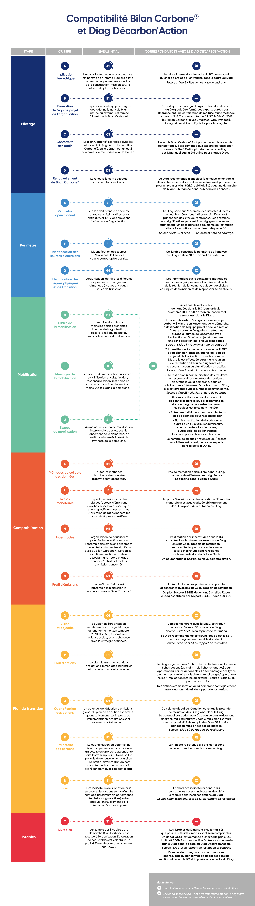

# 6.2 - Compatibilité de la démarche avec d'autres référentiels

<figure><figcaption>
Source : Freepik
</figcaption></figure>

La démarche Bilan Carbone® est compatible avec de nombreuses **méthodes et standards** et permet également de répondre à différentes **normes et règlementations** concernant la comptabilité carbone et stratégie de décarbonation. Parmi ces **référentiels** se trouvent :&#x20;

* [La méthode réglementaire pour la réalisation des bilans d'émissions des GES](../annexes/bibliographie/#methode-reglementaire) (BEGES-R)
* La [Corporate Sustainability Reporting Directive](../annexes/bibliographie/#csrd) (CSRD)
* [La comptabilité carbone analytique](../annexes/bibliographie/#guides-pratiques) (CCA)
* Le [Green House Gas Protocol](../annexes/bibliographie/#ghg-p) (GHG-P)
* &#x20;L'[ISO 14064-1:2018 et ISO 14069:2013](../annexes/bibliographie/#iso) (ISO)

Diverses méthodes complémentaires au Bilan Carbone® existent, permettant de [progresser dans son parcours de maturité](../introduction-a-la-transition-bas-carbone/quelle-integration-du-bilan-carbone-r-au-sein-dune-demarche-de-transition-bas-carbone.md#id-4-le-bilan-carbone-r-dans-une-demarche-de-transition-bas-carbone-section-a-relire-et-finir), comme la démarche [ACT-Pas à Pas](../annexes/bibliographie/#act-pas-a-pas-ou-act-step-by-step).

## Compatibilité avec le Bilan GES règlementaire

En suivant la méthode Bilan Carbone®, une organisation répond aux exigences de la méthode réglementaire pour la réalisation des bilans d'émissions de GES ([BEGES-R](../annexes/bibliographie/)), dès le premier [niveau de maturité](../1-cadrage-de-la-demarche/1.1-definir-son-niveau-de-maturite-bilan-carbone-r.md) (Niveau Initial).

Le tableau ci-dessous illustre la correspondance entre les différentes exigences de la méthode réglementaire et la façon dont le Bilan Carbone® y répond.

<figure><figcaption>
Figure 6.2.1 : Compatibilité entre Bilan Carbone® et Bilan GES règlementaire
</figcaption></figure>

<mark style="color:$info;">🌐</mark> [_<mark style="color:$info;">English version</mark>_](https://abc-transitionbascarbone.fr/wp-content/uploads/2025/11/Compatibility-with-the-Regulatory_Comptabilite-avec-la-methode-GES-scaled.png) _<mark style="color:$info;">of this image.</mark>_

Le dépôt de la méthode réglementaire se fait dans la [plateforme nationale](../annexes/bibliographie/#autres-standards-normes-et-reglementations-de-comptabilisation-des-emissions-de-ges) pour la publication des bilans d'émission de gaz à effet et serre de l'ADEME.&#x20;

## Compatibilité avec le Diag Décarbon'Action

Le [Diag Décarbon'Action](https://www.bilancarbone-methode.com/annexes/bibliographie#autres-standards-normes-et-reglementations-de-comptabilisation-des-emissions-de-ges) est un dispositif d'accompagnement est un dispositif d'accompagnement créé et financé par Bpifrance et l’ADEME, avec l'appui méthodologique de l'ABC, qui permet de réaliser un premier bilan des émissions de gaz à effet de serre.

Le Bilan Carbone® peut être utilisé pour répondre au dispositif. En particulier en s'appuyant sur les critères du [Niveau Initial](../1-cadrage-de-la-demarche/1.1-definir-son-niveau-de-maturite-bilan-carbone-r.md), qui sont adaptés aux cibles du Diag Décarbon'action (TPE, PME et certaines ETI, donc des organisations débutantes ou des petites structures avec peu de ressources, effectuant leur premier Bilan Carbone®).&#x20;

Un tableau de correspondance ci-dessous présente le détail des correspondances entre un Bilan Carbone® niveau initial, et un Diag Décarbon'Action :&#x20;

<figure><figcaption>
Figure 6.2.2 : Compatibilité entre Bilan Carbone® et Diag Décarbon'action
</figcaption></figure>

A noter qu'en plus de cela, le dispositif Diag Décarbon'action demande une "mise en transition" (exemples non exhaustifs et non cumulatifs : préparation d'un plan de communication, construction d'une calculette GES, dispositif de suivi des résultats des actions, etc.), ce qui correspond avec les prescriptions du Bilan Carbone® sur la phase de [mise en œuvre du plan de transition](../5-plan-de-transition/5.4-mise-en-oeuvre-du-plan-de-transition.md).&#x20;

## Compatibilité avec la Corporate Sustainability Reporting Directive

La directive européenne CSRD incite les organisations à transformer leurs modèles d'affaires pour répondre aux enjeux climatiques et aux réalités scientifiques sur l'impact environnemental et social des activités économiques. La démarche Bilan Carbone®, essentiel dans ce contexte, permet aux organisations de comptabiliser leurs émissions de gaz à effet de serre et d'évaluer l'impact de leurs activités. En se basant sur ces données, les organisations peuvent élaborer un plan de transition structuré pour réduire leurs émissions et atteindre les objectifs de la CSRD.

Le suivi de la démarche Bilan Carbone®, à partir du [niveau de maturité](../1-cadrage-de-la-demarche/1.1-definir-son-niveau-de-maturite-bilan-carbone-r.md) Avancé, permet de répondre à la majeure partie des exigences de la norme ESRS E1 de la CSRD, qui concerne le changement climatique. L'ESRS E1 est divisée en 12 Disclosure Requirements (DR) : E1.GOV-3, E1.IRO-1, E1.SBM-3, E1-1, E1-2, E1-3, E1-4, E1-5, E1-6, E1-7, E1-8, et E1-9. Chaque DR contient un certains nombre de points de données (datapoints) à reporter.

L'étape de comptabilisation du Bilan Carbone® et l'export du [profil d'émission](../4-comptabilisation/4.5-profil-demission.md#csrd-esrs-e1-6-et-e1-5) au format de reporting demandé couvre les DR E1-5 et E1-6. D'autres étapes de la démarche Bilan Carbone® (plan de transition, analyse des risques) permet de couvrir une majeure partie des autres DR.

> <mark style="background-color:blue;">⏳\[</mark>[<mark style="background-color:blue;">WIP</mark>](../#structures-des-informations-specifiques)<mark style="background-color:blue;">] A date, un bureau d’étude indépendant a mené une évaluation sur les taux de compatibilité entre les deux référentiels. Ils sont présentés ci-dessous, afin de simplifier l'intégration de ces éléments avec les exigences de la CSRD.</mark> <mark style="background-color:blue;"></mark><mark style="background-color:blue;">**Des évolutions sont prévues dans la méthode, et surtout dans les outils, pour automatiser la couverture de points de données (datapoints) supplémentaires.**</mark>

**\*% DP couverts :** Un DP désigné comme « couvert » ci-dessous n'est pas systématiquement une correspondance totale. Il s'agit du taux de DP pour lesquels le Bilan Carbone® fournit des informations, mais potentiellement partiellement : via des évolutions en cours (ajustements méthodologiques, futurs outils), ou dont la qualité de la réponse dépend de l'organisation elle-même.

<table data-full-width="true"><thead><tr><th width="180">DR</th><th width="81">% DP*</th><th width="405">Précisions</th><th>⏳[WIP] Evolutions prévues</th></tr></thead><tbody><tr><td>E1-1 : Élaborer un plan de transition pour l'atténuation du changement climatique</td><td>63%</td><td>La méthode Bilan Carbone® est un bon socle et couvre en partie l'E1 sur de nombreux aspects. Si des évolutions sont prévues, la méthode n'a pas vocation à couvrir 100% des DP. Des approfondissements sont nécessaires. Par exemple concernant l'approche stratégique, c'est un prérequis du Niveau Avancé, qui peut se construire entre 2 renouvellements du bilan, via ACT-S ou équivalent.)</td><td>Des évolutions mineures de la méthode sont prévues afin d'améliorer certaines prises en compte (aujourd'hui partielle) de DP, ce qui ne fera pas augmenter sensiblement le % total. Il s'agit de précisions et reformulations (par exemple sur les actions stratégiques, sur les indicateurs carbone en KPI, pour lequel le BC niveau avancé a déjà des exigences opérationnelles).</td></tr><tr><td>E1-2 : Prouver que des politiques relatives à l'atténuation et à l'adaptation au changement climatique sont mises en place par l’entreprise</td><td>100%</td><td>La méthode Bilan Carbone® couvre l'ensemble de l'E2, au moins partiellement. Des évolutions sont prévues pour maximiser la couverture de certains DP. Approfondissements non nécessaires.</td><td>Des évolutions mineures de la méthode sont prévues afin d'améliorer certaines prises en compte (aujourd'hui partielle) de DP, pour viser une prise en compte maximale. Il s'agit de précisions sur certaines notions (l'efficacité énergétique, les énergies renouvelables et l'adaptation)</td></tr><tr><td>E1-3 : Publier les actions et ressources liées aux politiques mises en place en lien avec le changement climatique</td><td>100%</td><td>La méthode Bilan Carbone® couvre l'ensemble de l'E3, au moins partiellement. Ce DR étant au cœur des étapes du plan de transition de la méthode Bilan Carbone. Des évolutions sont prévues pour maximiser la couverture de certains DP. Approfondissements non nécessaires.</td><td>Des évolutions mineures de la méthode sont prévues afin d'améliorer certaines prises en compte (aujourd'hui partielle) de DP, pour viser une prise en compte maximale. Il s'agit de précisions notamment sur les notions de Capex et Opex permettant d'ancrer le climat au cœur de la stratégie d'entreprise.</td></tr><tr><td>E1-4 : Objectifs liés à l'atténuation et à l'adaptation au changement climatique</td><td>100%</td><td>La méthode Bilan Carbone® couvre l'ensemble de l'E4, au moins partiellement. Ce DR étant au cœur des étapes du plan de transition de la méthode Bilan Carbone. Des évolutions sont prévues pour maximiser la couverture de certains DP. Approfondissements non nécessaires.</td><td>Des évolutions mineures de la méthode sont prévues afin d'améliorer certaines prises en compte (aujourd'hui partielle) de DP, pour viser une prise en compte maximale. Il s'agit de précisions notamment sur une liste précise d'indicateurs, sur des objectifs séparés sur les scopes 1, 2 et 3, ou sur des objectifs alignés 1.5°C.</td></tr><tr><td>E1-5 : Consommation d’énergie et mix énergétique</td><td>74%</td><td>La méthode Bilan Carbone® couvre la majeure partie de l'E5, au moins partiellement. Plusieurs évolutions sont prévues pour que la méthode couvre 100% des DP, ce DR étant au cœur de l'étape de quantification des émissions. Approfondissements complémentaires non nécessaires.</td><td>La majeure partie des évolutions concerne la création d'un Export CSRD qui sera ajouté dans les futurs outils (janvier 2025), pour viser une prise en compte maximale de ce DR. Cela concerne notamment une liste d'indicateurs énergétique. La complétude de cet export sera une option, si le Bilan Carbone® doit servir à l'exercice de reporting CSRD.</td></tr><tr><td>E1-6 : Émissions brutes de GES des scopes 1, 2, 3 et total</td><td>71%</td><td>La méthode Bilan Carbone® couvre la majeure partie de l'E6, au moins partiellement. Plusieurs évolutions sont prévues pour que la méthode couvre 100% des DP, ce DR étant au cœur de l'étape de quantification des émissions. Approfondissements complémentaires non nécessaires.</td><td>La majeure partie des évolutions concerne la création d'un Export CSRD qui sera ajouté dans les futurs outils (janvier 2025), pour viser une prise en compte maximale de ce DR. Cela concerne notamment une liste d'indicateurs, la notion de la dépendance au secteur à fort impact, et les émissions spécifiques des scopes 1 et 2. La complétude de cet export sera une option, si le Bilan Carbone® doit servir à l'exercice de reporting CSRD.</td></tr><tr><td>E1-7 : Les absorptions de GES et les projets d'atténuation des GES financés grâce aux crédits carbone</td><td>0%</td><td>Ce DR n'est pas couvert par la méthode Bilan Carbone®, et n'a pas vocation à l'être. Des approfondissements complémentaires sont donc nécessaires.</td><td>L'ABC et sa communauté souhaite se positionner sur ce sujet, mais potentiellement en sus de la méthode Bilan Carbone® actuelle.</td></tr><tr><td>E1-8 : Tarification du carbone</td><td>0%</td><td>Ce DR n'est pas couvert par la méthode Bilan Carbone®, et n'a pas vocation à l'être. Des approfondissements complémentaires sont donc nécessaires.</td><td>Evolutions non prévues.</td></tr><tr><td>E1-9 : Effets financiers anticipés des risques physiques et de transition et des opportunités potentielles liées au climat</td><td>100%</td><td>La méthode Bilan Carbone® couvre partiellement l'ensemble de l'E9. Si des évolutions sont prévues, la méthode n'a pas vocation à couvrir ces DP autrement que partiellement. Des approfondissements complémentaire sont donc nécessaires. Par exemple concernant l'analyse des risques, c'est un prérequis, qui peut se construire de manière complémentaire au Niveau Avancé (TCFD, OCARA ou équivalent)</td><td>Des évolutions mineures de la méthode sont prévues afin d'améliorer certaines prises en compte, mais elle continuera à s'intéresser à la plupart des DP de manière partielle. Il s'agit de précisions notamment sur la méthode d'analyse des risques.</td></tr><tr><td>E1.GOV-3 : Intégration de la stratégie dans la gouvernance</td><td>0%</td><td>Ce DR n'est pas couvert par la méthode Bilan Carbone®, et n'a pas vocation à l'être. Des approfondissements complémentaires sont donc nécessaires. La méthode recommande vivement l'utilisation de ACT-S si besoin d'approfondir les champs manquants de ce DR.</td><td>Evolutions non prévues.</td></tr><tr><td>E1.SBM-3 : Résilience du business model face aux enjeux climatiques</td><td>85%</td><td>La méthode Bilan Carbone® est un bon socle et couvre en partie la DR SMB-3 sur de nombreux aspects. Si des évolutions sont prévues, la méthode n'a pas vocation à couvrir 100% des DP. Des approfondissements sont nécessaires. La méthode recommande vivement l'utilisation de ACT-S si besoin d'approfondir les champs manquants de ce DR.</td><td>Des évolutions mineures de la méthode sont prévues afin d'améliorer certaines prises en compte, notamment sur le lien entre stratégie climat et stratégie globale de l'organisation, ou sur les objectifs d'adaptation.</td></tr><tr><td>E1.IRO-1 : Analyse des impacts, risques et opportunités climat</td><td>88%</td><td>La méthode Bilan Carbone® est un bon socle et couvre en partie l'IRO-1 sur de nombreux aspects, notamment sur la notion de temporalité (court, moyen, long terme) et les scénarios. La méthode n'a pas vocation à couvrir 100% des DP. Des approfondissements restent donc nécessaires. La méthode recommande vivement l'utilisation d'une méthode complémentaire (TCFD, OCARA ou équivalent) si besoin d'approfondir les champs manquants de ce DR.</td><td>Evolutions non prévues.</td></tr></tbody></table>

> <mark style="background-color:blue;">⏳\[</mark>[<mark style="background-color:blue;">WIP</mark>](../#structures-des-informations-specifiques)<mark style="background-color:blue;">] Nous travaillons activement à faire évoluer les</mark> [<mark style="background-color:blue;">outils</mark>](../formation-et-outils-dapplication-de-la-methode/outils-bilan-carbone-r-tableurs-et-logiciel.md) <mark style="background-color:blue;">pour qu'ils soient entièrement optimisés, avec des fonctionnalités spécifiques pour un export CSRD. Pour information, un tableau plus complet et actualisé sera prochainement inséré ici pour illustrer la correspondance entre les différentes directives (DR) de la CSRD ESRS E1 et la façon dont le Bilan Carbone® couvre ces points de données (datapoints).</mark>

Le rapport de la CSRD doit être publié dans une partie dédiée au sein du rapport de gestion et doit être rendu public au format électronique unique européen (ESEF), dans le cadre du projet ESAP (European Single Access Point ou point d’accès unique européen).

## Compatibilité et lien avec ACT Pas à Pas

A la suite de la démarche Bilan Carbone®, les organisations souhaitant approfondir et affiner leur stratégie de décarbonation, peuvent se lancer dans des démarches telles que [ACT-Pas à Pas](../annexes/bibliographie/#act-pas-a-pas-ou-act-step-by-step).

L'enchainement d'une démarche ACT à la suite d'un Bilan Carbone® est particulièrement fréquent et pertinent, notamment après un Bilan Carbone® de Niveau Initial ou Standard, dans l'optique d'approfondir la structuration de la stratégie de décarbonation, afin d'atteindre le Niveau Avancé lors du renouvellement de la démarche Bilan Carbone®.

Afin que le suivi de ACT se passe au mieux, certains critères de la méthode Bilan Carbone® sont à respecter avec attention, car ils sont des prérequis à la démarche ACT.

> <mark style="background-color:blue;">⏳\[</mark>[<mark style="background-color:blue;">WIP</mark>](../#structures-des-informations-specifiques)<mark style="background-color:blue;">] Pour information, un tableau sera inséré ici pour illustrer la correspondance entre les différents prérequis de ACT-S et la façon dont le Bilan Carbone® y répond, en fonction du niveau de maturité.</mark>

## Compatibilité avec la Comptabilité Carbone Analytique

Il est possible d'obtenir un Bilan Carbone® compatible avec les attentes de la [comptabilité carbone analytique](../annexes/bibliographie/#guides-pratiques), en exprimant les résultats (profil GES et actions) avec une lecture dite « analytique » (selon des axes ou postes analytiques). [Cela permet de](../annexes/bibliographie/fiche-cca.md#quels-sont-les-objectifs-de-la-demarche) construire un Bilan Carbone® à des niveaux hiérarchiques différents (périmètres de responsabilité), et de piloter ses prises de décision via un coût financier et un coût carbone. Pour cela, et en plus de l'ensemble des [livrables Bilan Carbone®](6.1-restitution-du-bilan-carbone-r.md), des informations complémentaires sont à restituer :&#x20;

* La liste des axes analytiques sélectionnées pour l’étude
* Le périmètre temporel du dernier exercice comptable
* La liste des axes analytiques sélectionnés pour l’étude, pris en compte par poste d’émission
* La liste des codes comptables pris en compte et reliés aux postes d'émission
* Pour chaque périmètre de responsabilité : l’affectation du profil d’émission, de la trajectoire de réduction et du programme d’actions

## Compatibilités avec le GHG-P et l'ISO 14064-1

> <mark style="background-color:blue;">⏳\[</mark>[<mark style="background-color:blue;">WIP</mark>](../#structures-des-informations-specifiques)<mark style="background-color:blue;">] Pour information, un tableau comparatif sera inséré ici pour illustrer la correspondance entre les différentes exigences du GHG-P et de l'ISO et la façon dont le Bilan Carbone® y répond.</mark>

***

_Vous avez une question de compréhension ?_ [_Consultez la FAQ_](../annexes/faq.md)_. La méthode est vivante et donc susceptible d'évoluer (précisions, compléments) : retrouvez le_ [_suivi des modifications ici_](../avant-propos/historique-et-suivi-des-modifications.md)_._
