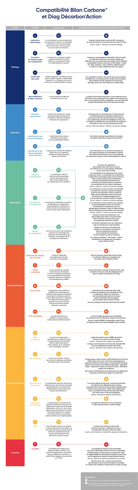

# 6.2 - Compatibilité de la démarche avec d'autres référentiels

<figure><figcaption>
Source : Freepik
</figcaption></figure>

La démarche Bilan Carbone® est compatible avec de nombreuses **méthodes et standards** et permet également de répondre à différentes **normes et règlementations** concernant la comptabilité carbone et stratégie de décarbonation. Parmi ces **référentiels** se trouvent :&#x20;

* [La méthode réglementaire pour la réalisation des bilans d'émissions des GES](../annexes/bibliographie/#methode-reglementaire) (BEGES-R)
* La [Corporate Sustainability Reporting Directive](../annexes/bibliographie/#csrd) (CSRD)
* [La comptabilité carbone analytique](../annexes/bibliographie/#guides-pratiques) (CCA)
* Le [Green House Gas Protocol](../annexes/bibliographie/#ghg-p) (GHG-P)
* &#x20;L'[ISO 14064-1:2018 et ISO 14069:2013](../annexes/bibliographie/#iso) (ISO)

Diverses méthodes complémentaires au Bilan Carbone® existent, permettant de [progresser dans son parcours de maturité](../introduction-a-la-transition-bas-carbone/quelle-integration-du-bilan-carbone-r-au-sein-dune-demarche-de-transition-bas-carbone.md#id-4-le-bilan-carbone-r-dans-une-demarche-de-transition-bas-carbone-section-a-relire-et-finir), comme la démarche [ACT-Pas à Pas](../annexes/bibliographie/#act-pas-a-pas-ou-act-step-by-step).

## Compatibilité avec le Bilan GES règlementaire

En suivant la méthode Bilan Carbone®, une organisation répond aux exigences de la méthode réglementaire pour la réalisation des bilans d'émissions de GES ([BEGES-R](../annexes/bibliographie/)), dès le premier [niveau de maturité](../1-cadrage-de-la-demarche/1.1-definir-son-niveau-de-maturite-bilan-carbone-r.md) (Niveau Initial).

Le tableau ci-dessous illustre la correspondance entre les différentes exigences de la méthode réglementaire et la façon dont le Bilan Carbone® y répond.

<figure><figcaption>
Figure 6.2.1 : Compatibilité entre Bilan Carbone® et Bilan GES règlementaire
</figcaption></figure>

<mark style="color:$info;">🌐</mark> [_<mark style="color:$info;">English version</mark>_](https://abc-transitionbascarbone.fr/wp-content/uploads/2025/11/Compatibility-with-the-Regulatory_Comptabilite-avec-la-methode-GES-scaled.png) _<mark style="color:$info;">of this image.</mark>_

Le dépôt de la méthode réglementaire se fait dans la [plateforme nationale](../annexes/bibliographie/#autres-standards-normes-et-reglementations-de-comptabilisation-des-emissions-de-ges) pour la publication des bilans d'émission de gaz à effet et serre de l'ADEME.&#x20;

## Compatibilité avec le Diag Décarbon'Action

Le [Diag Décarbon'Action](https://www.bilancarbone-methode.com/annexes/bibliographie#autres-standards-normes-et-reglementations-de-comptabilisation-des-emissions-de-ges) est un dispositif d'accompagnement est un dispositif d'accompagnement créé et financé par Bpifrance et l’ADEME, avec l'appui méthodologique de l'ABC, qui permet de réaliser un premier bilan des émissions de gaz à effet de serre.

Le Bilan Carbone® peut être utilisé pour répondre au dispositif. En particulier en s'appuyant sur les critères du [Niveau Initial](../1-cadrage-de-la-demarche/1.1-definir-son-niveau-de-maturite-bilan-carbone-r.md), qui sont adaptés aux cibles du Diag Décarbon'action (TPE, PME et certaines ETI, donc des organisations débutantes ou des petites structures avec peu de ressources, effectuant leur premier Bilan Carbone®).&#x20;

Un tableau de correspondance ci-dessous présente le détail des correspondances entre un Bilan Carbone® niveau initial, et un Diag Décarbon'Action :&#x20;

<figure><figcaption>
Figure 6.2.2 : Compatibilité entre Bilan Carbone® et Diag Décarbon'action
</figcaption></figure>

A noter qu'en plus de cela, le dispositif Diag Décarbon'action demande une "mise en transition" (exemples non exhaustifs et non cumulatifs : préparation d'un plan de communication, construction d'une calculette GES, dispositif de suivi des résultats des actions, etc.), ce qui correspond avec les prescriptions du Bilan Carbone® sur la phase de [mise en œuvre du plan de transition](../5-plan-de-transition/5.4-mise-en-oeuvre-du-plan-de-transition.md).&#x20;

## Compatibilité avec la Corporate Sustainability Reporting Directive

La directive européenne CSRD incite les organisations à transformer leurs modèles d'affaires pour répondre aux enjeux climatiques et aux réalités scientifiques sur l'impact environnemental et social des activités économiques. La démarche Bilan Carbone®, essentiel dans ce contexte, permet aux organisations de comptabiliser leurs émissions de gaz à effet de serre et d'évaluer l'impact de leurs activités. En se basant sur ces données, les organisations peuvent élaborer un plan de transition structuré pour réduire leurs émissions et atteindre les objectifs de la CSRD.

Le suivi de la démarche Bilan Carbone®, à partir du [niveau de maturité](../1-cadrage-de-la-demarche/1.1-definir-son-niveau-de-maturite-bilan-carbone-r.md) Avancé, permet de répondre à la majeure partie des exigences de la norme ESRS E1 de la CSRD, qui concerne le changement climatique. L'ESRS E1 est divisée en 12 Disclosure Requirements (DR) : E1.GOV-3, E1.IRO-1, E1.SBM-3, E1-1, E1-2, E1-3, E1-4, E1-5, E1-6, E1-7, E1-8, et E1-9. Chaque DR contient un certains nombre de points de données (datapoints) à reporter.

L'étape de comptabilisation du Bilan Carbone® et l'export du [profil d'émission](../4-comptabilisation/4.5-profil-demission.md#csrd-esrs-e1-6-et-e1-5) au format de reporting demandé couvre les DR E1-5 et E1-6. D'autres étapes de la démarche Bilan Carbone® (plan de transition, analyse des risques) permet de couvrir une majeure partie des autres DR.

> <mark style="background-color:blue;">⏳\[</mark>[<mark style="background-color:blue;">WIP</mark>](../#structures-des-informations-specifiques)<mark style="background-color:blue;">] A date, un bureau d’étude indépendant a mené une évaluation sur les taux de compatibilité entre les deux référentiels. Ils sont présentés ci-dessous, afin de simplifier l'intégration de ces éléments avec les exigences de la CSRD.</mark> <mark style="background-color:blue;"></mark><mark style="background-color:blue;">**Des évolutions sont prévues dans la méthode, et surtout dans les outils, pour automatiser la couverture de points de données (datapoints) supplémentaires.**</mark>

**\*% DP couverts :** Un DP désigné comme « couvert » ci-dessous n'est pas systématiquement une correspondance totale. Il s'agit du taux de DP pour lesquels le Bilan Carbone® fournit des informations, mais potentiellement partiellement : via des évolutions en cours (ajustements méthodologiques, futurs outils), ou dont la qualité de la réponse dépend de l'organisation elle-même.

<table data-full-width="true"><thead><tr><th width="180">DR</th><th width="81">% DP*</th><th width="405">Précisions</th><th>⏳[WIP] Evolutions prévues</th></tr></thead><tbody><tr><td>E1-1 : Élaborer un plan de transition pour l'atténuation du changement climatique</td><td>63%</td><td>La méthode Bilan Carbone® est un bon socle et couvre en partie l'E1 sur de nombreux aspects. Si des évolutions sont prévues, la méthode n'a pas vocation à couvrir 100% des DP. Des approfondissements sont nécessaires. Par exemple concernant l'approche stratégique, c'est un prérequis du Niveau Avancé, qui peut se construire entre 2 renouvellements du bilan, via ACT-S ou équivalent.)</td><td>Des évolutions mineures de la méthode sont prévues afin d'améliorer certaines prises en compte (aujourd'hui partielle) de DP, ce qui ne fera pas augmenter sensiblement le % total. Il s'agit de précisions et reformulations (par exemple sur les actions stratégiques, sur les indicateurs carbone en KPI, pour lequel le BC niveau avancé a déjà des exigences opérationnelles).</td></tr><tr><td>E1-2 : Prouver que des politiques relatives à l'atténuation et à l'adaptation au changement climatique sont mises en place par l’entreprise</td><td>100%</td><td>La méthode Bilan Carbone® couvre l'ensemble de l'E2, au moins partiellement. Des évolutions sont prévues pour maximiser la couverture de certains DP. Approfondissements non nécessaires.</td><td>Des évolutions mineures de la méthode sont prévues afin d'améliorer certaines prises en compte (aujourd'hui partielle) de DP, pour viser une prise en compte maximale. Il s'agit de précisions sur certaines notions (l'efficacité énergétique, les énergies renouvelables et l'adaptation)</td></tr><tr><td>E1-3 : Publier les actions et ressources liées aux politiques mises en place en lien avec le changement climatique</td><td>100%</td><td>La méthode Bilan Carbone® couvre l'ensemble de l'E3, au moins partiellement. Ce DR étant au cœur des étapes du plan de transition de la méthode Bilan Carbone. Des évolutions sont prévues pour maximiser la couverture de certains DP. Approfondissements non nécessaires.</td><td>Des évolutions mineures de la méthode sont prévues afin d'améliorer certaines prises en compte (aujourd'hui partielle) de DP, pour viser une prise en compte maximale. Il s'agit de précisions notamment sur les notions de Capex et Opex permettant d'ancrer le climat au cœur de la stratégie d'entreprise.</td></tr><tr><td>E1-4 : Objectifs liés à l'atténuation et à l'adaptation au changement climatique</td><td>100%</td><td>La méthode Bilan Carbone® couvre l'ensemble de l'E4, au moins partiellement. Ce DR étant au cœur des étapes du plan de transition de la méthode Bilan Carbone. Des évolutions sont prévues pour maximiser la couverture de certains DP. Approfondissements non nécessaires.</td><td>Des évolutions mineures de la méthode sont prévues afin d'améliorer certaines prises en compte (aujourd'hui partielle) de DP, pour viser une prise en compte maximale. Il s'agit de précisions notamment sur une liste précise d'indicateurs, sur des objectifs séparés sur les scopes 1, 2 et 3, ou sur des objectifs alignés 1.5°C.</td></tr><tr><td>E1-5 : Consommation d’énergie et mix énergétique</td><td>74%</td><td>La méthode Bilan Carbone® couvre la majeure partie de l'E5, au moins partiellement. Plusieurs évolutions sont prévues pour que la méthode couvre 100% des DP, ce DR étant au cœur de l'étape de quantification des émissions. Approfondissements complémentaires non nécessaires.</td><td>La majeure partie des évolutions concerne la création d'un Export CSRD qui sera ajouté dans les futurs outils (janvier 2025), pour viser une prise en compte maximale de ce DR. Cela concerne notamment une liste d'indicateurs énergétique. La complétude de cet export sera une option, si le Bilan Carbone® doit servir à l'exercice de reporting CSRD.</td></tr><tr><td>E1-6 : Émissions brutes de GES des scopes 1, 2, 3 et total</td><td>71%</td><td>La méthode Bilan Carbone® couvre la majeure partie de l'E6, au moins partiellement. Plusieurs évolutions sont prévues pour que la méthode couvre 100% des DP, ce DR étant au cœur de l'étape de quantification des émissions. Approfondissements complémentaires non nécessaires.</td><td>La majeure partie des évolutions concerne la création d'un Export CSRD qui sera ajouté dans les futurs outils (janvier 2025), pour viser une prise en compte maximale de ce DR. Cela concerne notamment une liste d'indicateurs, la notion de la dépendance au secteur à fort impact, et les émissions spécifiques des scopes 1 et 2. La complétude de cet export sera une option, si le Bilan Carbone® doit servir à l'exercice de reporting CSRD.</td></tr><tr><td>E1-7 : Les absorptions de GES et les projets d'atténuation des GES financés grâce aux crédits carbone</td><td>0%</td><td>Ce DR n'est pas couvert par la méthode Bilan Carbone®, et n'a pas vocation à l'être. Des approfondissements complémentaires sont donc nécessaires.</td><td>L'ABC et sa communauté souhaite se positionner sur ce sujet, mais potentiellement en sus de la méthode Bilan Carbone® actuelle.</td></tr><tr><td>E1-8 : Tarification du carbone</td><td>0%</td><td>Ce DR n'est pas couvert par la méthode Bilan Carbone®, et n'a pas vocation à l'être. Des approfondissements complémentaires sont donc nécessaires.</td><td>Evolutions non prévues.</td></tr><tr><td>E1-9 : Effets financiers anticipés des risques physiques et de transition et des opportunités potentielles liées au climat</td><td>100%</td><td>La méthode Bilan Carbone® couvre partiellement l'ensemble de l'E9. Si des évolutions sont prévues, la méthode n'a pas vocation à couvrir ces DP autrement que partiellement. Des approfondissements complémentaire sont donc nécessaires. Par exemple concernant l'analyse des risques, c'est un prérequis, qui peut se construire de manière complémentaire au Niveau Avancé (TCFD, OCARA ou équivalent)</td><td>Des évolutions mineures de la méthode sont prévues afin d'améliorer certaines prises en compte, mais elle continuera à s'intéresser à la plupart des DP de manière partielle. Il s'agit de précisions notamment sur la méthode d'analyse des risques.</td></tr><tr><td>E1.GOV-3 : Intégration de la stratégie dans la gouvernance</td><td>0%</td><td>Ce DR n'est pas couvert par la méthode Bilan Carbone®, et n'a pas vocation à l'être. Des approfondissements complémentaires sont donc nécessaires. La méthode recommande vivement l'utilisation de ACT-S si besoin d'approfondir les champs manquants de ce DR.</td><td>Evolutions non prévues.</td></tr><tr><td>E1.SBM-3 : Résilience du business model face aux enjeux climatiques</td><td>85%</td><td>La méthode Bilan Carbone® est un bon socle et couvre en partie la DR SMB-3 sur de nombreux aspects. Si des évolutions sont prévues, la méthode n'a pas vocation à couvrir 100% des DP. Des approfondissements sont nécessaires. La méthode recommande vivement l'utilisation de ACT-S si besoin d'approfondir les champs manquants de ce DR.</td><td>Des évolutions mineures de la méthode sont prévues afin d'améliorer certaines prises en compte, notamment sur le lien entre stratégie climat et stratégie globale de l'organisation, ou sur les objectifs d'adaptation.</td></tr><tr><td>E1.IRO-1 : Analyse des impacts, risques et opportunités climat</td><td>88%</td><td>La méthode Bilan Carbone® est un bon socle et couvre en partie l'IRO-1 sur de nombreux aspects, notamment sur la notion de temporalité (court, moyen, long terme) et les scénarios. La méthode n'a pas vocation à couvrir 100% des DP. Des approfondissements restent donc nécessaires. La méthode recommande vivement l'utilisation d'une méthode complémentaire (TCFD, OCARA ou équivalent) si besoin d'approfondir les champs manquants de ce DR.</td><td>Evolutions non prévues.</td></tr></tbody></table>

> <mark style="background-color:blue;">⏳\[</mark>[<mark style="background-color:blue;">WIP</mark>](../#structures-des-informations-specifiques)<mark style="background-color:blue;">] Nous travaillons activement à faire évoluer les</mark> [<mark style="background-color:blue;">outils</mark>](../formation-et-outils-dapplication-de-la-methode/outils-bilan-carbone-r-tableurs-et-logiciel.md) <mark style="background-color:blue;">pour qu'ils soient entièrement optimisés, avec des fonctionnalités spécifiques pour un export CSRD. Pour information, un tableau plus complet et actualisé sera prochainement inséré ici pour illustrer la correspondance entre les différentes directives (DR) de la CSRD ESRS E1 et la façon dont le Bilan Carbone® couvre ces points de données (datapoints).</mark>

Le rapport de la CSRD doit être publié dans une partie dédiée au sein du rapport de gestion et doit être rendu public au format électronique unique européen (ESEF), dans le cadre du projet ESAP (European Single Access Point ou point d’accès unique européen).

## Compatibilité et lien avec ACT Pas à Pas

A la suite de la démarche Bilan Carbone®, les organisations souhaitant approfondir et affiner leur stratégie de décarbonation, peuvent se lancer dans des démarches telles que [ACT-Pas à Pas](../annexes/bibliographie/#act-pas-a-pas-ou-act-step-by-step).

Afin que le suivi de ACT se passe au mieux, certains critères de la méthode Bilan Carbone® sont à respecter avec attention, car ils sont des prérequis à la démarche ACT.

Le Bilan Carbone® et ACT pas-à-pas sont deux démarches complémentaires, avec un objectif commun. L'ABC et l'ADEME recommande d'articuler le Bilan Carbone® et ACT® dans **3 parcours possibles** selon votre maturité :

<figure><figcaption>
Figure 6.2.3 : Parcours de transition bas carbone Bilan Carbone® x ACT pas-à-pas
</figcaption></figure>

🌐 _English version of this image._

### Parcours 1 : Initiation&#x20;

**Un Bilan Carbone® Initial suivi d'ACT pas-à-pas**

* Un premier inventaire des émissions et définition d'un plan d'action court terme, en réalisation un Bilan Carbone® Initial.
* Il peut être suivi d'une démarche ACT pas-à-pas pour construire une stratégique climatique opérationnelle allant du court au long terme en cohérence avec la stratégie globale de l'organisation.
* Idéal pour les organisations débutantes.

> <mark style="background-color:blue;">⏳\[</mark>[<mark style="background-color:blue;">WIP</mark>](../#structures-des-informations-specifiques)<mark style="background-color:blue;">] Pour information, une infographie 6.2.4 sera prochainement insérée ici pour illustrer ce parcours.</mark>&#x20;

Le tableau ci-dessous vous donne le détail nécessaire pour bien articuler ces 2 démarches :

| Ce que fait le Bilan Carbone® Initial                                                                                                                                                                                                                                                                                                                                                                                                                                                                                                                                                                                                                                                                                                                                                                                                                                                                                                                                                                                                                                                                                                                                                  | Commentaires                                                                                                                                                                                                                                                                                                                                                                                                                                                                                                                                                                                                                                                                                                                                                                                                                                                                                                                                                                                                                                                                                                                                                                                                                                                                                                                                                                | Tuilage entre Bilan Carbone® Initial et ACT Pas-à-Pas                                                                                                                                                                                                                                                                                                                                                                                                                                                                                                                                                                                                                                                                                                                                                                                                                                                                                                                                                                                                                                                                                                                                                                                                                                                                                                                                                                                                                                                                                                                                                                                             | Ce que fait ACT Pas-à-Pas                                                                                                                                                                                                                                                                                                                                                                                                                                                                                                                                                                                                                                                                                                 |
| -------------------------------------------------------------------------------------------------------------------------------------------------------------------------------------------------------------------------------------------------------------------------------------------------------------------------------------------------------------------------------------------------------------------------------------------------------------------------------------------------------------------------------------------------------------------------------------------------------------------------------------------------------------------------------------------------------------------------------------------------------------------------------------------------------------------------------------------------------------------------------------------------------------------------------------------------------------------------------------------------------------------------------------------------------------------------------------------------------------------------------------------------------------------------------------- | --------------------------------------------------------------------------------------------------------------------------------------------------------------------------------------------------------------------------------------------------------------------------------------------------------------------------------------------------------------------------------------------------------------------------------------------------------------------------------------------------------------------------------------------------------------------------------------------------------------------------------------------------------------------------------------------------------------------------------------------------------------------------------------------------------------------------------------------------------------------------------------------------------------------------------------------------------------------------------------------------------------------------------------------------------------------------------------------------------------------------------------------------------------------------------------------------------------------------------------------------------------------------------------------------------------------------------------------------------------------------- | ------------------------------------------------------------------------------------------------------------------------------------------------------------------------------------------------------------------------------------------------------------------------------------------------------------------------------------------------------------------------------------------------------------------------------------------------------------------------------------------------------------------------------------------------------------------------------------------------------------------------------------------------------------------------------------------------------------------------------------------------------------------------------------------------------------------------------------------------------------------------------------------------------------------------------------------------------------------------------------------------------------------------------------------------------------------------------------------------------------------------------------------------------------------------------------------------------------------------------------------------------------------------------------------------------------------------------------------------------------------------------------------------------------------------------------------------------------------------------------------------------------------------------------------------------------------------------------------------------------------------------------------------- | ------------------------------------------------------------------------------------------------------------------------------------------------------------------------------------------------------------------------------------------------------------------------------------------------------------------------------------------------------------------------------------------------------------------------------------------------------------------------------------------------------------------------------------------------------------------------------------------------------------------------------------------------------------------------------------------------------------------------- |
| 
-G1 : L'organisation identifie les différents risques liés au changement climatique (risques physiques, risques de transition).  -O1 : La vision de l'organisation est définie par un objectif moyen et long terme (horizon temporel 2030 et 2050), exprimés en valeur absolue, et en cohérence avec la stratégie nationale.  -P1 : Le plan de transition contient des actions immédiates, prioritaires et d'amélioration de la collecte.  -Q1 : Un potentiel de réduction d'émissions global du plan de transition est évalué quantitativement. Les impacts de l'implémentation des actions sont évalués qualitativement.  -R1 : La quantification du potentiel de réduction permet de construire une trajectoire en approche ascendante (dite bottom-up) sur 3-4 ans, soit la période de renouvellement du bilan. Elle justifie l'atteinte d'un objectif court terme (horizon du prochain bilan) cohérent avec l'objectif global.  -S1 : Des indicateurs de suivi et de mise en œuvre des actions sont définis. Le suivi des indicateurs de performance (émissions significatives) entre chaque renouvellement de la démarche n'est pas imposé.
 | 
Le niveau initial constitue un premier Bilan Carbone®, répondant notamment aux attentes du BEGES-R et du Diag Décarbon'action.   Une première identification des risques physiques et de transition est faite : - l'organisation liste les différents risques et les impacts liés au changement climatique, sans obligatoirement que ceux-ci lui soient spécifiques.  Un premier plan de transition est réalisé contenant  : - des premiers objectifs, qui ne nécessitent pas d'être exprimés en intensité relative, d'être basés sur une analyse sectorielle approfondie ni sur une projection détaillée de l'activité globale de l'organisation. - des actions immédiates, prioritaires et d'amélioration de la collecte. Les fiches-actions contiennent des éléments sur leur mise en œuvre et sur leur potentiel de réduction (qualitatifs). - le volume global de réduction du Plan de Transition (quantitatif) dont l'ordre de grandeur peut se baser sur une quantification des effets cumulés des principales actions (et pas nécessairement sur une quantification de chaque action). - ce volume permet de tracer une première trajectoire de réduction sur les 3-4 prochaines années. - des indicateurs de suivi et de mise en œuvre associés aux actions, qui ne font pas nécessairement l'objet d'un dispositif de suivi.
 | 
L’ADEME recommande d’utiliser la méthode Bilan Carbone® en amont de la réalisation de ACT Pas à Pas.  Il est tout à fait pertinent et souhaitable de se lancer dans une démarche ACT®-pas à pas après un Bilan Carbone® Initial. Les livrables issus du Bilan Carbone® (G1, et O1 à S1) seront approfondis lors du suivi de la démarche ACT®-pas à pas. Cela permet de les consolider en véritable stratégie climat et feuille de route du plan de transition.  D'autres étapes (analyse de risques, formation pour décideurs suivie par des membres de la direction/instance dirigeante, actions de mobilisation) optionnelles pour le niveau initial, peuvent alimenter la démarche ACT®-pas à pas, qui permettra d'approfondir les réflexions sans obligatoirement repartir de zéro.  Si les conditions sont réunies, il peut être pertinent (main non obligatoire) de s'appuyer sur le même prestataire dans la réalisation du Bilan Carbone® et de ACT®-pas à pas. Cela garantit une compréhension fine des éléments à approfondir et une certaine continuité de parcours.  Lorsque l'organisation est formellement engagée dans une démarche ACT®-pas à pas à l'issue de son Bilan Carbone® initial, il est recommandé de focaliser le critère P1 sur la construction d'un plan d'actions 'sans regret' dont la mise en œuvre peut s'engager rapidement sans attendre ACT®-pas à pas (actions immédiates, de sensibilisation, mobilisation de la Direction, dont l'impact ne fait aucun doute). Les actions plus coûteuses ou plus stratégiques seront dans tous les cas construites dans ACT®-pas à pas.
 | 
ACT®-pas à pas permet de construire sa stratégie climat, en définissant :  - sa situation actuelle, via un état des lieux global des pratiques de l'entreprise et de la maturité de l'entreprise sur le sujet - les enjeux auxquels l'entreprise doit faire face (SWOT-climat) - sa vision long terme (modèles d'affaires, produits/services, marchés et pérennité) dans un monde bas carbone avec une feuille de route séquencée associée - un plan stratégique à court à moyen terme  (voire plus selon la capacité de projection se dessinant lors de l'accompagnement) - un plan d'action court terme qui traduit la stratégie en mesures concrètes, pilotables, caractérisées et planifiées
 |

### Parcours 2 : Intégration

**Un Bilan Carbone® Standard intégrant ACT pas-à-pas**

*
  La comptabilisation exhaustive des émissions se fait via le Bilan Carbone® Standard.
*
  Puis la construction du plan de transition avec ACT Pas-à-Pas.
* Idéal pour une démarche intégrée combinant la rigueur de la méthode et des outils Bilan Carbone® et la structuration d'un plan de transition approfondi issu de ACT Pas-à-Pas.

<figure><figcaption>
Figure 6.2.5 : Parcours de transition "<strong>Intégration</strong>" entre Bilan Carbone® x ACT pas-à-pas
</figcaption></figure>

🌐 _English version of this image._

Le tableau ci-dessous vous donne le détail nécessaire pour bien articuler ces 2 démarches :

| Ce que fait le Bilan Carbone® Standard                                                                                                                                                                                                                                                                                                                                                                                                                                                                                                                                                                                                                                                                                                                                                                                                                                                                                                                                                                                                                                                                                                                                                                                                                                                                                                                                                            | Commentaires                                                                                                                                                                                                                                                                                                                                                                                                                                                                                                                                                                                                                                                                                                                                                                                                                                                                                                                                                                                                                                                                                                                                                                                                                                                                                                                                                                                                                                                                                                                                                                                                                                                                                                                   | Tuilage entre Bilan Carbone® Standard et ACT Pas-à-Pas                                                                                                                                                                                                                                                                                                                                                                                                                                                                                                                                                                                                                                                                                                                                                                                                                                                                                                                                                                                                                                                                                                                                                                                                                                                                                                                                                                                                                                                                                                                                                                                                                                                                                                   | Ce que fait ACT Pas-à-Pas                                                                                                                                                                                                                                                                                                                                                                                                                                                                                                                                                                                                                                                                                                                           |
| ------------------------------------------------------------------------------------------------------------------------------------------------------------------------------------------------------------------------------------------------------------------------------------------------------------------------------------------------------------------------------------------------------------------------------------------------------------------------------------------------------------------------------------------------------------------------------------------------------------------------------------------------------------------------------------------------------------------------------------------------------------------------------------------------------------------------------------------------------------------------------------------------------------------------------------------------------------------------------------------------------------------------------------------------------------------------------------------------------------------------------------------------------------------------------------------------------------------------------------------------------------------------------------------------------------------------------------------------------------------------------------------------- | ------------------------------------------------------------------------------------------------------------------------------------------------------------------------------------------------------------------------------------------------------------------------------------------------------------------------------------------------------------------------------------------------------------------------------------------------------------------------------------------------------------------------------------------------------------------------------------------------------------------------------------------------------------------------------------------------------------------------------------------------------------------------------------------------------------------------------------------------------------------------------------------------------------------------------------------------------------------------------------------------------------------------------------------------------------------------------------------------------------------------------------------------------------------------------------------------------------------------------------------------------------------------------------------------------------------------------------------------------------------------------------------------------------------------------------------------------------------------------------------------------------------------------------------------------------------------------------------------------------------------------------------------------------------------------------------------------------------------------ | -------------------------------------------------------------------------------------------------------------------------------------------------------------------------------------------------------------------------------------------------------------------------------------------------------------------------------------------------------------------------------------------------------------------------------------------------------------------------------------------------------------------------------------------------------------------------------------------------------------------------------------------------------------------------------------------------------------------------------------------------------------------------------------------------------------------------------------------------------------------------------------------------------------------------------------------------------------------------------------------------------------------------------------------------------------------------------------------------------------------------------------------------------------------------------------------------------------------------------------------------------------------------------------------------------------------------------------------------------------------------------------------------------------------------------------------------------------------------------------------------------------------------------------------------------------------------------------------------------------------------------------------------------------------------------------------------------------------------------------------------------- | --------------------------------------------------------------------------------------------------------------------------------------------------------------------------------------------------------------------------------------------------------------------------------------------------------------------------------------------------------------------------------------------------------------------------------------------------------------------------------------------------------------------------------------------------------------------------------------------------------------------------------------------------------------------------------------------------------------------------------------------------- |
| 
'-G2 : L'organisation identifie les risques lui étant spécifiques, et formalise un lien avec la cartographie des flux pour problématiser les vulnérabilités.

-O2 : La vision de l'organisation est définie par un objectif moyen et long terme (horizon temporel 2030 et 2050), exprimés en valeur absolue et en intensité relative. Ils sont cohérents avec les objectifs des standards sectoriels internationaux.

-P2 : Le plan de transition contient des actions immédiates, prioritaires, stratégiques, d'adaptation et d'amélioration de la collecte.

-Q2 : Les potentiels de réductions d'émissions sont quantifiés, à minima pour les actions immédiates et prioritaires.

-R2 : La quantification du potentiel de réduction permet de construire une trajectoire en approche ascendante (dite bottom-up) sur 10 ans. Elle justifie l'atteinte des objectifs court terme (horizon du prochain bilan) et moyen terme (horizon 2030 ou sur une dizaine d'années) cohérents avec l'objectif global.

-S2 : Des indicateurs de suivi et de mise en œuvre des actions sont définis. Des indicateurs de performance permettent de suivre les émissions les plus significatives. Un dispositif de suivi de type tableau de bord est utilisé pour le suivi de ces indicateurs entre chaque renouvellement de la démarche. Il permet d'analyser les évolutions.
 | 

Le niveau standard constitue un Bilan Carbone® avec des notions plus approfondies en termes de plan de transition. 

Une identification spécifique des risques physiques et de transition
<ul><li>L'analyse des vulnérabilités de l'organisation consiste à cartographier les risques étant spécifiques à l'organisation. Cette réflexion permet d'alimenter le plan de transition avec au moins une action d'adaptation.</li></ul>
Un plan de transition contenant :
<ul><li>la construction des objectifs devient plus élaborée : elle nécessite l'analyse des standards sectoriels internationaux, en valeur absolue et en intensité relative. Ils ne sont pas, à ce stade, nécessairement croisés avec une projection détaillée de l'activité globale de l'organisation.</li><li>le plan d'actions devient plus diversifié et représentatif sur les types d'actions : en plus des actions immédiates, prioritaires et d'amélioration de la collecte, il doit contenir une ou des actions stratégiques et d'adaptation. Les fiches actions contiennent divers éléments sur la mise en œuvre et la pertinence de l'action.</li><li>les potentiels de réduction des actions sont quantitatifs (au moins pour les actions immédiates et prioritaires)</li><li>les objectifs et potentiels de réduction (quantitatifs) permettent de tracer une trajectoire sur 10 ans. Le total de réduction estimé permet à minima de suivre la tendance fixée par les objectifs</li><li>un dispositif de suivi permet d'analyser les évolutions entre deux bilans. Il doit être utilisé par l'organisation en interne, tant sur la mise en œuvre des actions, que sur la performance des résultats obtenus.</li></ul> | 
Dans le cadre d’un Bilan Carbone® Standard, l’ABC recommande de travailler le plan de transition via ACT Pas-à-Pas.

Concrètement, il s'agit de se lancer dans une démarche ACT®-pas à pas pour mener à bien l'étape 5 un Bilan Carbone® Standard et de construire un plan de transition qui répond à toutes les exigences O2 à S2.

ACT® pas-à-pas permet de gagner en maturité en allant plus loin que les exigences sur plusieurs aspects :
<ul><li>la trajectoire intègre des notions supplémentaires (émissions verrouillées, utilisation de trajectoires de référence, logique sectorielle, croissance prévisionnelle, etc.)</li><li>développement d'une vision long terme (modèles d'affaires, produits/services, marchés et pérennité)</li></ul>
Concernant la cartographie des risques (critère G2), il est possible d'assurer une continuité dans la réflexion, en l'utilisant ou en l'approfondissant lors de la démarche ACT® pas-à-pas.

De même, si d'autres exigences du Bilan Carbone®, optionnelles pour le niveau Standard, ont été suivies (formation pour décideurs suivie par des membres de la direction, actions de mobilisation) elles alimenteront la démarche ACT® pas-à-pas sans obligatoirement repartir de zéro.

Dans ce parcours intégré, la restitution (étape 6 dans un Bilan Carbone® et étape 5.f dans ACT®-pas à pas) peut se faire en même temps, et sert alors de point final des 2 démarches.

Il est pertinent de s'appuyer sur le même prestataire dans la réalisation du Bilan Carbone® et de ACT®-pas à pas. Cela garantit la fluidité de la démarche, une compréhension fine des éléments à approfondir et une véritable intégration du parcours Bilan Carbone® x ACT®.
 | 

ACT®-pas à pas permet de construire sa stratégie climat, en définissant :
<ul><li>sa situation actuelle, via un état des lieux global des pratiques de l'entreprise et de la maturité de l'entreprise sur le sujet</li><li>les enjeux auxquels l'entreprise doit faire face (SWOT-climat)</li><li>sa vision long terme (modèles d'affaires, produits/services, marchés et pérennité) dans un monde bas carbone avec une feuille de route séquencée associée</li><li>un plan stratégique à court à moyen terme (voire plus selon la capacité de projection se dessinant lors de l'accompagnement)</li><li>un plan d'action court terme qui traduit la stratégie en mesures concrètes, pilotables, caractérisées et planifiées</li></ul> |

### Parcours 3 : Pilotage

**Un ACT pas-à-pas suivi d'un Bilan Carbone® Avancé**

* Le plan de transition a déjà été construit en amont avec ACT Pas-à-Pas
* Le pilotage opérationnel et le suivi de performance se fait avec le renouvellement d'une démarche Bilan Carbone® au niveau de maturité Avancé
* Cela permet une actualisation et amélioration continue du plan de transition
* Idéal pour les optimiser son Bilan Carbone® et piloter un plan de transition préexistant construit via ACT Pas-à-Pas

> <mark style="background-color:blue;">⏳\[</mark>[<mark style="background-color:blue;">WIP</mark>](../#structures-des-informations-specifiques)<mark style="background-color:blue;">] Pour information, une infographie 6.2.6 sera prochainement insérée ici pour illustrer ce parcours.</mark>&#x20;

Le tableau ci-dessous vous donne le détail nécessaire pour bien articuler ces 2 démarches :

| Ce que fait ACT Pas-à-Pas                                                                                                                                                                                                                                                                                                                                                                                                                                                                                                                                                                                                                                                                                                                           | Tuilage entre ACT Pas-à-Pas et Bilan Carbone® Avancé                                                                                                                                                                                                                                                                                                                                                                                                                                                                                                                              | Commentaires                                                                                                                                                                                                                                                                                                                                                                                                                                                                                                                                                                                                                                                                                                                                                                                                                                                                                                                                                                                                                                                                                                      | Ce que fait le Bilan Carbone® Avancé                                                                                                                                                                                                                                                                                                                                                                                                                                                                                                                                                                                                                                                                                                                                                                                                                                                                                                                                                                                                                                                                                                                                                                                                                                                                                                                                                                                                                                                                                                                                                                                                                                                                                                                                                                                                                                                                                                                                                                                                                                                   |
| --------------------------------------------------------------------------------------------------------------------------------------------------------------------------------------------------------------------------------------------------------------------------------------------------------------------------------------------------------------------------------------------------------------------------------------------------------------------------------------------------------------------------------------------------------------------------------------------------------------------------------------------------------------------------------------------------------------------------------------------------- | --------------------------------------------------------------------------------------------------------------------------------------------------------------------------------------------------------------------------------------------------------------------------------------------------------------------------------------------------------------------------------------------------------------------------------------------------------------------------------------------------------------------------------------------------------------------------------- | ----------------------------------------------------------------------------------------------------------------------------------------------------------------------------------------------------------------------------------------------------------------------------------------------------------------------------------------------------------------------------------------------------------------------------------------------------------------------------------------------------------------------------------------------------------------------------------------------------------------------------------------------------------------------------------------------------------------------------------------------------------------------------------------------------------------------------------------------------------------------------------------------------------------------------------------------------------------------------------------------------------------------------------------------------------------------------------------------------------------- | -------------------------------------------------------------------------------------------------------------------------------------------------------------------------------------------------------------------------------------------------------------------------------------------------------------------------------------------------------------------------------------------------------------------------------------------------------------------------------------------------------------------------------------------------------------------------------------------------------------------------------------------------------------------------------------------------------------------------------------------------------------------------------------------------------------------------------------------------------------------------------------------------------------------------------------------------------------------------------------------------------------------------------------------------------------------------------------------------------------------------------------------------------------------------------------------------------------------------------------------------------------------------------------------------------------------------------------------------------------------------------------------------------------------------------------------------------------------------------------------------------------------------------------------------------------------------------------------------------------------------------------------------------------------------------------------------------------------------------------------------------------------------------------------------------------------------------------------------------------------------------------------------------------------------------------------------------------------------------------------------------------------------------------------------------------------------------------- |
| 

ACT®-pas à pas permet de construire sa stratégie climat, en définissant :
<ul><li>sa situation actuelle, via un état des lieux global des pratiques de l'entreprise et de la maturité de l'entreprise sur le sujet</li><li>les enjeux auxquels l'entreprise doit faire face (SWOT-climat)</li><li>sa vision long terme (modèles d'affaires, produits/services, marchés et pérennité) dans un monde bas carbone avec une feuille de route séquencée associée</li><li>un plan stratégique à court à moyen terme (voire plus selon la capacité de projection se dessinant lors de l'accompagnement)</li><li>un plan d'action court terme qui traduit la stratégie en mesures concrètes, pilotables, caractérisées et planifiées</li></ul> | 
La démarche ACT®-pas à pas donne à l'organisation une maturité suffisante pour se lancer dans un Bilan Carbone® avancé.

Lorsqu'elle entame ce niveau avancé, l’organisation doit être déjà engagée dans une stratégie climat, qu'elle a donc obtenue ici via ACT pas à pas.

C'est ainsi que le Bilan Carbone® peut servir d'outil pour piloter et évaluer les résultats de la réduction des émissions. Et donc du suivi de la trajectoire de décarbonation, et le cas échéant, d'une éventuelle évaluation ou réorientation de la stratégie de l'organisation.
 | 
Le niveau avancé constitue un Bilan Carbone® axé sur le pilotage d'un plan de transition défini lors de la démarche ou lors de la réalisation amont d'une démarche complémentaire, ici ACT®-pas à pas.

Les livrables issus de ACT® et la stratégie climat peuvent resservir tels quels dans le Bilan Carbone® avancé, ou être ajustés si besoin. Pour cela l'organisation doit :
 1/vérifier qu'ils sont bien alignés avec les exigences O3 à S3. C'est a priori le cas si la démarche ACT®-pas à pas a été suivie correctement.
 2/piloter sa trajectoire et sa stratégie en fonction des résultats issus de l'actualisation du Bilan Carbone®, et donc réorienter certains objectifs ou certaines actions en cas de divergences importantes (augmentation des émissions par exemple, indicateur de faible performance d'une action).

L'organisation devra toutefois veiller au degré de profondeur attendue dans l'analyse des risques physiques et de transition (exigences G3 du niveau avancé), et vérifier si le sujet doit être approndi dans son Bilan Carbone® ou en parallèle.
 | 
'-G3 : L'organisation réalise ou a réalisé (issue d'un travail préexistant ou complémentaire) une véritable analyse des risques physiques et de transition qui la concernent, et quantifie les effets que ces risques peuvent avoir sur l'ensemble de sa chaine de valeur.

-O3 : La vision de l'organisation est définie par un objectif moyen et long terme (horizon temporel 2030 et 2050), exprimés en valeur absolue et en intensité relative. Ils sont cohérents avec les objectifs des standards sectoriels internationaux, et sont mis en perspective avec une analyse des projections d'activité de l'organisation. La vision s'appuie aussi sur des objectifs d'adaptation.

-P3 : Le plan de transition contient un panachage d'actions (immédiates, prioritaires, stratégiques, d'adaptation et d'amélioration de la collecte) significatives et cohérentes entre elles, portant également sur certaines émissions évitées.

-Q3 : Les potentiels de réductions d'émissions liés à chaque action sont quantifiés (y compris de certaines actions stratégiques dont la définition et la quantification peut se baser sur un travail préexistant ou complémentaire)

-R3 : L'organisation se dote ou consolide une trajectoire en approche ascendante (dite bottom-up) sur 30 ans, basée sur le potentiel de réduction des actions et/ou de sa stratégie climat (issue d'un travail préexistant ou complémentaire). Cette trajectoire justifie l'atteinte des objectifs court terme (horizon annuel), moyen terme (horizon 2030 ou sur une dizaine d'années) et long terme (horizon 2050) cohérents avec l'objectif global.

-S3 : Des indicateurs de mise en œuvre, de suivi et de performance sont obligatoires et un dispositif de suivi de type tableau de bord est utilisé. Les indicateurs de performance du plan de transition (les émissions significatives) sont ancrés dans la stratégie globale de l'organisation et sont suivis à minima annuellement. Les résultats de la démarche sont remontés périodiquement à la direction.
 |

### Evaluation

Le plan de transition n'est pas un document figé mais un processus vivant qui s'enrichit avec l'expérience. L'évaluation ACT, par exemple, vous permet d'identifier précisément les axes de progression et d'affiner continuellement votre stratégie. L'évaluation du Bilan Carbone®, quant à elle, garantit la fiabilité des résultats. Elle permet également d'identifier des points bloquants et d'amélioration entre deux bilans d'une organisation.

## Compatibilité avec la Comptabilité Carbone Analytique

Il est possible d'obtenir un Bilan Carbone® compatible avec les attentes de la [comptabilité carbone analytique](../annexes/bibliographie/#guides-pratiques), en exprimant les résultats (profil GES et actions) avec une lecture dite « analytique » (selon des axes ou postes analytiques). [Cela permet de](../annexes/bibliographie/fiche-cca.md#quels-sont-les-objectifs-de-la-demarche) construire un Bilan Carbone® à des niveaux hiérarchiques différents (périmètres de responsabilité), et de piloter ses prises de décision via un coût financier et un coût carbone. Pour cela, et en plus de l'ensemble des [livrables Bilan Carbone®](6.1-restitution-du-bilan-carbone-r.md), des informations complémentaires sont à restituer :&#x20;

* La liste des axes analytiques sélectionnées pour l’étude
* Le périmètre temporel du dernier exercice comptable
* La liste des axes analytiques sélectionnés pour l’étude, pris en compte par poste d’émission
* La liste des codes comptables pris en compte et reliés aux postes d'émission
* Pour chaque périmètre de responsabilité : l’affectation du profil d’émission, de la trajectoire de réduction et du programme d’actions

## Compatibilités avec le GHG-P et l'ISO 14064-1

> <mark style="background-color:blue;">⏳\[</mark>[<mark style="background-color:blue;">WIP</mark>](../#structures-des-informations-specifiques)<mark style="background-color:blue;">] Pour information, un tableau comparatif sera inséré ici pour illustrer la correspondance entre les différentes exigences du GHG-P et de l'ISO et la façon dont le Bilan Carbone® y répond.</mark>

***

_Vous avez une question de compréhension ?_ [_Consultez la FAQ_](../annexes/faq.md)_. La méthode est vivante et donc susceptible d'évoluer (précisions, compléments) : retrouvez le_ [_suivi des modifications ici_](../avant-propos/historique-et-suivi-des-modifications.md)_._
