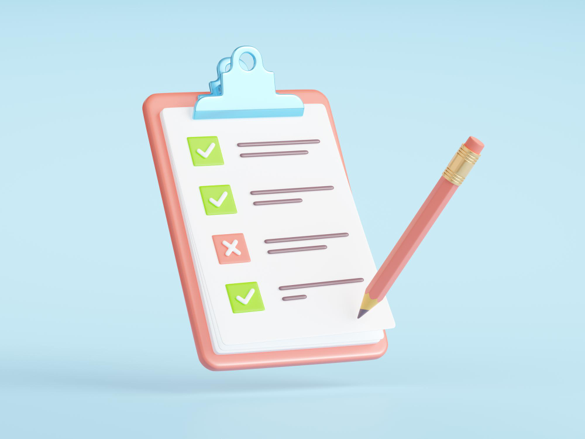

# 7.3 - Evaluation Result

<figure><figcaption>
Source: Freepik
</figcaption></figure>

## Results

The evaluation report of a Bilan Carbone® goes through a [dedicated platform](../annexes/bibliographie/#labc-et-les-ressources-complementaires-au-bilan-carbone-r) in order to simplify its completion. At the end of the evaluation, 3 results are possible, in the form of a verbatim statement from the evaluator:&#x20;

* _"The assessment is verified and validated. No element indicates that the assessment is not fundamentally correct"_
* _"The evaluation could not be completed"_
* _"Elements indicate that the assessment is not fundamentally correct"_

In the first case, an evaluation certificate is issued by the ABC to the organisation. This certificate contains an evaluation stamp indicating the maturity level of the assessment.

## Communication

Once the result has been transmitted to the organisation, it may communicate on the conclusion of the evaluation, **by strictly citing the verbatim statement**. Communication must be carried out in accordance with the ABC's [communication guide](../annexes/bibliographie/#ressources-sur-la-communication). The organisation is not obliged to communicate on the result obtained.

As a reminder, the organisation's emission profile is deposited anonymously at the end of the approach on the OCCF platform. The associated evaluation result will, where applicable, be automatically implemented on the platform of the [Observatory of Carbon Accounting in France](../annexes/bibliographie/#labc-et-les-ressources-complementaires-au-bilan-carbone-r).

This only concerns communication on the result of the evaluation of the approach, and not communication on the approach itself.


Under no circumstances will it be possible to communicate externally on a result obtained through [self-evaluation](7-introduction-a-levaluation-de-la-demarche.md#glossaire-relatif-a-levaluation) or through the evaluation of the assessment carried out by a person who has not been trained and certified in the evaluation of Bilan Carbone®. A directory of authorised experts (trained and certified) can be found on the [ABC website](../annexes/bibliographie/#labc-et-les-ressources-complementaires-au-bilan-carbone-r).


***

_Do you have a comprehension question?_ [_Consult the FAQ_](../annexes/faq.md)_. The method is living and therefore subject to change (clarifications, additions): find the_ [_change log here_](../avant-propos/historique-et-suivi-des-modifications.md)_._
