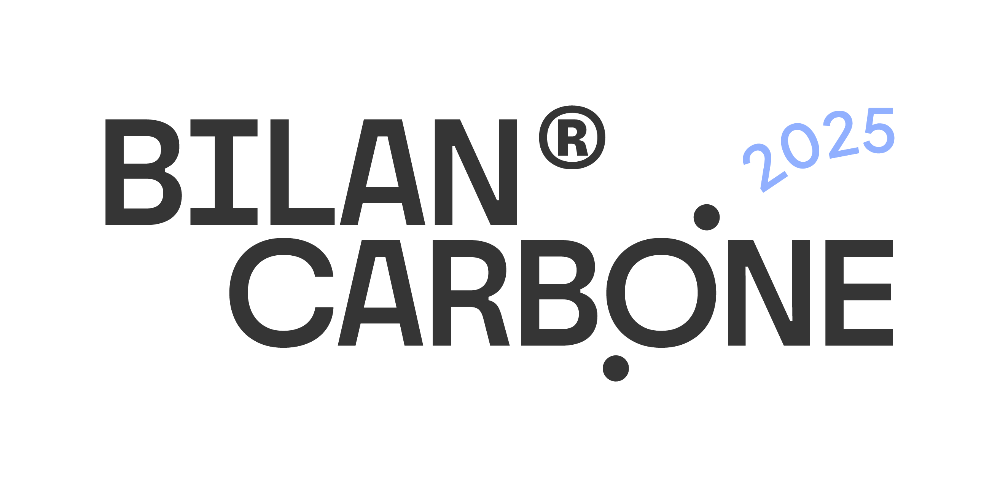

# 📗 Foreword

<figure><figcaption></figcaption></figure>


The new version of the Bilan Carbone® methodology is now online!&#x20;

To learn more about the changes made, please consult the [change log](avant-propos/historique-et-suivi-des-modifications.md).&#x20;


## Summary

This methodological guide presents version 9 of the Bilan Carbone® method as applied to an organisation. It details the objectives, principles, methodology, steps of the approach, and presents various annexes and resources useful for its application and evaluation.

The Bilan Carbone® method, born from the initiative of [ADEME](annexes/glossaire.md) and subsequently carried by the [Association for Low Carbon Transition (ABC)](annexes/bibliographie/#labc-et-les-ressources-complementaires-au-bilan-carbone-r), constitutes an essential pillar in the assessment and reduction of greenhouse gas (GHG) emissions. It encompasses not only the historical method, the reference standard, but also the [tools](https://app.gitbook.com/s/GBSULMB7RDjF3KmSrnc9/formation-et-outils-dapplication-de-la-methode) distributed by the ABC or compliant tools, as well as the training provided by accredited [training](formation-et-outils-dapplication-de-la-methode/formations-a-la-methode-bilan-carbone-r.md) organisations, thus forming a complete package in service of its community.

Since its creation in 2004, the Bilan Carbone® has undergone eight successive evolutions, demonstrating its constant commitment to advances in carbon accounting. Version 8, published in 2018, marked a significant milestone by reinforcing the strategic dimension of carbon accounting and enabling organisations to project themselves over the next 30 years.

**In 2022, four years after the launch of version 8, the ABC initiated work with a view to publishing version 9 of the Bilan Carbone® in July 2024 (with application from 2025), aspiring to offer a complete and coherent low-carbon transition approach, adapted to all stakeholders involved.**

## Major evolutions of the method

Version 9 of the Bilan Carbone® brings a modular methodology, a true guide to excellence that enables the development of a continuous improvement approach and GHG emissions reporting. The methodology allows for deeper GHG accounting by conducting **a strategic analysis** of an organisation and **proposing best practices** in terms of transition planning.

This new version of the method introduces numerous evolutions:

### **🧭 Three maturity levels to match the reality of organisations**

Each maturity level (Beginner, Standard and Advanced) is defined by specific criteria regarding renewal frequency, action monitoring, scope, and the importance of engagement.&#x20;

The Bilan Carbone® has always been adapted to need (from a first assessment to managing an organisation's decarbonisation). These new maturity levels make it possible to set the ambition of the approach, and to standardise practices. The primary objective remains to enable action regardless of one's profile or maturity level.

### **📝 The transition plan, at the heart of the method**

The Bilan Carbone® asserts itself as **a genuine complete 7-step approach** (and not merely a carbon accounting method) in which action planning is reinforced.&#x20;

It is essential to recall the philosophy of the Bilan Carbone®, centred on the principle of "counting in order to act". The method becomes more demanding regarding the existence of a transition plan, but it also facilitates this process by adapting to the three maturity levels, with tailored deliverables, objectives, and monitoring indicators.

### **🏋️‍♀️ Mobilising all stakeholders**

The _awareness of stakeholders_, mandatory in previous versions of the Bilan Carbone®, gives way to the _mobilisation of stakeholders_, with the ambition of putting organisations into action, in motion and in transition. The Bilan Carbone® thus establishes itself as a comprehensive and orchestrated 7-step approach, going beyond a simple carbon accounting method, in which continuous mobilisation is necessary. The method specifies the content and messages, and offers free resources, while leaving the choice of mobilisation formats and tools open.

### 🔢 A more precise and educational uncertainty estimate

The uncertainty estimate gains in precision and educational clarity. From a technical standpoint, certain mathematical limitations of the previous method have been resolved, in alignment with best practices for uncertainties associated with databases. **This advance makes it possible to obtain more reliable estimates that are more representative of reality.**

From an educational perspective, the method now integrates both a qualitative estimate of the margin of error and a quantitative estimate. This dual approach makes the calculation of uncertainty not only more useful, but also more understandable and actionable for users. By providing clear indications on data quality and the precision of results, this new uncertainty estimate facilitates better decision-making and reinforces the continuous improvement of accounting approaches.

### **✅ Compatible with the best standards**

The use of the Bilan Carbone® is compatible with other [standards](annexes/bibliographie/), notably the long-established ones: ISO, the GHG Protocol, the French regulatory method, but also with the new European CSRD directive or analytical carbon accounting. This change facilitates its integration into the overall transition pathway, in connection with NZI, ACT, SBTi, and others.

### **🎯 Assessable assessments**

A significant evolution lies in **the evaluation and audit of results**, now available on request, meeting various needs such as regulatory compliance, assurance of the reliability of one's approach for a better transition, quality control of stakeholder assessments, and transparency of communication.&#x20;

Beyond the technical aspect, this standardisation of verifications implies the mobilisation of new roles, notably experts in financial accounting, underscoring the evolution towards a **more holistic and regulated approach.**

### 🧩 A more modern format for the method

Beyond the technical elements introduced in the Bilan Carbone®, a desire to make the method more accessible emerges through a more modern "wiki" format: knowledge is shared freely, the document is organised by step, sections are tree-structured, the search function enables quick access to information, and bibliographic hyperlinks smooth the experience. This format allows for both a more organised overall reading, and a more efficient targeted reading.

The document as a whole runs to more than 300 pages, which is why it is accompanied by a [summary](introduction-au-bilan-carbone-r/0.3-synthese-de-la-methode.md) of the method of 10 pages, freely available and downloadable, which condenses the most structuring information of the Bilan Carbone® method.

### ⏳ Ongoing evolutions and improvements

The Bilan Carbone® method is intended to be dynamic and living. Work on the method continues in discussion with the carbon accounting ecosystem **in a logic of continuous improvement**. The next areas of reflection in 2025 will focus on the Product footprint, the Territory footprint, or on the framing of the Bilan Carbone® with regard to avoided and sequestered emissions. Consequently, updates will be made to evolve this guide. Each new methodological integration will be the subject of a [transparent publication](avant-propos/historique-et-suivi-des-modifications.md). Any major update will give rise to free upgrade training sessions delivered to the ABC community by its training partners.

## The Bilan Carbone® and the Association for Low Carbon Transition (ABC)


The Bilan Carbone® refers to:&#x20;

* A method initially developed by ADEME and Jean-Marc Jancovici from the consultancy Manicore, and today developed and updated by the Association for Low Carbon Transition (ABC). This method enables the quantification and reduction of GHG emissions. It can be applied to organisations, [products or territories.](annexes/annexes/annexe-6-ouverture-aux-autres-echelles-territoire-et-produit.md)&#x20;
* The [tools](formation-et-outils-dapplication-de-la-methode/outils-bilan-carbone-r-tableurs-et-logiciel.md) distributed by the ABC, which facilitate the calculations enabling the quantification of GHG emissions, as well as the associated user manuals.&#x20;
* The [training](formation-et-outils-dapplication-de-la-methode/formations-a-la-methode-bilan-carbone-r.md) required to apply the Bilan Carbone® method, which is provided by partners accredited by the ABC.
* A ® trademark registered with the INPI in France and throughout the EU

The result of the Bilan Carbone® approach applied to an organisation may be named:&#x20;

* Bilan Carbone® at Beginner, Standard or Advanced level, depending on the maturity level chosen by the organisation.&#x20;
* **Assessed** Bilan Carbone® at Beginner, Standard or Advanced level, depending on the maturity level chosen by the organisation, and if the organisation's Bilan Carbone® has been assessed using the [associated procedures](https://app.gitbook.com/s/GBSULMB7RDjF3KmSrnc9/7-evaluation-et-qualite-du-bilan-carbone-r).



The Association for Low Carbon Transition ([ABC](annexes/bibliographie/#labc-et-les-ressources-complementaires-au-bilan-carbone-r)) — formerly the Association Bilan Carbone — was created in 2011 by [ADEME](annexes/glossaire.md) and [APCC](annexes/glossaire.md), to carry and disseminate the Bilan Carbone® methodology. It makes available to organisations and citizens the tools and methods enabling them to succeed in defining and implementing their decarbonisation strategy. The ABC brings together more than 1,000 organisations committed to climate action and animates a community of stakeholders around the issues of low-carbon transition and more particularly carbon accounting. Through its missions, the association wishes to mobilise and train the maximum number of stakeholders (organisations and citizens) on the issues related to the fight against climate change.

This new version of the Bilan Carbone® method can be consulted freely and free of charge. However, its use is conditional on [membership](annexes/bibliographie/#labc-et-les-ressources-complementaires-au-bilan-carbone-r) or an up-to-date licence with the ABC as a legal entity, thus ensuring an up-to-date version of the tools as well as various additional services (for more details, consult the [ABC website](annexes/bibliographie/)). Any organisation wishing to use the method or our tools must have within it at least one person trained in the Bilan Carbone® methodology by an accredited training organisation (for more details, see the [general terms of use](annexes/bibliographie/#labc-et-les-ressources-complementaires-au-bilan-carbone-r)).


## Document architecture: how to use it?

### Usage tips

This document is presented in a tree-structured "wiki" format. Several usage tips:&#x20;

* The authors recommend consulting the [table of contents](table-des-matieres.md) to better navigate within the document.
* The document includes numerous hyperlinks pointing either to definitions available in the [Glossary](annexes/glossaire.md), or to other resources in the [Bibliography](annexes/bibliographie/), or to other cited sections of the document.
* The document is accompanied by a [summary](introduction-au-bilan-carbone-r/0.3-synthese-de-la-methode.md) of 10 pages.
* The document's tree structure is numbered according to the 7 [steps](introduction-au-bilan-carbone-r/0.2-les-etapes-dun-bilan-carbone-r.md) of the Bilan Carbone®. It contains introductory sections upstream and resource sections downstream.
* Some sub-sections of this document contain information subdivided into drop-down menus corresponding to the three maturity levels defined by the method. The authors recommend always consulting the content outside the drop-down menu, which is common to all three maturity levels, before opening them to consult the detailed specifics by maturity level.&#x20;
* It is strongly recommended to read the content of higher maturity levels, even if they do not immediately concern the level targeted by the organisation, because, in a logic of **continuous improvement** and progression, certain specific points of higher levels may already be sought and achieved.

### Structure of specific information

Specific callouts are present throughout the document. They have different meanings:

Designates and details the requirements of the Bilan Carbone®, for each maturity level


Designates an informative point of the Bilan Carbone® method



Designates unique elements of the Bilan Carbone® method



Designates a point of vigilance of the Bilan Carbone® method.


> :mag\_right: _Cites a reference or an external resource for a possible complement to the Bilan Carbone® method._

> ⏳<mark style="background-color:blue;">\[</mark>[<mark style="background-color:blue;">WIP</mark>](./#structures-des-informations-specifiques)<mark style="background-color:blue;">] Designates a forthcoming evolution of the Bilan Carbone® method. In most cases following the experimentation phase. For information, "WIP" means work in progress.</mark>

### Terms of use


The Bilan Carbone® method guide is a work made available under the terms of the [Creative Commons Attribution - ShareAlike 4.0 International Licence](https://creativecommons.org/licenses/by-sa/4.0/)

**You are free to:**

* **Share** — copy and redistribute the material in any medium or format
* **Adapt** — remix, transform, and build upon the material
* for any purpose, even commercially.

**Under the following terms:**

* **Attribution** — You must [give appropriate credit](https://creativecommons.org/licenses/by-sa/4.0/deed.en), provide a link to the licence and to the original content, and [indicate](https://creativecommons.org/licenses/by-sa/4.0/deed.en) if changes were made. You may do so in any reasonable manner, but not in any way that suggests the licensor endorses you or your use.
* **ShareAlike** — If you remix, transform, or build upon the material, you must distribute your contributions under the [same licence](https://creativecommons.org/licenses/by-sa/4.0/deed.en) as the original (Creative Commons Licence CC - BY - SA).
* **No additional restrictions** — You may not apply legal terms or [technological measures](https://creativecommons.org/licenses/by-sa/4.0/deed.en) that legally restrict others from doing anything the licence permits.


For more details, see the [general terms of use](annexes/bibliographie/#labc-et-les-ressources-complementaires-au-bilan-carbone-r).

***

_Do you have a comprehension question?_ [_Consult the FAQ_](annexes/faq.md)_. The method is living and therefore subject to evolution (clarifications, additions): find the_ [_change log here_](avant-propos/historique-et-suivi-des-modifications.md)_._