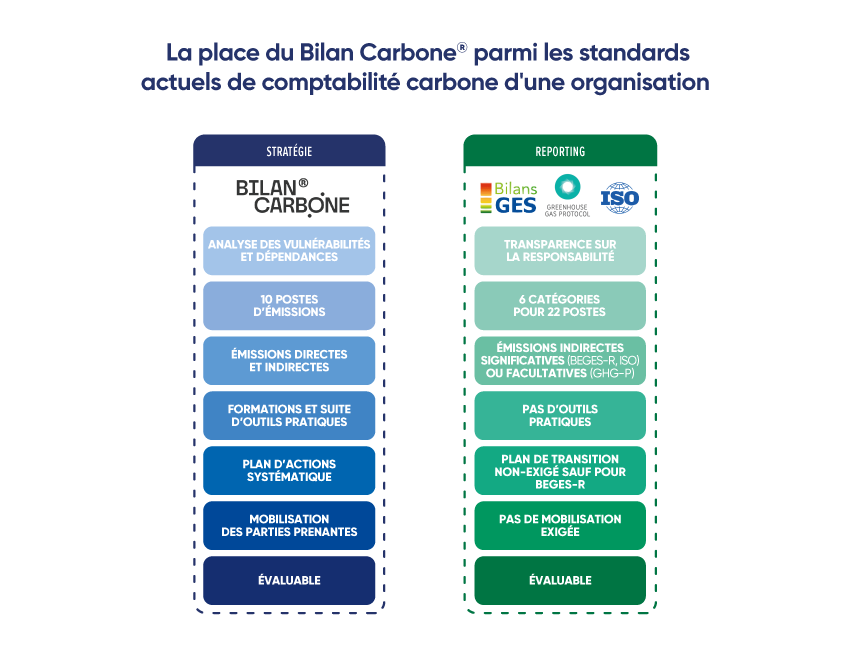
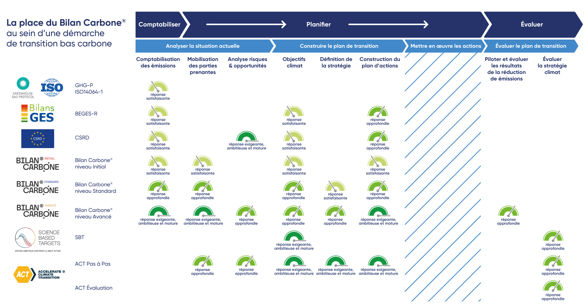

# How does Bilan Carbone® integrate into a low-carbon transition approach?

<figure><figcaption>
Source: Freepik
</figcaption></figure>

[Low-carbon transition approaches](quest-ce-quune-demarche-de-transition-bas-carbone.md) are multiple, with a common objective. Transition pathways adapt to the profile and maturity of each organisation, but also of territories, states, individuals, projects, or products, with various tools, methods and regulations at their disposal.

[Bilan Carbone®](../) is a comprehensive method that intervenes at several stages in a transition approach, seeking to feed into the strategy of an organisation. Bilan Carbone® makes it possible both to account for carbon, voluntarily or regulatorily, while being resolutely oriented towards action.

To position the role and value of Bilan Carbone® in a low-carbon transition approach, the following are presented below:

1. **The place of Bilan Carbone® within the different scales of carbon accounting** or how Bilan Carbone® integrates at the organisational, territorial, individual, or product level.
2. **The place of Bilan Carbone® among the current standards for organisational carbon accounting**, i.e. a comparison of Bilan Carbone® with other recognised standards, in order to highlight its specificities and complementarities.
3. **The place of Bilan Carbone® within regulations** or how Bilan Carbone® meets legal and regulatory requirements in terms of carbon accounting and _reporting_.
4. **The place of Bilan Carbone® in its transition pathway** in order to illustrate how Bilan Carbone® integrates into the overall low-carbon transition pathway of an organisation, from emissions analysis through to the implementation and continuous improvement of reduction actions within the framework of a genuine transition strategy.

## :one: The different scales of carbon accounting

In the context of carbon accounting, four main scales are generally distinguished:&#x20;

* **Territories**: this scale applies to a specific geographical area, such as a city, region or country. It includes the organisations established there, the individuals living there, and therefore all the activities taking place. [Two complementary methods](../annexes/bibliographie/#autres-echelles-de-comptabilisation-des-emissions-de-ges) exist: one focuses on GHG emissions produced strictly on the territory (inventory or cadastral approach). The other also accounts for indirect emissions, produced outside the territory but necessary for its functioning and the activities taking place (footprint or responsibility approach). As with organisations, the cadastral approach concerns emissions to which the territory is a direct contributor — occurring within it — whereas the footprint approach allows conclusions to be drawn on the territory's dependence on fossil fuels and its vulnerability to the challenges of the low-carbon transition.
* **Individuals**: this scale focuses on GHG emissions attributable to the activities of a person. A [reference method](../annexes/bibliographie/#autres-echelles-de-comptabilisation-des-emissions-de-ges) frames the method for estimating an individual's footprint in order to provide comprehensive and educational information on their climate contribution and levers for action.
* **Products**: this scale assesses the GHG emissions associated with a product (good or service) throughout its life cycle, from design to end of life. [Several complementary methods](../annexes/bibliographie/#autres-echelles-de-comptabilisation-des-emissions-de-ges) focus on the specific carbon footprint of products. ABC is notably conducting work with its partners to better integrate the product footprint within transition strategies.
* **Organisations**: this scale concerns the GHG emissions induced by all the activities of an [organisation](../annexes/glossaire.md), whether it is a company, an association or a public body. The activities taken into account by organisational carbon accounting are included within an [organisational boundary](../2-perimetre-de-la-demarche/2.2-perimetre-organisationnel.md). [Several complementary methods](quelle-integration-du-bilan-carbone-r-au-sein-dune-demarche-de-transition-bas-carbone.md#id-2-la-place-du-bilan-carbone-r-parmi-les-standards-actuels-de-comptabilite-carbone-dune-organisation) focus on the carbon footprint of organisations.


The present method focuses on the organisational scale. This is referred to as **Bilan Carbone® Organisation.**


> <mark style="background-color:blue;">⏳\[</mark>[<mark style="background-color:blue;">WIP</mark>](../#structures-des-informations-specifiques)<mark style="background-color:blue;">] The methodological principles of Bilan Carbone® Organisation also apply to Product or Territory approaches. These will be the subject of</mark> [<mark style="background-color:blue;">further reflection</mark>](../annexes/annexes/annexe-6-ouverture-aux-autres-echelles-territoire-et-produit.md) <mark style="background-color:blue;">over the coming years.</mark>

All these accounting scales are relevant, allowing adaptation to the responsibilities, dependencies, and specific levers for action of each of these stakeholders.

## :two: The place of Bilan Carbone® among the current standards for organisational carbon accounting

Among the most recognised current standards in organisational carbon accounting are:&#x20;

* The French regulatory method for carrying out GHG emission assessments ([BEGES-R](../annexes/bibliographie/#autres-standards-normes-et-reglementations-de-comptabilisation-des-emissions-de-ges))\*
* The Greenhouse Gas Protocol ([GHG-P](../annexes/bibliographie/#autres-standards-normes-et-reglementations-de-comptabilisation-des-emissions-de-ges))
* &#x20;ISO 14064-1:2006 and ISO 14069:2013 ([ISO](../annexes/bibliographie/#autres-standards-normes-et-reglementations-de-comptabilisation-des-emissions-de-ges))

\*BEGES-R is a regulation associated with a method, so it will also be discussed in the [following](quelle-integration-du-bilan-carbone-r-au-sein-dune-demarche-de-transition-bas-carbone.md#id-3-la-place-du-bilan-carbone-r-vis-a-vis-des-reglementations) paragraph concerning regulations.

Bilan Carbone® and these standards share similarities, complementarities but also specificities.

* These standards serve **complementary purposes**: GHG-P and ISO standards are generally used for reporting outside France, and BEGES-R for reporting in France. Bilan Carbone® makes it possible to produce these reports, in the formats required by the different standards, but also to produce a strategic analysis of the organisation (notably vulnerabilities and transition opportunities) and to initiate and manage its low-carbon transition.
* The Bilan Carbone® method is **compatible** with the requirements of GHG-P, BEGES-R, and ISO 14064-1. Conversely, following these standards will not systematically meet Bilan Carbone® requirements: these standards may recommend, without requiring, several key steps of Bilan Carbone® (notably on uncertainty management, on the accounting of indirect emissions, on stakeholder engagement or on the relevance of the transition plan).
* Bilan Carbone® **deliverables** are consistent with the information requested by other standards. The export format and formalism of these deliverables may nevertheless differ. The Bilan Carbone® report establishes the necessary correspondence links making it possible to follow the Bilan Carbone® method and [extract results in several formats](../6-synthese-et-restitution/6.2-compatibilite-de-la-demarche-avec-dautres-referentiels.md). Precautions may however be necessary (for example working on materiality to follow the philosophy of ISO or BEGES-R, not depreciating fixed assets in the case of GHG-P). The precautions to be identified are specified where applicable.
* An important specificity of Bilan Carbone® lies in its **positioning** as a [**complete approach**](quest-ce-quune-demarche-de-transition-bas-carbone.md)**,** in which carbon accounting is only one step. Unlike other carbon accounting standards, the Bilan Carbone® method also emphasises engagement and action planning. The granular requirements of the method allow the organisation to gain in maturity with each renewal of the exercise, in a progressive and long-term approach logic, until it becomes an environmental management tool.
* The boundary to be taken into account in a Bilan Carbone® also includes emissions on which the organisation is **dependent**. This makes it possible to act strategically on the organisation's vulnerabilities. It is not a matter of determining who is responsible for emissions, but rather of identifying who can act to reduce them.
* A few [**calculation processes**](../annexes/annexes/annexe-1-grands-principes-de-comptabilisation-du-bilan-carbone-r.md) differ and must be applied with caution:&#x20;
  * Emissions associated with energy consumption are calculated using a location-based approach in Bilan Carbone® and BEGES-R. ISO also allows calculation using a market-based approach. GHG-P requires both approaches to be calculated.
  * Emissions associated with capital goods must be depreciated in Bilan Carbone® and BEGES-R. GHG-P requires these emissions not to be depreciated. ISO allows a choice between the two options.
  * Emission categories are very similar across these standards, with two specificities: ISO includes "GHG removals"; and GHG-P does not include "visitor travel".
  * These calculation processes are detailed in [practical guides](../annexes/bibliographie/#guides-pratiques-de-comptabilisation). It should be noted that it is possible to follow the Bilan Carbone® method and export results according to other standards by applying these calculation principles.

The table below is a summary of the similarities and specificities between Bilan Carbone® and the other current standards for organisational carbon accounting:&#x20;

<figure><figcaption>
Figure 0.1.2: The place of Bilan Carbone® among the current standards for organisational carbon accounting
</figcaption></figure>

🌐 [_<mark style="color:$info;">English version</mark>_](https://abc-transitionbascarbone.fr/wp-content/uploads/2025/11/The-place-of-the-Bilan-Carbone_La-place-du-Bilan-Carbone-parmi-les-standards-scaled.png) _<mark style="color:$info;">of this image.</mark>_

## :three: The place of Bilan Carbone® with respect to regulations

Bilan Carbone® seeks to align the regulatory obligation and the voluntary commitment of all actors in French and European society, so that a voluntary approach can bring benefits with regard to a future obligation, but also so that a regulated actor can go further and do more than the regulatory requirement.

Bilan Carbone® Organisation thus makes it possible to meet, in terms of carbon accounting, two regulations in particular:

* The French regulatory method for carrying out GHG emission assessments ([BEGES-R](../annexes/bibliographie/#autres-standards-normes-et-reglementations-de-comptabilisation-des-emissions-de-ges))\*
* The Corporate Sustainability Reporting Directive ([CSRD](../annexes/bibliographie/#autres-standards-normes-et-reglementations-de-comptabilisation-des-emissions-de-ges))

### French regulation

The Bilan Carbone® method is [**compatible**](../6-synthese-et-restitution/6.2-compatibilite-de-la-demarche-avec-dautres-referentiels.md) with regulatory requirements:

* Bilan Carbone® at [Beginner level](../1-cadrage-de-la-demarche/1.1-definir-son-niveau-de-maturite-bilan-carbone-r.md#niveau-initial-un-premier-bilan-carbone-r) meets the regulation on all points.
* Bilan Carbone® at [Standard level](../1-cadrage-de-la-demarche/1.1-definir-son-niveau-de-maturite-bilan-carbone-r.md#niveau-standard-un-bilan-carbone-r-avec-des-actions-ciblant-lensemble-des-emissions) and [Advanced level](../1-cadrage-de-la-demarche/1.1-definir-son-niveau-de-maturite-bilan-carbone-r.md#niveau-avance-un-bilan-carbone-r-qui-pilote-une-veritable-strategie-de-transition) require more.

> :mag\_right: _Since the_ [_evolution_](../annexes/bibliographie/#methode-reglementaire-pour-la-realisation-des-bilans-demissions-de-gaz-a-effet-de-serre) _of French regulations in 2023, there is a very strong correspondence between the philosophies of Bilan Carbone® and BEGES-R, which now also requires emission management (comprehensive inventory also covering significant emissions, analytical commentary on results, renewal of the assessment and comparison of assessments between the reference year and the reporting year)._

Bilan Carbone® retains several complementary specificities (approach logic, or strategic analysis logic for example), supplemented by the training, tools and community that accompany this method.


Bilan Carbone® allows carbon accounting over a freely chosen boundary and time period (for example a project, an event, a construction site). If an organisation subject to regulation wishes to use Bilan Carbone®, two major precautions must be taken:&#x20;

* The temporal boundary must be a full year of activity (reporting year).
* The organisational boundary must be that of the legal entity subject to the regulation (SIREN).


### The CSRD

Following the Bilan Carbone® approach, at its highest level of requirements, makes it possible to meet a large part of the requirements of the ESRS E1 standard of the CSRD, which concerns climate change:

* Bilan Carbone® at [Beginner level](../1-cadrage-de-la-demarche/1.1-definir-son-niveau-de-maturite-bilan-carbone-r.md#niveau-initial-un-premier-bilan-carbone-r) and [Standard level](../1-cadrage-de-la-demarche/1.1-definir-son-niveau-de-maturite-bilan-carbone-r.md#niveau-standard-un-bilan-carbone-r-avec-des-actions-ciblant-lensemble-des-emissions) do not meet all CSRD (ESRS E1) requirements.
* Bilan Carbone® at [Advanced level](../1-cadrage-de-la-demarche/1.1-definir-son-niveau-de-maturite-bilan-carbone-r.md#niveau-avance-un-bilan-carbone-r-qui-pilote-une-veritable-strategie-de-transition) covers the majority of requirements, [listed here.](../6-synthese-et-restitution/6.2-compatibilite-de-la-demarche-avec-dautres-referentiels.md)

> <mark style="background-color:blue;">⏳\[</mark>[<mark style="background-color:blue;">WIP</mark>](../#structures-des-informations-specifiques)<mark style="background-color:blue;">] A correspondence table will be made available shortly listing the</mark> _<mark style="background-color:blue;">data points</mark>_ <mark style="background-color:blue;">(specific information the organisation is required to disclose under the CSRD) that an Advanced level Bilan Carbone® approach will make it possible to complete.</mark>

CSRD declarations require an audit by an independent third party. ABC and the National Council of the Order of Chartered Accountants drafted a [guide to the evaluation](../annexes/bibliographie/#labc-et-les-ressources-complementaires-au-bilan-carbone-r) of a Bilan Carbone®, a BEGES-R and a CSRD-specific exercise so that evaluation practices are common and shared, to seek ever more synergies and clarify the transition challenges for all organisations.

## :four: Bilan Carbone® in a low-carbon transition approach

An organisation encounters several needs throughout its growing maturity on transition issues:&#x20;

* **Know its context**: What are its stakeholders' demands? What are its regulatory obligations? What are the best practices in its sector? An organisation first needs to motivate its transition action. Several resources are available, notably ADEME's [sector guides](../annexes/bibliographie/#guides-pratiques-de-comptabilisation), but also [content proposed by ABC](../annexes/bibliographie/#labc-et-les-ressources-complementaires-au-bilan-carbone-r). Bilan Carbone® proposes here to define several boundaries (organisational, operational, temporal) in order to size the exercise appropriately in relation to the organisation's context. A risk and opportunity analysis for the transition is required within the Bilan Carbone® framework in order to begin the work of developing a long-term vision of the organisation's low-carbon transition.
* **Know its emission profile** (GHG profile): what are the emission categories? how do they relate to each other? what is the priority or priorities for the organisation in terms of reduction? [International standards](quelle-integration-du-bilan-carbone-r-au-sein-dune-demarche-de-transition-bas-carbone.md#la-place-du-bilan-carbone-r-parmi-les-standards-actuels-de-comptabilite-carbone-dune-organisation) but also [French regulation](quelle-integration-du-bilan-carbone-r-au-sein-dune-demarche-de-transition-bas-carbone.md#la-place-du-bilan-carbone-r-vis-a-vis-des-reglementations) offer methods and reporting formats on this issue, for reporting purposes. Bilan Carbone® goes further, accompanying the organisation from data collection through to the production of the GHG profile and its interpretation. Several sectoral adaptations of Bilan Carbone® allow organisations in the relevant sectors to focus on sector-specific issues. In parallel, Bilan Carbone® proposes engagement activities to share the first conclusions and promote action. Bilan Carbone® proposes a voluntary [audit process](https://app.gitbook.com/s/GBSULMB7RDjF3KmSrnc9/7-evaluation-et-qualite-du-bilan-carbone-r), in order to ensure optimal quality of its results and the actions arising from them.
* **Develop a transition strategy and evaluate it**: how to define its emission reduction objectives? how to create a transition plan that allows these objectives to be achieved? how to integrate this transition plan within the organisation's overall strategy? how to monitor and improve the organisation's carbon accounting approach? Several complementary methods and tools address all of these issues: the [Science-Based Targets initiative](../annexes/bibliographie/#ressources-sur-la-strategie-et-plan-de-transition) supports large companies in defining objectives that make it possible to comply with the [Paris Agreement](../annexes/bibliographie/#ressources-introductives) and the [IPCC](../annexes/bibliographie/#ressources-introductives) recommendations; Empreinte Projets is the new version of [Quanti GES](../annexes/bibliographie/#ressources-sur-la-strategie-et-plan-de-transition) led by ADEME, aimed at estimating the impact of a project; [ACT Step by Step](../annexes/bibliographie/#ressources-sur-la-strategie-et-plan-de-transition) and [ACT Evaluation](../annexes/bibliographie/#ressources-sur-la-strategie-et-plan-de-transition), two sister approaches led by ADEME in France and internationally, make it possible to create and evaluate a transition strategy that is consistent with the GHG profile, ambitious and credible across all aspects of the organisation. Bilan Carbone® links with these approaches so that the organisation can easily use the carbon accounting work and the transition plan within these four approaches. Bilan Carbone® becomes for the [most mature organisations](../1-cadrage-de-la-demarche/1.1-definir-son-niveau-de-maturite-bilan-carbone-r.md#niveau-avance-un-bilan-carbone-r-qui-pilote-une-veritable-strategie-de-transition) the tool for managing the transition pathway.
* **Understand the different possibilities for action in favour of the transition:** what is the value of developing new low-carbon goods and services? how to integrate sequestration within the organisation's strategy? Bilan Carbone® builds on the principles of the [Net Zero Initiative](../annexes/bibliographie/#autres-echelles-de-comptabilisation-des-emissions-de-ges), conceiving climate action [in three forms](../2-perimetre-de-la-demarche/2.1-les-emissions-comptabilisees-dans-un-bilan-carbone-r.md): the reduction of emissions "at home" (what Bilan Carbone® Organisation enables) — Pillar A, the reduction of emissions "elsewhere" through new goods & services — Pillar B — and the increase of GHG sequestration within natural spaces or through capture and storage technologies — Pillar C. These three forms of carbon accounting are non-miscible, as an organisation should maximise its action on all three pillars simultaneously. It should be noted that efforts made on Pillars B and C are also valued in transition strategy evaluation approaches, notably ACT.
* **Communicate its commitment to the transition:** What should I communicate to highlight my transition action? How can I communicate it and to whom? Many institutions today ask organisations to publish their GHG assessment, whether for investors (such as [CDP](../annexes/bibliographie/)), the State (BEGES-R [regulation](quelle-integration-du-bilan-carbone-r-au-sein-dune-demarche-de-transition-bas-carbone.md#la-place-du-bilan-carbone-r-vis-a-vis-des-reglementations)), the European Commission ([CSRD](quelle-integration-du-bilan-carbone-r-au-sein-dune-demarche-de-transition-bas-carbone.md#la-csrd)), their clients who are themselves carrying out their GHG assessment or who wish to select committed suppliers. While each stakeholder will tend to request different information, Bilan Carbone® strives to propose a methodological and technical framework synthesising the expectations of each framework in order to facilitate the organisation's reporting.

The transition pathway is non-linear. Each of these approaches feeds the organisation's reflection and increases its maturity. Pathways are multiple, and in a logic of cycle, continuous improvement and renewal, Bilan Carbone® meets the need for regular management of emissions and results.

<figure><figcaption>
Figure 0.1.3: The place of Bilan Carbone® within a low-carbon transition approach
</figcaption></figure>

<mark style="color:$info;">🌐</mark> <mark style="color:$info;"></mark>_<mark style="color:$info;">English version of this image.</mark>_

> <mark style="background-color:blue;">⏳\[</mark>[<mark style="background-color:blue;">WIP</mark>](../#structures-des-informations-specifiques)<mark style="background-color:blue;">] The third ABC panorama on the</mark> [<mark style="background-color:blue;">different transition pathways</mark>](../annexes/bibliographie/#labc-et-les-ressources-complementaires-au-bilan-carbone-r) <mark style="background-color:blue;">will be updated shortly and will detail the different tools and methods available.</mark>

***

_Do you have a question about the content?_ [_Consult the FAQ_](../annexes/faq.md)_. The method is a living document and therefore subject to change (clarifications, additions): find the_ [_change log here_](../avant-propos/historique-et-suivi-des-modifications.md)_._
