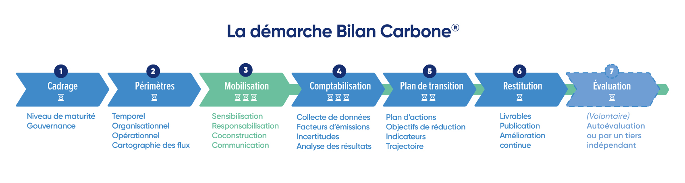

# 0.2 - Les étapes d'un Bilan Carbone®

La démarche Bilan Carbone® est structurée en 7 étapes.

<figure><figcaption>
Figure 0.2 : Les étapes d'un Bilan Carbone®
</figcaption></figure>

<mark style="color:$info;">🌐</mark> [_<mark style="color:$info;">English version</mark>_](https://abc-transitionbascarbone.fr/wp-content/uploads/2025/11/The-Bilan-Carbone-approach.png) _<mark style="color:$info;">of this image.</mark>_

## [Étape 1 - Cadrer la démarche Bilan Carbone®](https://app.gitbook.com/s/GBSULMB7RDjF3KmSrnc9/1-cadrage-de-la-demarche)&#x20;

Au lancement d'une démarche Bilan Carbone®, il est nécessaire de cadrer :&#x20;

* Le [niveau de maturité](../1-cadrage-de-la-demarche/1.1-definir-son-niveau-de-maturite-bilan-carbone-r.md) de l'organisation en termes de comptabilité carbone et sa position sur le [parcours de transition bas carbone](../introduction-a-la-transition-bas-carbone/quest-ce-quune-demarche-de-transition-bas-carbone.md). Il s'agit de dresser un premier diagnostic : l'organisation réalise-t-elle son premier ou énième Bilan Carbone® ? Quelles sont les attentes en interne et en externe ? Quels sont les moyens ? S'agira t-il d'une première ou d'une énième sensibilisation aux enjeux planétaires ? La méthode se décline en 3 grands niveaux de maturité afin de proposer des exigences **adaptées à l'organisation et à ses objectifs : Initial, Standard et Avancé.**
* Le [pilotage](../1-cadrage-de-la-demarche/1.2-definir-le-pilotage-de-la-demarche-bilan-carbone-r.md) et la gouvernance interne permettent de structurer, coordonner et assurer l'aboutissement de la démarche. Le niveau d'exigence sur le pilotage de chacune des étapes de la démarche, notamment l'implication hiérarchique et la formation, peut dépendre du [niveau de maturité](../1-cadrage-de-la-demarche/1.1-definir-son-niveau-de-maturite-bilan-carbone-r.md).

## [Étape 2 - Définir le périmètre de la démarche](https://app.gitbook.com/s/GBSULMB7RDjF3KmSrnc9/2-perimetre-de-la-demarche)

Cette méthode s'intéresse obligatoirement aux [émissions induites](../2-perimetre-de-la-demarche/2.1-les-emissions-comptabilisees-dans-un-bilan-carbone-r.md#pilier-a) par une [organisation](../2-perimetre-de-la-demarche/2.1-les-emissions-comptabilisees-dans-un-bilan-carbone-r.md#organisation).

L'organisation définit son périmètre [organisationnel](../2-perimetre-de-la-demarche/2.2-perimetre-organisationnel.md), [temporel](../2-perimetre-de-la-demarche/2.3-perimetre-temporel.md), et [identifier ses sources d'émission](../2-perimetre-de-la-demarche/2.4-perimetre-operationnel.md) lui permettant de délimiter son [périmètre opérationnel](../2-perimetre-de-la-demarche/2.4-perimetre-operationnel.md). Elle identifie les [risques et opportunités de transition.](../2-perimetre-de-la-demarche/2.5-identification-des-risques-et-opportunites-de-transition.md)

Cela permet de délimiter l'étude et de préparer la phase de comptabilisation, en étant certain d'inclure toutes les émissions directes et indirectes de l'organisation.

Le niveau d'exigence sur l'identification des périmètres peut dépendre du [niveau de maturité](../1-cadrage-de-la-demarche/1.1-definir-son-niveau-de-maturite-bilan-carbone-r.md) de l'organisation.

## [Étape 3 - Programmer les étapes de Mobilisation](https://app.gitbook.com/s/GBSULMB7RDjF3KmSrnc9/3-mobilisation-des-parties-prenantes)

La [mobilisation](../3-mobilisation-des-parties-prenantes/3-introduction-a-la-mobilisation.md) est une partie capitale de la démarche Bilan Carbone®, puisqu'elle permet à l'ensemble des parties prenantes de l'organisation d'être sensibilisées puis de se mettre en mouvement pour réaliser le Bilan Carbone® et engager le plan de transition. La mobilisation **se poursuit en continu** durant toute la démarche Bilan Carbone®, et doit permettre la transmission de certains messages clés pour déclencher le passage à l'action.&#x20;

La méthode Bilan Carbone® définit les attendus, c'est à dire [les messages et les contenus](../3-mobilisation-des-parties-prenantes/3.1-programmer-les-phases-de-mobilisation/) considérés comme nécessaires pour obtenir un passage à l'action et une réduction suffisante des émissions. En revanche, les moyens (formats, outils, etc.) de parvenir à ces objectifs restent à l'appréciation du pilote de la démarche.

Les exigences en termes de mobilisation s'adaptent selon l'organisation et ses ressources, en fonction de son [niveau de maturité](../1-cadrage-de-la-demarche/1.1-definir-son-niveau-de-maturite-bilan-carbone-r.md).

## [Étape 4 - Comptabiliser ses émissions](https://app.gitbook.com/s/GBSULMB7RDjF3KmSrnc9/4-comptabilisation)

L'étape de comptabilisation consiste à la fois à [collecter](../4-comptabilisation/4.2-methode-de-collecte-des-donnees-dactivite.md) l'ensemble des données d'activité requises et à les convertir en tonnes de CO2 équivalent grâce à des [facteurs d'émission](../4-comptabilisation/4.3-methode-de-selection-des-facteurs-demission.md). Il s'agit de dresser le [profil d'émission](../4-comptabilisation/4.5-profil-demission.md) de l'organisation, c'est-à-dire la répartition des émissions quantifiées de l'organisation sur les différents postes du Bilan Carbone®.

Les [incertitudes](../4-comptabilisation/4.4-methode-destimation-des-incertitudes/), inhérentes aux facteurs d'émission choisis et aux données collectées, doivent être quantifiées et affichées en toute transparence sur le profil d'émission.

La qualité de la comptabilisation (précision des données d'activité, des facteurs d'émission, etc.) varie selon le [niveau de maturité](../1-cadrage-de-la-demarche/1.1-definir-son-niveau-de-maturite-bilan-carbone-r.md) de l'organisation et selon ses ressources.

## [Étape 5 - Établir un plan de transition](https://app.gitbook.com/s/GBSULMB7RDjF3KmSrnc9/5-plan-de-transition)

Un [plan de transition](../5-plan-de-transition/5-introduction-au-plan-de-transition.md) est défini suite à la comptabilisation des émissions. Ce plan doit comprendre des [objectifs](../5-plan-de-transition/5.1-definition-des-objectifs.md) de réduction, une série d'[actions](../5-plan-de-transition/5.2-construction-du-plan-daction.md) détaillées et quantifiées, une [trajectoire](../5-plan-de-transition/5.3-definition-de-la-trajectoire-de-transition.md) crédible par rapport aux actions envisagées et aux objectifs fixés.

Des [indicateurs](../5-plan-de-transition/5.5-suivi-et-pilotage-du-plan-de-transition.md) permettent le suivi de la [mise en œuvre](../5-plan-de-transition/5.4-mise-en-oeuvre-du-plan-de-transition.md) et de la performance de ces actions.

Le niveau d'exigence du plan de transition est à adapter à l'organisation et à ses ressources en fonction de son [niveau de maturité](../1-cadrage-de-la-demarche/1.1-definir-son-niveau-de-maturite-bilan-carbone-r.md).

## [Étape 6 - Synthèse et restitution](https://app.gitbook.com/s/GBSULMB7RDjF3KmSrnc9/6-synthese-et-restitution)

Le résultat d’un Bilan Carbone® est la quantification des émissions de GES de l’organisation, réparties par catégorie d’émission dans les périmètres considérés, ainsi qu’un plan de transition proposé en cohérence, et les indicateurs de suivi associés. Les livrables attendus sont cadrés, et [restitués](../6-synthese-et-restitution/6.1-restitution-du-bilan-carbone-r.md) à l'organisation pour un usage interne ou externe, selon son [niveau de maturité](../1-cadrage-de-la-demarche/1.1-definir-son-niveau-de-maturite-bilan-carbone-r.md).

[Différents formats](../6-synthese-et-restitution/6.2-compatibilite-de-la-demarche-avec-dautres-referentiels.md) d'export du Bilan Carbone® permettent de répondre aux exigences réglementaires et aux autres méthodes de comptabilité carbone.

L'organisation prépare la suite de sa progression en [amélioration continue](../6-synthese-et-restitution/6.3-renouvellement-et-amelioration-continue.md).

Le profil d'émission anonymisé doit être déposé à minima sur la plateforme de l'[OCCF](../annexes/bibliographie/#labc-et-les-ressources-complementaires-au-bilan-carbone-r).&#x20;

## [Étape 7 - Evaluer la qualité du Bilan Carbone®](https://app.gitbook.com/s/GBSULMB7RDjF3KmSrnc9/7-evaluation-et-qualite-du-bilan-carbone-r)

La qualité de la démarche Bilan Carbone® peut-être évaluée par une [équipe d'évaluateurs ](../7-evaluation-et-qualite-du-bilan-carbone-r/7.1-preparer-levaluation-de-son-bilan.md)indépendantes. L'évaluation s'appui sur les livrables établis au cours de la démarche, en suivant un [référentiel](../7-evaluation-et-qualite-du-bilan-carbone-r/7.2-le-process-devaluation.md) strict.&#x20;

L'étape 7 est **facultative et volontaire**. Seul un audit réussi permet de [revendiquer](../7-evaluation-et-qualite-du-bilan-carbone-r/7.3-resultat-de-levaluation.md) un Bilan Carbone® évalué.

***

_Vous avez une question de compréhension ?_ [_Consultez la FAQ_](../annexes/faq.md)_. La méthode est vivante et donc susceptible d'évoluer (précisions, compléments) : retrouvez le_ [_suivi des modifications ici_](../avant-propos/historique-et-suivi-des-modifications.md)_._
