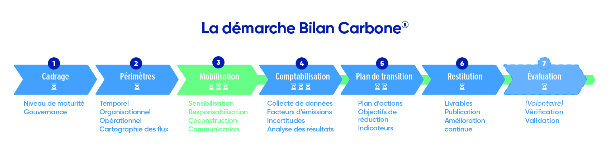

# 0.3 - Synthèse de la méthode

## Synthèse téléchargeable de la Méthode Bilan Carbone®



## Synthèse en ligne de la Méthode Bilan Carbone®

:link: Le guide est à retrouver en intégralité ici : [bilancarbone-methode.com](http://bilancarbone-methode.com/)

### **Introduction**

Le **Bilan Carbone®,** développé par l'ADEME en 2004 puis par l'ABC depuis 2011, est une méthodologie de comptabilisation et de réduction des émissions de gaz à effet de serre (GES), développée pour aider les organisations à réduire leur impact environnemental. Son but principal est de fournir une analyse rigoureuse et exhaustive des émissions de GES, tant directes qu'indirectes, permettant ainsi aux organisations de concevoir et de piloter des plans de transition bas carbone efficaces.

Cette **nouvelle version** du Bilan Carbone® apporte une méthodologie modulable, véritable guide d’excellence permettant de développer une démarche d’amélioration continue et un reporting des émissions de GES. La méthodologie permet d’approfondir la comptabilité des GES en menant une analyse stratégique d’une organisation et propose les meilleures pratiques en matière de plan de transition.

### **Objectifs du Bilan Carbone®**

Les principaux objectifs du Bilan Carbone® sont :

* **Mobilisation des parties prenantes** : engager les parties prenantes de l'organisation par la sensibilisation, la responsabilisation, la co-construction et la restitution des transformations permises par le plan de transition.
* **Comptabilisation rigoureuse des émissions de GES** : Inclure toutes les sources d'émissions directes et indirectes, couvrant les périmètres de responsabilité et de dépendance de l'organisation.
* **Élaboration d'un plan de transition** : Construire un plan ambitieux et opérationnel de réduction des émissions de GES et des vulnérabilités liées aux changement climatique, en s'appropriant les risques mais aussi les opportunités offertes par la transition.

Ces objectifs se déclinent selon le niveau de maturité de l'organisation en matière de comptabilité carbone, encourageant une amélioration continue et une progression à chaque itération du Bilan Carbone®.

### **Principes du Bilan Carbone®**

Le Bilan Carbone® répond aux principes suivants :&#x20;

* Cohérence : la démarche est en cohérence avec les enjeux actuels, c'est-à-dire avec les stratégies nationales et internationales de lutte contre le changement climatique (Stratégie Nationale Bas Carbone, Accord de Paris, …), et favorise l'émergence d'une société bas carbone.&#x20;
* Exactitude : les biais et les incertitudes inhérents à la démarche sont qualifiés, quantifiés et réduits au maximum.
* Significativité : la démarche cherche à couvrir un maximum d'émissions, et à agir en priorité sur toutes les émissions dites significatives.
* Évaluation : la démarche doit aboutir à des résultats pouvant être évalués, notamment par le biais du guide d'évaluation des bilans. Cette procédure est facultative, mais doit pouvoir être appliquée sur l'ensemble des exigences de la démarche.
* Transparence : la démarche doit être suffisamment transparente, et les résultats obtenus doivent être publiés sur la plateforme de l'Observatoire de la Comptabilité Carbone en France (OCCF).&#x20;
* Stratégie bas carbone : la démarche cherche à ajouter une dimension d'atténuation à la stratégie de l'organisation.
* Vision long terme : la démarche contribue à la définition d'une vision de transition bas carbone de l'organisation sur le long terme.
* Anticipation : la démarche invite à anticiper les changements à venir.
* Pragmatisme : la démarche demande de rester pragmatique vis-à-vis des résultats obtenus, qui ne sont pas toujours ceux anticipés au préalable.

### **Étapes d'un Bilan Carbone®**

La méthode Bilan Carbone® est structurée en sept étapes :&#x20;

<figure><figcaption></figcaption></figure>

<mark style="color:$info;">🌐</mark> [_<mark style="color:$info;">English version</mark>_](https://abc-transitionbascarbone.fr/wp-content/uploads/2025/11/The-Bilan-Carbone-approach.png) _<mark style="color:$info;">of this image.</mark>_

1.  **Étape 1 - Cadrer la démarche** :&#x20;

    Au lancement d'une démarche Bilan Carbone®, il est nécessaire de cadrer : \
    \- Le niveau de maturité de l'organisation en termes de comptabilité carbone et sa position sur le parcours de transition bas carbone. Il s'agit de dresser un premier diagnostic : l'organisation réalise-t-elle son premier ou énième Bilan Carbone® ? Quelles sont les attentes en interne et en externe ? Quels sont les moyens ? S'agira t-il d'une première ou d'une énième sensibilisation aux enjeux planétaires ? La méthode se décline en 3 grands niveaux de maturité afin de proposer des exigences adaptées à l'organisation et à ses objectifs : Initial, Standard et Avancé. \
    \- Le pilotage et la gouvernance interne permettent de structurer, coordonner et assurer l'aboutissement de la démarche. Le niveau d'exigence sur le pilotage de chacune des étapes de la démarche, notamment l'implication hiérarchique et la formation, peut dépendre du niveau de maturité.
2.  **Étape 2 - Définir les périmètres** :&#x20;

    Cette méthode s'intéresse obligatoirement aux émissions induites par une organisation. L'organisation doit définir son périmètre organisationnel, temporel, et identifier ses sources d'émissions lui permettant de délimiter son périmètre opérationnel. Elle identifie les risques et opportunités de transition. Cela permet de délimiter l'étude et de préparer la phase de comptabilisation, en étant certain d'inclure toutes les émissions directes et indirectes de l'organisation. Le niveau d'exigence sur l'identification des périmètres peut dépendre du niveau de maturité de l'organisation.
3.  **Étape 3 - Programmer la Mobilisation** :&#x20;

    La mobilisation est une partie capitale de la démarche Bilan Carbone®, puisqu'elle permet à l'ensemble des parties prenantes de l'organisation d'être sensibilisées puis de se mettre en mouvement pour réaliser le Bilan Carbone® et engager le plan de transition. La mobilisation se poursuit en continu durant toute la démarche Bilan Carbone®, et doit permettre la transmission de certains messages clés pour déclencher le passage à l'action. La méthode Bilan Carbone® définit les attendus, c'est à dire les messages et les contenus considérés comme nécessaires pour obtenir un passage à l'action et une réduction suffisante des émissions. En revanche, les moyens (formats, outils, etc.) de parvenir à ces objectifs restent à l'appréciation du pilote de la démarche. Les exigences en termes de mobilisation s'adaptent selon l'organisation et ses ressources, en fonction de son niveau de maturité.
4.  **Étape 4 - Comptabiliser les émissions** :&#x20;

    L'étape de comptabilisation consiste à la fois à collecter l'ensemble des données d'activité requises et à les convertir en tonnes de CO2 équivalent grâce à des facteurs d'émission. Il s'agit de dresser le profil d'émission de l'organisation, c'est-à-dire la répartition des émissions quantifiées de l'organisation sur les différents postes du Bilan Carbone®. Les incertitudes, inhérentes aux facteurs d'émission choisis et aux données collectées, doivent être quantifiées et affichées en toute transparence sur le profil d'émission. La qualité de la comptabilisation (précision des données d'activité, des facteurs d'émission, etc.) varie selon le niveau de maturité de l'organisation et selon ses ressources.
5.  **Étape 5 - Etablir un plan de transition** :&#x20;

    Un plan de transition doit être défini suite à la comptabilisation des émissions. Ce plan doit comprendre des objectifs de réduction, une série d'actions détaillées et quantifiées, une trajectoire crédible par rapport aux actions envisagées et aux objectifs fixés. Des indicateurs permettent le suivi de la mise en œuvre et de la performance de ces actions. Le niveau d'exigence du plan de transition est à adapter à l'organisation et à ses ressources en fonction de son niveau de maturité.
6.  **Étape 6 - Synthèse et restitution de la démarche** :&#x20;

    Le résultat d’un Bilan Carbone® est la quantification des émissions de GES de l’organisation, réparties par catégorie d’émission dans les périmètres considérés, ainsi qu’un plan de transition proposé en cohérence, et les indicateurs de suivi associés. Les livrables attendus sont cadrés, et restitués à l'organisation pour un usage interne ou externe, selon son niveau de maturité. Différents formats d'export du Bilan Carbone® permettent de répondre aux exigences réglementaires et aux autres méthodes de comptabilité carbone. L'organisation prépare la suite de sa progression en amélioration continue. Le profil d'émission anonymisé doit être déposé à minima sur la plateforme de l'OCCF.
7.  **Étape 7 - Évaluer la qualité du Bilan Carbone®** : L'étape 7 est facultative et volontaire.

    La qualité de la démarche Bilan Carbone® peut-être évaluée par une équipe d'évaluateurs indépendantes. L'évaluation s'appui sur les livrables établis au cours de la démarche, en suivant un référentiel strict. L'étape 7 est facultative et volontaire. Seul un audit réussi permet de revendiquer un Bilan Carbone® évalué.

### **Échelle de Maturité du Bilan Carbone®**

Il existe un gradient de degrés de maturité, de l'organisation débutante à la plus expérimentée. Afin de s'adapter à cette diversité, **la méthode Bilan Carbone®** **se décline en 3 grands niveaux de maturité (Initial, Standard et Avancé) :**&#x20;

*   **Niveau Initial** : Le profil type est l'organisation qui réalise « **un premier Bilan Carbone®** » :

    L'objectif de l'organisation est de mobiliser certaines équipes clés pour effectuer une première comptabilisation de ses émissions de GES, et établir un plan de transition simple associé à des objectifs court terme. L'un des objectifs de ce premier plan de transition sera de renouveler la démarche en visant un Bilan Carbone® de niveau Standard. L'implication hiérarchique et la gouvernance du sujet carbone sont émergentes. De manière générale, ce niveau est adapté pour une organisation débutante ou à une petite structure avec peu de ressources, effectuant son premier Bilan Carbone®, souhaitant répondre au Bilan GES règlementaire, ou au Diag Décarbon'action.
*   **Niveau Standard** : Le profil type est l'organisation qui réalise « **un Bilan Carbone® et des actions ciblant l'ensemble des émissions** » : &#x20;

    L'objectif d'une démarche Bilan Carbone® de niveau Standard est de réaliser une comptabilisation exhaustive de ses émissions, en vue d'établir un plan de transition complet, quantifié, et incluant des objectifs à moyen terme. L'ensemble des parties prenantes sera mobilisé, qu'elles soient internes ou externes à l'organisation. L'implication hiérarchique et la gouvernance du sujet carbone sont de plus en plus intégrées. Il s'agit du Bilan Carbone® tel qu'il est historiquement réalisé, et concerne la majorité des organisations. Un Bilan Carbone® de niveau Standard est typiquement un renouvellement amélioré d'une précédente démarche de niveau Initial.
*   **Niveau Avancé** : Le profil type est l'organisation qui réalise « **un Bilan Carbone® pour piloter sa stratégie interne** » :

    Un Bilan Carbone® de niveau Avancé se caractérise par une comptabilisation approfondie des postes d'émissions les plus significatifs. L'organisation s'est doté entre deux renouvellement du Bilan Carbone® (ou se dote au cours de la démarche), d'une analyse des risques et opportunités de transition en complément de sa démarche Bilan Carbone®. L'organisation s'est doté entre deux renouvellement du Bilan Carbone® (ou se dote au cours de la démarche), d'une véritable stratégie de transition bas carbone (possiblement via ACT Step-by-Step ou d'autres méthodes équivalentes). L'organisation peut l'amender, et suivre l'évolution de celle-ci grâce au renouvellement régulier du Bilan Carbone® de niveau Avancé. Le Bilan Carbone® sert d'outil de pilotage interne et de management des émissions de GES de l'organisation. Les indicateurs carbones alimentent la stratégie globale de l'organisation. Il est pertinent pour un niveau Avancé de mettre en place une comptabilité carbone analytique. Le plan de transition est quantifié, et fixe un objectif long terme de réduction des émissions, voire de transformation du business model, crédibilisé par une trajectoire de décarbonation échéancée à court, moyen et long terme. L'ensemble des parties prenantes est mobilisé. Le Bilan Carbone® de Niveau Avancé permet de répondre à la majeure partie des exigences de la CSRD ESRS E1. L'implication hiérarchique et la gouvernance du sujet carbone sont des priorités pour l'organisation. Ce niveau concerne les organisations les plus matures sur les enjeux de la transition bas carbone, disposant de ressources internes dédiées. Les évaluations du Bilan Carbone® ou de la stratégie de l'organisation permettent de confirmer cette maturité.

Au lancement de la démarche, l'organisation doit choisir un niveau de maturité adapté, et se conformer aux exigences correspondantes. Un questionnaire de maturité permet d'estimer rapidement le niveau de maturité d'une organisation. Il ne se veut pas exhaustif, mais permet d'avoir une première idée du niveau de maturité adapté, et à viser au cours de la démarche.

L'organisation peut directement viser le niveau correspondant à ses objectifs, à ses besoins et à sa maturité, sans nécessairement commencer par le Niveau Initial. L'organisation doit progresser en termes de maturité à chaque itération de la démarche. Cela ne se traduit pas forcément par l'atteinte d'un niveau supérieur.

<figure><figcaption></figcaption></figure>

<mark style="color:$info;">🌐</mark> [_<mark style="color:$info;">English version</mark>_](https://abc-transitionbascarbone.fr/wp-content/uploads/2025/11/EN-Progression-path-of-the-Bilan-Carbone%C2%AE-method-1.png) _<mark style="color:$info;">of this image.</mark>_

### Récapitulatif des exigences du Bilan Carbon&#x65;**®**

Si le Bilan Carbone® apporte une méthodologie modulable, les exigences pour chacun des niveaux sont strictes. Chaque niveau est défini par des critères spécifiques :&#x20;

<figure><figcaption></figcaption></figure>

<mark style="color:$info;">🌐</mark> [_<mark style="color:$info;">English version</mark>_](https://abc-transitionbascarbone.fr/wp-content/uploads/2025/11/Criterion-defining-scaled.png) _<mark style="color:$info;">of this image.</mark>_

### **Restitution du Bilan Carbone®**

La clôture de la démarche et sa restitution se fait en 2 ou 3 étapes :

1. Une **restitution interne :** par le pilote du Bilan Carbone®, accompagné de l'équipe projet. Elle est composée de l'ensemble des Livrables Bilan Carbone® (présenté ci-dessous). Ces livrables sont archivés par l'organisation elle-même.
2. Une **restitution et publication** des résultats: d'une part, pour contribuer à la connaissance publique en comptabilité carbone, le profil GES de l'organisation est déposé anonymement sur l'Observatoire de la Comptabilité Carbone en France (OCCF) afin d'améliorer les connaissances sur les émissions GES des différents secteurs d'activité. D'autre part, l'organisation peut publier son bilan (en entier ou en partie) sur son site internet, dans sa documentation externe et sur les réseaux.
3. Une **restitution** possiblement étayée par une **évaluation** **volontaire** :  Dans le cas où l'organisation souhaite faire évaluer son bilan par un évaluateur indépendant, des pièces complémentaires sont à annexer aux Livrables Bilan Carbone® (présenté ci-dessous). Le résultat de l'évaluation figurera également sur l'Observatoire de la Comptabilité Carbone en France (OCCF).

Les **Livrables d'un Bilan Carbone®** comprennent :&#x20;

* [x] Les livrables de l'étape 1 - Cadrage :&#x20;
  * Une description de l’organisation concernée par le Bilan Carbone® : Raison sociale, SIRET, SIREN, code NAF, nombre d'ETP ;
  * Une présentation du pilote de la démarche : nom, poste occupé (et n° de formé et date de la formation à la démarche Bilan Carbone® le cas échént). Ainsi que, le cas échéant, du membre de la direction porteur de la démarche : nom, poste occupé, n° de formé, date de la formation pour Décideurs suivie.
  * Une présentation de l'équipe projet qui réalise le Bilan Carbone® : nom, n° de formé, date de la formation à la démarche Bilan Carbone® qu'il.elle a suivi, organisation d'appartenance (si externe) ;
  * Le niveau de maturité de l'organisation ;
* [x] Les livrables de l'étape 2 - Périmètres :&#x20;
  * Le choix du périmètre organisationnel ainsi qu'une justification (liste d'installations et sites concernés) ;
  * Le périmètre temporel choisi ;
  * Le choix du périmètre opérationnel (critère de significativité le cas échéant) et sa justification ;
  * La cartographie des flux de l’organisation (quantifiée, le cas échéant) ou la cartographie analytique (le cas échéant) ;
  * Les risques physiques et de transition, liés au changement climatique ; selon ce qui est demandé dans le niveau de maturité (liste des risques et opportunités, cartographie des risques et opportunités, ou analyse des risques et opportunités le cas échéant).
* [x] Les livrables de l'étape 3 - Mobilisation :&#x20;
  * Une synthèses des différentes phases de mobilisation ayant été mis en place : leurs cibles, les messages passés, leur forme, l'étape de la démarche associée ;
* [x] Les livrables de l'étape 4 - Comptabilisation :&#x20;
  * Un récapitulatif des données collectées ainsi qu'une description du processus de collecte de données ayant été suivi (dans une matrice de collecte) ;
  * La documentation des facteurs d’émission utilisés, et des facteurs d'émission en ratios monétaires (spécifiques et non spécifiques) ainsi que leurs sources [(matrice de collecte)](../4-comptabilisation/4.3-methode-de-selection-des-facteurs-demission.md#matrice-de-collecte-des-donnees) ;
  * Les incertitudes associées au profil GES de l'organisation ;
  * Le taux d'utilisation de ratios monétaire associé au profil GES de l'organisation ;
  * Le profil GES de l’organisation, recensant les émissions en tCO2e ;
* [x] Les livrables de l'étape 5 - plan de transition
  * Les objectifs associés au plan de transition ;
  * Le plan d'action via l'ensemble des fiches actions ;
  * La trajectoire du plan de transition ;
  * Les indicateurs (de suivi, de mise en œuvre et de performance), ainsi que le dispositif de suivi employé pour le suivi du plan de transition, le cas échéant ;

Important : les exigences portant sur ces livrables peuvent varier selon le niveau de maturité de la démarche (Initial, Standard, Avancé). Le détail est à retrouver dans le guide complet.&#x20;

### **Évaluation du Bilan Carbone®**

C'est l'étape 7 (volontaire et facultative) de la démarche. L’un des aspects fondamentaux de la méthode Bilan Carbone® est la transparence sur tout le processus de calcul, du choix des périmètres jusqu’aux moyens de communication aux parties prenantes.

L’**évaluation** d’un Bilan Carbone® garantit ainsi la fiabilité des résultats. Elle permet également d’identifier des points bloquants et d’amélioration entre deux bilans d’une organisation. L'évaluation est une démarche volontaire ayant deux objectifs :&#x20;

* Vérifier que le bilan respecte les exigences de la méthode Bilan Carbone®
* Confirmer le niveau de maturité de l'organisation réalisant son bilan (ce point peut être utile pour savoir quelle démarche complémentaire au Bilan Carbone® peut être amorcée par la suite)

L'évaluation du Bilan Carbone® suit le processus décrit dans le Guide d'évaluation des bilans : [bilancarbone-evaluation.com](https://www.bilancarbone-evaluation.com/).

### **Intégration du Bilan Carbone® dans une démarche de transition Bas Carbone**

La démarche Bilan Carbone® et la restitution de ces résultats peut alimenter d'autres démarches.

La méthode Bilan Carbone® est **compatible** avec les attentes du GHG-P, du BEGES-R, et de l'ISO 14064-1. Ces standards répondent à des **usages complémentaires**, quelques **procédés calculatoires** diffèrent et doivent être appliqués avec précautions.

Le tableau ci-dessous est un récapitulatif des similitudes et spécificités entre le Bilan Carbone® et les autres standards actuels de comptabilité carbone d'une organisation :&#x20;

<figure><figcaption></figcaption></figure>

<mark style="color:$info;">🌐</mark> [_<mark style="color:$info;">English version</mark>_](https://abc-transitionbascarbone.fr/wp-content/uploads/2025/11/The-place-of-the-Bilan-Carbone_La-place-du-Bilan-Carbone-parmi-les-standards-scaled.png) _<mark style="color:$info;">of this image.</mark>_

Les résultats du Bilan Carbone® peuvent alimenter des démarches de **reporting règlementaire** (BEGES-R en France, CSRD en Europe).

Les démarches de transition bas carbone font progresser les organisations dans leur parcours de transition. Ces démarches, d'une manière générale, suivent un processus structuré en plusieurs étapes clés, présentées dans un « **parcours de transition** ». Chaque organisation **adapte** ce parcours à son profil et à sa maturité, assurant ainsi sa propre transition vers un modèle bas carbone. Le détail est à retrouver dans le guide complet.&#x20;

### Informations détaillées et complémentaire

Cette synthèse est un résumé de la méthode Bilan Carbone®. Pour plus de détails, consultez le guide en intégralité ici : [bilancarbone-methode.com](http://bilancarbone-methode.com/).

Le document est organisé par étape, les sections sont arborescentes, la fonctionnalité recherche permet un accès rapide à l'information, et les redirections bibliographiques fluidifient l'expérience. Ce format permet à la fois une lecture d'ensemble plus organisée, mais également une lecture ciblée plus efficace, par exemple, en se référant à la **table des matières**.

### **Conclusion**

**Le Bilan Carbone® est une méthode essentielle pour les organisations souhaitant réduire leur impact environnemental et piloter efficacement leur transition bas carbone. En suivant les étapes (de la mobilisation à l'action), et les critères de maturité définis, les organisations peuvent prendre des décision en interne, témoigner de leurs engagements à l'externe et** **progresser dans leurs parcours de transition bas carbone.**

***

_Vous avez une question de compréhension ?_ [_Consultez la FAQ_](../annexes/faq.md)_. La méthode est vivante et donc susceptible d'évoluer (précisions, compléments) : retrouvez le_ [_suivi des modifications ici_](../avant-propos/historique-et-suivi-des-modifications.md)_._
